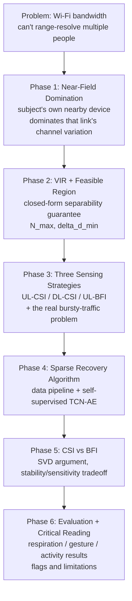

---
tags:
---
# MUSE-Fi — Teaching Plan

> Source paper: `papers/multipeople/MUSE-Fi_ Contactless MUti-person SEnsing Exploiting Near-field Wi-Fi.pdf` (ACM MobiCom'23). Deep, already-written summary lives at [[../multipeople/MUSE-Fi]] — this directory is the phase-by-phase teaching breakdown, filled in one phase at a time as we go through it.

## Why this paper, in this project

Same underlying physics as [[../simwisense/00-overview|SiMWiSense]] — a near scatterer dominates a link's CSI variation — applied through the opposite deployment topology: instead of a dedicated monitor near each subject, MUSE-Fi exploits the personal device (phone) each subject already carries. See [[../multipeople/MUSE-Fi]] §3 for the full contrast table.

## Pipeline diagram

## The 6 phases

1. **Near-Field Domination** — why multi-person Wi-Fi sensing is hard, and MUSE-Fi's core fix: a personal device near its owner makes that owner's motion dominate the link, turning "separate people in space" into "separate people by link identity."
2. **VIR + Feasible Region** — the variation-to-interference ratio, Cassini-oval feasible regions, and the closed-form bounds on how many people (N_max) and how close together (Δd_min) the system can handle.
3. **Three Sensing Strategies + Practical Traffic** — UL-CSI, DL-CSI, UL-BFI, and why real multi-user Wi-Fi traffic (bursty, contention-based) breaks the "high regular frame rate" assumption prior sensing work relied on.
4. **Sparse Recovery Algorithm (SRA)** — the 4-step data pipeline (segment → resample → spectrogram → normalize) and the self-supervised TCN-autoencoder that recovers missing samples without ever needing real sparse/dense ground-truth pairs.
5. **CSI vs BFI** — the SVD-based argument for why BFI is a "low-pass filtered" version of CSI, and the resulting stability-vs-sensitivity tradeoff.
6. **Evaluation + Critical Reading** — the three case studies (respiration, gesture, activity), headline numbers, and the honest limitations (weak baseline, idle-traffic failure mode, BFI cleartext privacy gap, hand-waved user registration).

## Related vault connections already made
- [[../basics/fresnel-zone-model]] §6 — same "proximity dominates sensitivity" intuition as near-field domination, different formalization (ellipsoid zones vs. VIR).
- [[../multipeople/SiMWiSense-FREL]] — RF-Net (MUSE-Fi's activity classifier) is FREL's intellectual ancestor.

## See also
- [[../multipeople/MUSE-Fi]]
- [[../simwisense/00-overview]]
- [[../wilight/00-overview]]
