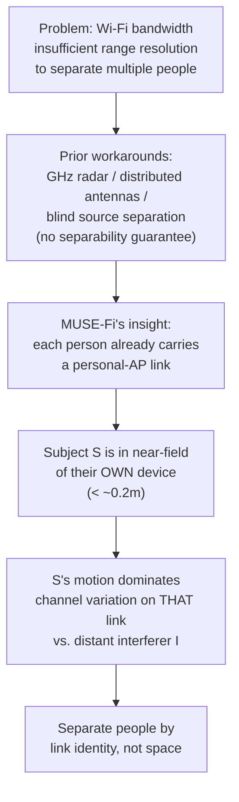

# Phase 1 — Near-Field Domination

**Source:** Paper §1 (Introduction) + §2.1–2.2 (Sensing Basics, Feasible Region setup)

The core physical principle the whole paper is built on: a personal device near its owner makes that owner's motion dominate the channel on *that specific link*, so you can separate people by "whose link is this" instead of by physically resolving their positions in space.

## Why this is hard in the first place

Range resolution ≈ 1/BW (see [[../../basics/CSI-feature-extraction]] §2.1). Even Wi-Fi 7's 320MHz bandwidth only gives meter-level resolution — nowhere near enough to physically tell two people apart by time-of-flight the way GHz-bandwidth radar can. Prior fixes all dodge the problem rather than solve it: switch to radar (extra hardware), use many distributed antennas (messes with normal Wi-Fi comms), or run blind-source-separation on mixed CSI (no guaranteed separability).

## The insight

Each person usually carries a personal device (phone) with its own AP link. Two facts, both ignored by prior single-link/multi-antenna proposals:
1. The personal-AP link already, for free, identifies whose data it is.
2. The subject sits in the **near-field of their own device** (empirically < ~0.2m) — so their motion dominates *that link's* channel variation, swamping everyone else, who are in the far field of that same link.

This flips "separate people in space" into "separate people by link identity" — a physically pre-separated, subject-specific channel per person, at zero deployment cost.

## The math

Basic channel model isolating subject $S$'s contribution:
$$h_{A,E}(t) = h_{A,S,E}(t) + h^S_{A,E} + h^D_{A,E}(t)$$
— static direct path + dynamic direct-path noise + reflection-via-$S$. The reflection term has the same two-hop structure as [[../../basics/scattering-model]]'s per-scatterer contribution:
$$h_{A,S,E}(t) = \frac{\lambda^2\sqrt{G_{A,S,E}}}{(4\pi)^2(d_{A,S}(t)d_{S,E}(t))^{\alpha/2}}\exp\!\left(-i\frac{2\pi}{\lambda}(d_{A,S}(t)+d_{S,E}(t))\right)$$

Add interferer $I$: $\tilde h_{A,E}(t) = h_{A,S,E}(t) + h_{A,I,E}(t) + h^S_{A,E} + h^D_{A,E}(t)$ — looks mixed/inseparable at face value.

**The key move**: look at the *rate of change*, not the value. The power of channel variation $P_S = |\partial h_{A,S,E}/\partial t|^2$ splits into an amplitude-variation term and a phase-variation term. Under realistic 5GHz near-field numbers ($d_{A,S}\sim3$m, $d_{S,E}\sim0.1$m, $\lambda\sim0.06$m), the phase term dominates so heavily the amplitude term is dropped, giving:
$$P_S \approx \tilde G_{A,S,E}\cdot v_S^2\cdot(d_{A,S}\,d_{S,E})^{-\alpha}$$

Same derivation for $I$: $P_I \approx \tilde G_{A,I,E}\cdot v_I^2\cdot(d_{A,I}\,d_{I,E})^{-\alpha}$. Since $d_{A,S}\approx d_{A,I}$ (both ~equidistant from AP) but $d_{S,E}\ll d_{I,E}$ (S is near its own device, I isn't), $P_S \gg P_I$ falls out of the $-\alpha$ power law directly — this is **near-field domination**, stated quantitatively instead of just intuitively.

## The math terms, one by one

**Building blocks — what's physically being named:**
- $h_{A,E}(t)$: total measured channel gain AP↔UE at time $t$ — literally what CSI is (magnitude = signal strength, phase = accumulated path distance).
- $h^S_{A,E}$ (Static): direct AP→UE path's gain, constant over time — the boring unchanging part.
- $h^D_{A,E}(t)$ (Dynamic): channel noise from other stuff moving along the direct path — background interference, not signal.
- $h_{A,S,E}(t)$: the reflection path AP→subject→UE — the one term that actually carries sensing information.
- $\lambda$: carrier wavelength (~0.06m at 5GHz). Scales the antenna-gain term, and — more importantly — sits in the phase term's denominator, controlling how sensitive phase is to distance.
- $G_{A,S,E}$: Tx gain × Rx gain × $S$'s reflection coefficient — how efficiently the signal bounces off $S$ and reaches the receiver.
- $d_{A,S}(t)$, $d_{S,E}(t)$: the two hop-distances (AP↔subject, subject↔device) — the only things that change as $S$ moves.
- $\alpha$: path-loss exponent (2–4; ≈4 indoors) — how fast signal power decays with distance.
- $\exp(-i\frac{2\pi}{\lambda}(d_{A,S}+d_{S,E}))$: the **phase term** — path length measured in wavelengths, turned into an angle. Exquisitely sensitive to small motion since a $\lambda/2$ path-length change swings this through half a cycle.
- $(d_{A,S}d_{S,E})^{\alpha/2}$ (denominator): the **amplitude term** — signal weakens as the product of both hop-distances grows.

This split cleanly separates "how far, hence how strong" (amplitude) from "how many wavelengths, hence what phase" (the exponential) — the same split as the scattering model, for a two-hop path.

**Why look at $\partial h/\partial t$ at all:** a static reflector gives constant $h_{A,S,E}$ — nothing to sense. $P_S = |\partial h_{A,S,E}/\partial t|^2$ ("power of channel variation") is big exactly when the link is wiggling a lot — i.e., when something nearby is moving. $v_S$ is just a simplifying stand-in ($\partial d_{A,S}/\partial t = \partial d_{S,E}/\partial t = v_S$) — "how fast is $S$ moving," collapsing the calculus into one speed term.

**Why the bracket splits into two terms, and why one gets dropped:** differentiating $h_{A,S,E}(t)$ hits both time-dependent factors — the amplitude factor and the phase factor — product rule gives both contributions:
- Amplitude-variation term $\frac{\alpha^2}{4}\left(\frac{d_{A,S}+d_{S,E}}{d_{A,S}d_{S,E}}\right)^2$: how much signal *strength* changes as $S$ moves a bit.
- Phase-variation term $\frac{16\pi^2}{\lambda^2}$: how much *phase* changes for the same small motion.

Plugging in real numbers ($d_{A,S}\sim3$m, $d_{S,E}\sim0.1$m, $\lambda\sim0.06$m): the amplitude term is order 1–100, the phase term is $16\pi^2/(0.06)^2\approx44{,}000$ — dwarfing it. Concrete version of "phase is far more sensitive to sub-wavelength motion than amplitude" (already known from [[../../basics/EMfund]]). That's why $(\star)$ drops the amplitude term.

**The final form, and why $-\alpha$ matters most:** collapses to $P_S \approx \tilde G_{A,S,E}\cdot v_S^2\cdot(d_{A,S}d_{S,E})^{-\alpha}$ ($\tilde G_{A,S,E}=(\lambda/4\pi)^2 G_{A,S,E}$ is just bookkeeping) — variation power scales with motion speed squared, inversely with distance to the power $\alpha\,(\approx4)$. Comparing $P_S$ (subject near its own device, $d_{S,E}\sim0.1$m) to $P_I$ (interferer far from that same device, $d_{I,E}\sim3$m, similar speed and AP-distance), the ratio is dominated by $(d_{I,E}/d_{S,E})^{\alpha}$ — a 30× distance advantage raised to the 4th power ≈ **810,000× power advantage**. Near-field domination is overwhelming, not marginal, purely because indoor path loss falls off so steeply.

## The honest caveat

The derivation assumes $v_S \approx v_I$ (similar motion intensity) — not realistic when one person breathes and another gestures. The paper flags this explicitly and only *experimentally* validates that the qualitative effect survives asymmetry (§2.4 pre-experiments) — it does not re-derive the closed form for the asymmetric case. This assumption is inherited by Phase 2's N_max/Δd_min numbers too.

## Notable — connection already in the vault

[[../../basics/fresnel-zone-model]] §6: same "proximity amplifies sensitivity to small motion" intuition, different formalization (ellipsoid zone geometry vs. this channel-variation-power argument). The paper does **not** use Fresnel zones anywhere in its own derivation — the one place the term appears is Related Work (§6), where it cites Yang et al. [65] for using the Fresnel zone model to reduce interference in multi-person respiration sensing, "but with the requirement of accurate subject location and fixed transceiver placement." So the *comparison* drawn here (ellipsoid zones vs. VIR) is a vault-level synthesis, not a paper claim — but the paper does position itself against the Fresnel approach on exactly that point: near-field domination needs no accurate subject localization. (Correction: an earlier version of this note said the paper never mentions Fresnel zones at all — that was wrong.)

## Summary (3-liner)

Wi-Fi can't range-resolve multiple people by distance, so MUSE-Fi instead looks at *rate of channel change* ($|\partial h/\partial t|^2$ — squared magnitude of the first derivative, not a second derivative) per personal-device link. A subject's own nearby device makes their motion's variation power overwhelm everyone else's, by a huge margin (the $-\alpha$ power law on the distance ratio). One caveat carried forward into Phase 2: the derivation assumes everyone moves at similar intensity ($v_S\approx v_I$).

## See also
- [[00-overview]]
- [[../../multipeople/MUSE-Fi]] §1
- [[../../basics/scattering-model]]
- [[../../basics/fresnel-zone-model]]
