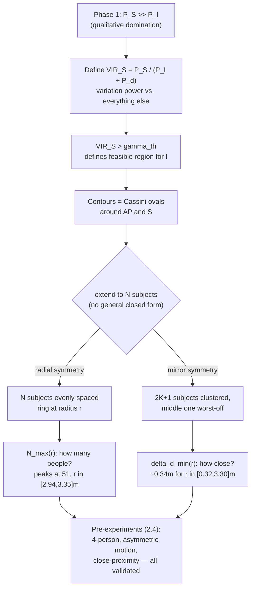

# Phase 2 — VIR + Feasible Region

**Source:** Paper §2.2 (Feasible Region), §2.3 (Multi-person Scenarios), §2.4 (Proof-of-Concept Pre-Experiments)

Turns Phase 1's qualitative "$P_S \gg P_I$ under reasonable assumptions" into a precise, checkable guarantee: given a threshold, exactly which positions/counts of other people are safe for sensing $S$.

## The new metric: VIR

$$\text{VIR}_S = \frac{P_S}{P_I + P_d}$$

$P_S$, $P_I$: channel-variation power from subject and interferer (Phase 1). $P_d = \eta\lambda^2 d_{A,E}^{-\alpha} + b$: dynamic noise on the direct AP↔UE path itself (Phase 1's $h^D_{A,E}(t)$), folded in as another interference source. VIR asks "how much of the total wiggle is $S$, vs. everything else also wiggling" — not raw signal strength, but *variation* strength, which is what actually matters for sensing.

**Why not reuse a standard SNR metric?** Prior work (cited as [59] in the paper) used signal-to-noise ratio — reflected power vs. noise floor. VIR instead compares variation power specifically, because two links can have identical signal strength but very different sensing usefulness depending on whose motion dominates the *change* over time.

## Feasible region — Cassini ovals

$\text{VIR}_S > \gamma_{th}$ defines the region interferer $I$ can occupy without breaking domination. Contours of constant VIR (Fig. 2) form **Cassini ovals** — peanut-shaped curves around the two foci (AP and $S$) — because the interference term scales with the *product* of two distances ($d_{A,I}\cdot d_{I,E}$), and constant-product-of-distances-from-two-points is exactly a Cassini oval's definition. Practically: small keep-out zones right around $S$ and the AP.

**Where the outer boundary actually comes from — it's not $S$'s constraint.** Note that $\text{VIR}_S$ alone only *improves* as $I$ moves farther away ($P_I\propto(d_{A,I}d_{I,E})^{-\alpha}$ shrinks, so the denominator shrinks) — nothing about $S$'s equation demands a ceiling on how far $I$ can be. The outer boundary comes from treating $I$ **symmetrically as a subject in their own right**: $I$ also needs $\text{VIR}_I>\gamma_{th}$ on $I$'s *own* link, and that quantity behaves oppositely — $I$'s own signal strength shrinks with $(d_{A,I}d_{I,E})^{-\alpha}$ too, so if $I$ drifts too far from the AP, $I$'s own sensing becomes invalid (too weak relative to the fixed interference floor). The full feasible region is the overlap of two constraints: excluded near $S$/AP (would break $\text{VIR}_S$) and excluded far from the AP (would break $\text{VIR}_I$) — a modeling choice that everyone in the room must be validly sensed simultaneously, not a mathematical necessity of $\text{VIR}_S$ alone.

## Scaling to many people — two symmetric special cases

A general $N$-person layout has no clean closed form (infinite possible arrangements), so the paper picks two symmetric cases, each targeted at one question:

1. **Radial symmetry** ($N$ subjects evenly ringed around the AP at radius $r$) → **"how many people can this support?"** Gives $N_{max}(r)$ (closed form after numerically fitting an otherwise-unclosed series sum). Peaks at $N_{max}=51$ for $r\in[2.94,3.35]$m. Note: the paper doesn't explain *why* the curve rises then falls with $r$ in words — it's a numeric result from the fitted formula, not a derived physical narrative. Don't over-read intuition into the exact shape.
2. **Mirror symmetry** ($2K{+}1$ subjects clustered, middle one worst-off) → **"how close together can two adjacent people be?"** Gives $\Delta d_{min}(r)$ — flat around **0.34m** for $r\in[0.32,3.30]$m, then jumps sharply near the range's edge.

## Reality check — pre-experiments (§2.4)

Run *before* any of Phase 3's sparse-traffic machinery exists: `iPerf3` forces **continuous, artificial traffic** between 4 emulated UEs and the AP, specifically so the physics claim (domination) can be checked in isolation, without also fighting real-traffic sparsity — that problem is deliberately deferred to later.

**Experiment 1 — validating $N_{max}$ (radial case), Fig. 4(a)/(b):**
- Setup: AP centered on a table, 4 users spaced 2m apart around it; each user = a UE + subject 15cm apart (near-field distance).
- Traffic runs 40s; CSI from **uplink** (UE→AP). Even with iPerf3 forcing constant exchange, raw CSI is still irregular (blue points) — MAC-layer contention/rate control doesn't vanish just because traffic is dense — so a processing step (red dotted curve) cleans it up.
- 4 subjects take turns holding their breath; each subject's phase plot shows a clean respiration waveform with **zero bleed-through** from the other three.
- Theory at this radius (Fig. 3c) predicts up to **25 supportable users** — only 4 tested. Deliberately conservative, since the closed-form $N_{max}$ assumes symmetric motion intensity, not yet stress-tested.

**Same setup, asymmetric motion, Fig. 4(c)/(d):** 3 subjects breathe normally while Subject D stands up/sits down — a completely different motion type and intensity ($v_D \gg v_{breathing}$). Both come through cleanly. This is the direct experimental patch for the $v_S\approx v_I$ assumption flagged in [[01-phase1-near-field-domination]] — not re-derived analytically, just shown to still hold qualitatively under real asymmetry.

**Experiment 2 — validating $\Delta d_{min}$ (mirror case), Fig. 4(e)/(f):** 3 subjects sit side-by-side, only **40cm** apart — close to the derived floor of ~0.34m, a near-worst-case test. Only the **middle** subject's result is reported, since theory says the middle position in a mirror-symmetric cluster is the most-interfered one (flanked both sides). Over ~30s, sequential breath-holding is still clearly resolved regardless of neighbors' behavior — confirming the close-proximity bound holds at a realistic spacing, not just abstractly.

**Why this section matters structurally**: the only place the Phase 1/2 closed-form math gets checked against real hardware before the full system (SRA, three sensing strategies, case studies) is built on top of it — everything from Section 3 onward assumes the physics already works, and §2.4 is the receipt for that assumption.

## Notable

- These bounds are explicitly flagged by the paper as **numeric/indicative, not a demonstrated capacity** — "51 subjects" is an illustration of the framework's scaling behavior under idealized, symmetric conditions, not a validated real-world number.
- Same caveat carries over from [[01-phase1-near-field-domination]]: the closed-form $N_{max}$/$\Delta d_{min}$ derivations assume symmetric motion intensity; only the qualitative trend is experimentally confirmed under asymmetry.

## Summary (3-liner)

Turns Phase 1's domination into a checkable guarantee via VIR (subject's variation power vs. everything else), whose feasible region is a Cassini-oval shape bounded on *both* sides — close to $S$/AP because it'd break $S$'s sensing, far from the AP because $I$'s own sensing would then fail. Two symmetric toy layouts convert this into concrete numbers: up to ~51 people ($N_{max}$) or ~0.34m minimum spacing ($\Delta d_{min}$) — application-agnostic separability bounds, not tied to any specific sensing task (gesture/respiration/activity come later, in Phase 6). Small pre-experiments (§2.4) confirm the physics holds even under real, asymmetric motion — patching Phase 1's caveat empirically rather than mathematically.

## See also
- [[00-overview]]
- [[01-phase1-near-field-domination]]
- [[../../multipeople/MUSE-Fi]] §2
