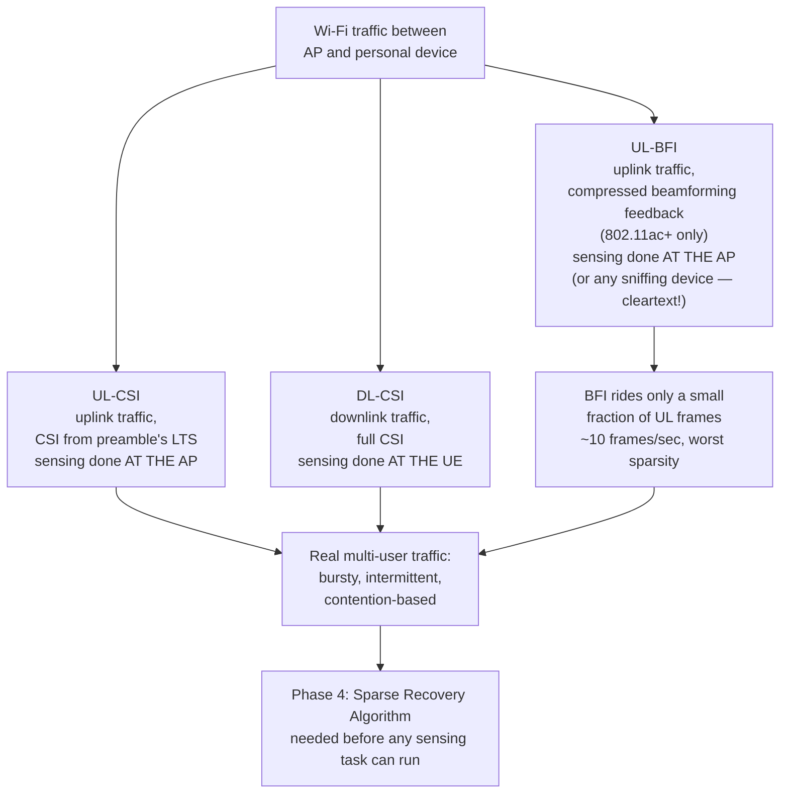
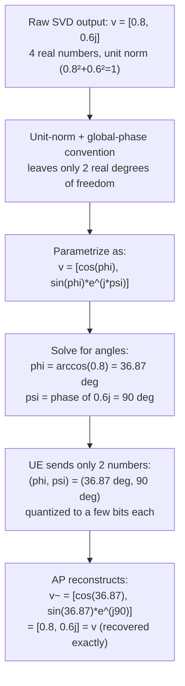

# Phase 3 — Three Sensing Strategies + the Real Traffic Problem

**Source:** Paper §3.1 (Three Sensing Strategies), §3.1.1 (User Registration), §3.1.2 (Practical Issues)

Defines *which raw data stream* MUSE-Fi even has access to, and exposes *why* it's messy in practice. This phase doesn't clean the data — that's [[04-phase4-sparse-recovery|Phase 4]]. Phase 3 is "here's the data source and the problem," Phase 4 is "here's the fix."

> Note on the diagram below: these are three **data-acquisition strategies** (which traffic direction, which piece of it), not filters. Nothing gets filtered/cleaned until Phase 4's Sparse Recovery Algorithm.

## The three strategies

- **UL-CSI**: uplink traffic, CSI pulled from the preamble's long training sequence (LTS). Sensing happens **at the AP** (uplink frames land there).
- **DL-CSI**: downlink traffic, same idea, sensing happens **at the UE**.
- **UL-BFI**: uplink traffic, but instead of full CSI you read the **beamforming feedback information (BFI)** — a compressed form of the downlink channel the UE sends back so the AP can tune its MIMO precoding. Only exists since 802.11ac, rides on uplink action frames.

**How BFI is actually produced — the 802.11n/ac/ax explicit sounding protocol** (standard mechanism MUSE-Fi repurposes, not something it invents):
1. AP sends a **Null Data Packet (NDP)** — full preamble/training fields, no payload — purely to let the UE measure the channel.
2. UE estimates the full downlink MIMO channel matrix $H_0$ from the NDP's training fields (same LTF-based estimation as [[../../basics/CSI-fundamentals]] §8.1, just for every Tx/Rx antenna pair).
3. UE runs an **SVD**: $H_0 = USV^*$. $V$ is exactly what the AP needs to precode (beamform) its next downlink transmission toward this UE.
4. Sending the full complex $V$ is too much data, so the UE **compresses it into a small set of real-valued angles** (Givens-rotation parameterization — any unitary matrix is exactly reconstructible from such angles). This compressed angle set *is* the BFI.
5. UE sends the angles back in a **Compressed Beamforming Report**, carried on an uplink Action frame — hence "UL"-BFI even though the information describes the *downlink* channel: it's feedback traveling receiver→transmitter.
6. AP reconstructs an approximate $\tilde V$ from the angles for its next beamformed transmission.

MUSE-Fi doesn't create any of this traffic — it's already happening for ordinary MIMO precoding. It just reads the angles as a free, already-compressed sensing signal, since $V$ shifts when nearby motion changes the channel.

**Concrete example — what the angle compression actually does** (simplest case: 2 Tx antennas, 1 spatial stream, so the feedback is just a unit vector $v\in\mathbb{C}^2$):

4 real numbers in, 2 angles transmitted, exact reconstruction on the other end — **this is literally what BFI *is*, mathematically**, not raw CSI. For more antennas/streams, the full $V$ matrix is parametrized by a *product* of several such Givens rotations (more $\phi_{lk},\psi_{lk}$ pairs) instead of one — same idea, scaled up. This small angle set is exactly what MUSE-Fi reads off the wire as its compressed sensing signal.

## Why the AP bothers — what precoding actually buys you

**The problem it solves:** with multiple Tx antennas and no weighting, each antenna's copy of the signal travels a different path to the receiver and arrives with a different phase (multipath). Unweighted, those copies just add up however physics happens to align them — sometimes constructive, often partially destructive. Extra antennas, but no control over how they combine.

**What precoding does:** deliberately weight each antenna's transmission (different complex gain/phase per antenna) so the copies recombine *constructively* at the receiver — steering energy toward the intended device instead of radiating evenly. The weights that do this are exactly $V$ from the SVD. Transmitting $Vx$ instead of raw $x$: after the real channel $H_0$, the receiver sees $H_0Vx = USV^*Vx = USx$ (since $V^*V=I$) — the messy, cross-coupled MIMO channel becomes several **independent, non-interfering parallel streams**, each boosted by its own singular value in $S$.

**Why it's reused on subsequent packets:** $V$ is only valid for the channel condition it was measured under, so the AP reuses those same weights for **every downlink data packet** to that UE until the channel changes enough to need a fresh NDP/BFI round.

**Why it's essential for multi-user (MU-MIMO), not just a nice-to-have:** without each user's own $V$, the AP can't shape its transmission so User A's stream doesn't leak into User B's antenna as interference. Precoding with per-user $V$'s is what makes simultaneous multi-user downlink possible at all — interference cancellation *between* users, not just an SNR boost for one.

**The MUSE-Fi payoff:** the AP's periodic re-sounding (fresh NDP → fresh BFI) exists purely for its own communication needs — MUSE-Fi doesn't trigger any of it, it just piggybacks on that already-happening refresh cadence to get a continuously-updated sensing signal for free.

## Precoding doesn't touch the data itself — only how it's spatially radiated

Easy trap: thinking $Vx$ somehow "enhances" or alters the transmitted bytes compared to what was meant to be sent. It doesn't. With $N_t$ antennas and weight vector $V=[v_1,\dots,v_{N_t}]^\top$, every antenna $i$ sends $v_i\cdot x$ — **the exact same data symbol $x$** (same bits, same constellation point), just scaled/phase-shifted per antenna. The information never changes; only the spatial pattern of how that one symbol is radiated does.

At the receiver, $y=H(Vx)+\text{noise}$ recombines constructively because $V$ was matched to $H$ via SVD. Crucially, the receiver never needs to separately "undo" $V$: the packet's training symbols (LTF) are precoded through the *same* $V$, so the receiver's normal channel estimation (known-vs-received LTF comparison) directly captures the combined effective channel $HV$ as one number, and demodulation proceeds exactly as usual against that. **So: no enhancement/disruption of the actual bytes being sent — only a spatial reshaping of how the same, unchanged symbol propagates and recombines.**

## Multi-user precoding — joint, not independent per-user

With two simultaneous users A and B sharing the same antennas, it's tempting to think each user's stream just gets weighted by its own $V$ independently, then summed. That fails: whatever the AP radiates for A's stream still physically reaches B's antenna too, so without coordination it shows up as interference at B (and vice versa).

**What actually happens:** the AP collects each user's channel feedback *separately* ($H_A$ from A's sounding, $H_B$ from B's), then **stacks them and solves for both users' precoding weights jointly**. The common baseline (vendor-specific, not mandated by the spec itself) is **Zero-Forcing Beamforming**:
$$H=\begin{bmatrix}H_A\\H_B\end{bmatrix}, \qquad W=H^*(HH^*)^{-1}$$
Columns $w_A,w_B$ of $W$ are built so $H_A\cdot w_B\approx0$ (B's stream nulled at A) and $H_B\cdot w_A\approx0$ (A's stream nulled at B), while each user's own term stays strong — one coupled linear system across all users, not two independent single-user computations.

**What each user sees:** AP transmits one composite signal $w_Ax_A+w_Bx_B$. At A: $y_A=H_A(w_Ax_A+w_Bx_B)+\text{noise}\approx(\text{gain})\cdot x_A+\text{noise}$ — B's term cancels by design. So it's not "each stream separately enhanced" — it's **each stream simultaneously enhanced *and* nulled-at-the-other-users**, only possible because the AP has both users' feedback and solves for both weights together.

**Privacy gap, flagged not solved here**: the paper states these BFI-carrying Action frames are transmitted in **cleartext/plain form** — any nearby device capable of sniffing traffic can extract it, not just the intended AP. Explicitly noted, deferred to a companion work.

## User registration

Before being sensed, a device announces itself + the sensing application it needs. Three stated reasons: (1) lets the system know user count/motion types, so it can reject users past capacity; (2) lets it pre-tune its pipeline (e.g. filter choice by expected motion intensity); (3) preserves privacy for uninterested ordinary Wi-Fi users. Actual registration mechanics are hand-waved — deferred to an "extended report."

## The real problem this phase surfaces

Phases 1–2 implicitly assumed a nice, steady CSI stream. Real multi-user Wi-Fi doesn't give you that — contention-based medium access makes both UL and DL traffic **bursty and intermittent**. Even one user streaming video already shows irregular frame arrival (upper-layer caching/rate control); a second user makes it worse via channel contention (measured directly: frames-per-100ms, 1 vs. 2 users streaming 1080p). BFI is hit hardest — it rides only a small fraction of UL frames, peaking around **10 frames/second**, roughly 1/10th the DL frame rate. **UL-BFI sensing faces the worst sparsity of the three strategies.**

This is the exact setup for Phase 4: a real sensing signal, but arriving in irregular sparse bursts instead of a clean regular stream.

**What "bursty and intermittent" concretely means**: no device gets a scheduled, guaranteed slot — before transmitting, each must sense the channel is idle, wait a random backoff, and retry on collision (CSMA/CA). Three effects stack: (1) upper-layer app behavior (video buffering, rate control) already sends data in chunks, not a steady drip, even alone; (2) adding users means active competition for airtime, so each device's own frame rate gets *more* irregular, not less; (3) this is real communication traffic, never generated to feed a sensing algorithm at a constant rate. Net result: **clusters of frames arriving close together, then stretches with almost none** — Fig. 5 shows this directly, frame counts per 100ms swinging between ~100+ and near-zero, not a flat line. Since every CSI sample only exists because a frame happened to land at that instant, the CSI time series inherits the exact same shape: dense bursts, then genuine blind spots with zero samples — not just noisy ones — which breaks standard evenly-spaced-sample assumptions (FFT/STFT) that Phase 4 has to work around.

## Summary (3-liner)

Three ways to get sensing data out of ordinary Wi-Fi traffic — UL-CSI and DL-CSI (full channel info, sensed at AP or UE respectively) and UL-BFI (compressed, AP-side, but cleartext and sniffable). None of them arrive as a clean stream in practice — CSMA/CA contention means no device gets a guaranteed slot, so real multi-user traffic clusters into bursts separated by genuine blind spots (not just noisy gaps), and BFI is the worst hit (~10 frames/sec). This sparsity, not the physics from Phases 1–2, is the next problem to solve.

## See also
- [[00-overview]]
- [[02-phase2-vir-feasible-region]]
- [[04-phase4-sparse-recovery]]
- [[../../multipeople/MUSE-Fi]] §4
