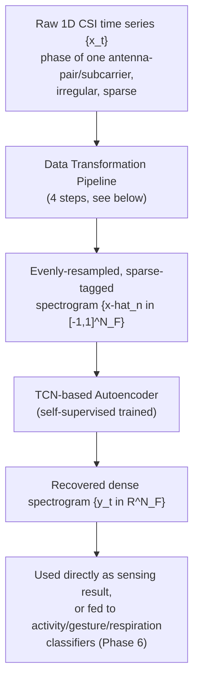
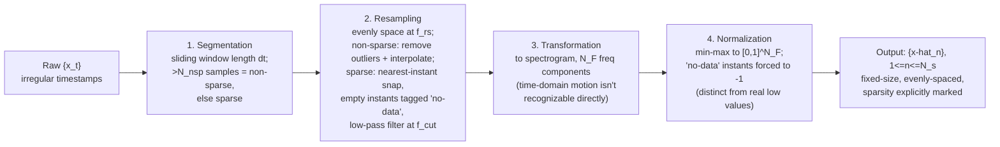
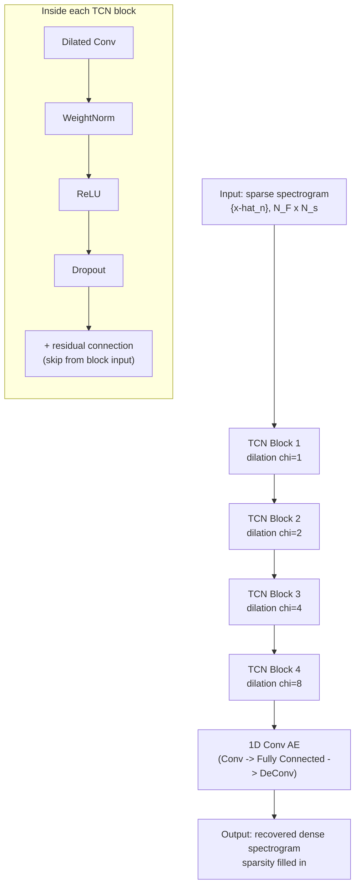
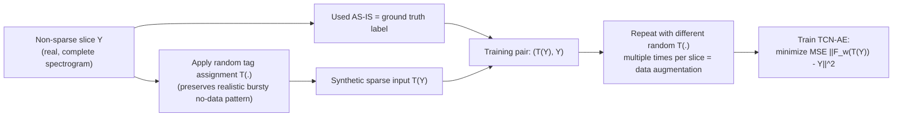

# Phase 4 — Sparse Recovery Algorithm (SRA)

**Source:** Paper §3.2 (Sparse Recovery Algorithm), §3.2.1 (Data Transformation Pipeline), §3.2.2 (TCN-based Sparse Slice Recovering), §4.1 (implementation parameters)

Phase 3 ended on a problem: real multi-user Wi-Fi traffic makes the CSI time series **sparse and irregular** — bursts of samples, then long gaps. SRA is the fix: turn that irregular stream into an evenly-sampled, densely-filled one that downstream sensing (respiration/gesture/activity, Phase 6) can actually consume. Two components: a **data transformation pipeline** (pre-processing) and a **self-supervised TCN-autoencoder** (the actual recovery/inpainting).

## Part 1 — Data Transformation Pipeline (§3.2.1)

Four steps, transforming the raw irregular series into a fixed-size, evenly-spaced, spectrogram-shaped input the network can actually consume.

1. **Segmentation**: slide a window of length $\Delta t$ across the raw series; a window with more than $N_{nsp}$ samples in it is marked **non-sparse**, otherwise **sparse**. These two slice types get treated differently downstream. ($\Delta t=0.1$s, $N_{nsp}=2$ in the actual implementation.)
2. **Resampling**: force everything onto an evenly-spaced time grid at frequency $f_{rs}$.
   - Non-sparse slices: remove outliers, interpolate to hit the target rate.
   - Sparse slices: snap existing samples to their nearest resampled time instant; instants with **no real sample at all** get tagged `no-data` and linearly filled (a placeholder, not treated as real data yet — the tag matters, see step 4). Everything then passes through a low-pass filter at cutoff $f_{cut}$ to denoise. ($f_{rs}=64$Hz; $f_{cut}=1$Hz for respiration, $20$Hz for gesture/activity — respiration is a much lower-frequency phenomenon, so a tighter cutoff makes sense.)
3. **Transformation**: convert the resampled time series into a **spectrogram** with $N_F$ frequency components. Rationale: raw time-domain motion patterns are environment- and subject-specific and hard to recognize directly — the frequency-domain view makes the impact of motion on the channel much more apparent (same logic as STFT-based feature extraction elsewhere in the vault).
4. **Normalization**: min-max normalize each spectrogram column into $[0,1]^{N_F}$ — this focuses on the *relative* variation pattern and removes magnitude differences caused by where the subject happens to be positioned (not motion-related). Critically: frequency components at `no-data`-tagged time instants get forced to **$-1$**, a value real data can never take — so the network can always tell "this was actually measured" from "this was a placeholder," instead of a fake zero blending in with real low-power measurements.

## Part 2 — TCN-based Sparse Slice Recovery (§3.2.2)

**Why a TCN, not U-Net or LSTM**: U-Net (used for audio inpainting) is heavier than needed here. LSTMs handle long-range dependency via recurrence, which is expensive; a **temporal convolutional network (TCN)** captures the same ultra-long-range dependencies via **dilated convolutions**, with far fewer parameters — important since this needs to train/run on resource-limited APs and UEs, not a data-center GPU.

- **Dilated convolution**, for the $k$-th output channel: $z_{k,n} = \sum_{i=0}^{L-1} f_{k,i+1}^\top \hat x_{n-\chi\cdot i}$ — same convolution idea as always, except the kernel taps are spread $\chi$ steps apart instead of adjacent. At $\chi=1$ it's an ordinary convolution (local context only). As $\chi$ grows, each output element "sees" a much wider span of the input **without** adding more parameters.
- **Stacking 4 blocks with exponentially increasing dilation ($\chi=1,2,4,8$)**: local features get extracted and combined progressively, so by the last block, each output node effectively has visibility over almost the **entire spectrogram** — long-range context, cheaply.
- **Conv AE module**: after the TCN blocks, a small 1D-conv → fully-connected → 1D-deconv autoencoder structure does the actual "fill in the gaps" prediction, using the well-represented features the TCN blocks handed it.
- Represented as a $w$-parameterized function $\mathcal{F}_w: \hat X \to \tilde Y$ (matrix form, $N_F\times N_s$).

## Part 3 — Self-Supervised Training (the clever part)

**The core problem**: normal supervised training needs (sparse input, dense ground-truth) pairs. But you can **never actually collect** a real ground-truth dense version of a sparse slice — the sparsity exists precisely *because* frames were genuinely missing; there's no hidden "real" data sitting behind it to reveal.

**The fix**: only use **non-sparse slices** for training — those already have real, complete data, so they can serve as their own ground truth. Then manufacture a sparse *input* by randomly tagging elements of that same slice as `no-data` (a random tag-assignment function $\mathcal{T}(\cdot)$) — with the important constraint that this synthetic tagging must **preserve the bursty, non-uniform pattern real sparsity actually has**, not just drop points uniformly at random.

- Each non-sparse slice gets reused multiple times with different random tag assignments — free data augmentation from one real recording.
- Training set: $\mathcal{D}_{train} = \{(\mathcal{T}(Y), Y)\}$ — fully synthetic sparsity, real labels, **zero manual labeling required**.
- Objective: $\min_w \mathbb{E}_{(\mathcal{T}(Y),Y)\in\mathcal{D}_{train}}\|\mathcal{F}_w(\hat X) - Y\|_2^2$, s.t. $\hat X=\mathcal{T}(Y)$ — plain MSE between recovered and true spectrogram.
- Overhead is minor: everything happens offline, automatically, with no real-time cost and no human labeling step at all.

## Implementation parameters (§4.1)

Non-sparse slices longer than 4s are used for training; 70% train / 30% test split. $\Delta t=0.1$s, $N_{nsp}=2$, $L=5$ (kernel size), $N_F=32$, $N_{ch}=64$, $f_{rs}=64$Hz, $f_{cut}=1$Hz (respiration) / $20$Hz (gesture, activity).

## Notable

- SRA's whole design is shaped by one constraint that doesn't show up elsewhere in the paper: it must run on **resource-limited APs/UEs**, not a server — that's the stated reason for choosing TCN over U-Net/LSTM in the first place.
- The self-supervised trick only works because non-sparse slices *exist at all* in the data — if traffic were sparse 100% of the time with zero non-sparse windows to learn from, there'd be nothing to build the training set from. Worth remembering for Phase 6's critical-reading discussion: the paper itself flags that highly sparse traffic from idle devices "may be beyond recovery."

## Summary (3-liner)

Real Wi-Fi traffic gives sparse, irregular CSI, so SRA first forces it onto an even time grid via a 4-step pipeline (segment → resample → spectrogram → normalize, with missing instants explicitly tagged $-1$), then fills the gaps with a TCN-autoencoder whose dilated convolutions cheaply capture long-range context. The clever part is training it: since real sparse/dense ground-truth pairs can never be collected, the network trains entirely on non-sparse slices with *synthetically* injected gaps — self-supervised, zero manual labeling, fully offline.

## See also
- [[00-overview]]
- [[03-phase3-sensing-strategies-and-traffic]]
- [[05-phase5-csi-vs-bfi]]
- [[../../multipeople/MUSE-Fi]] §5
