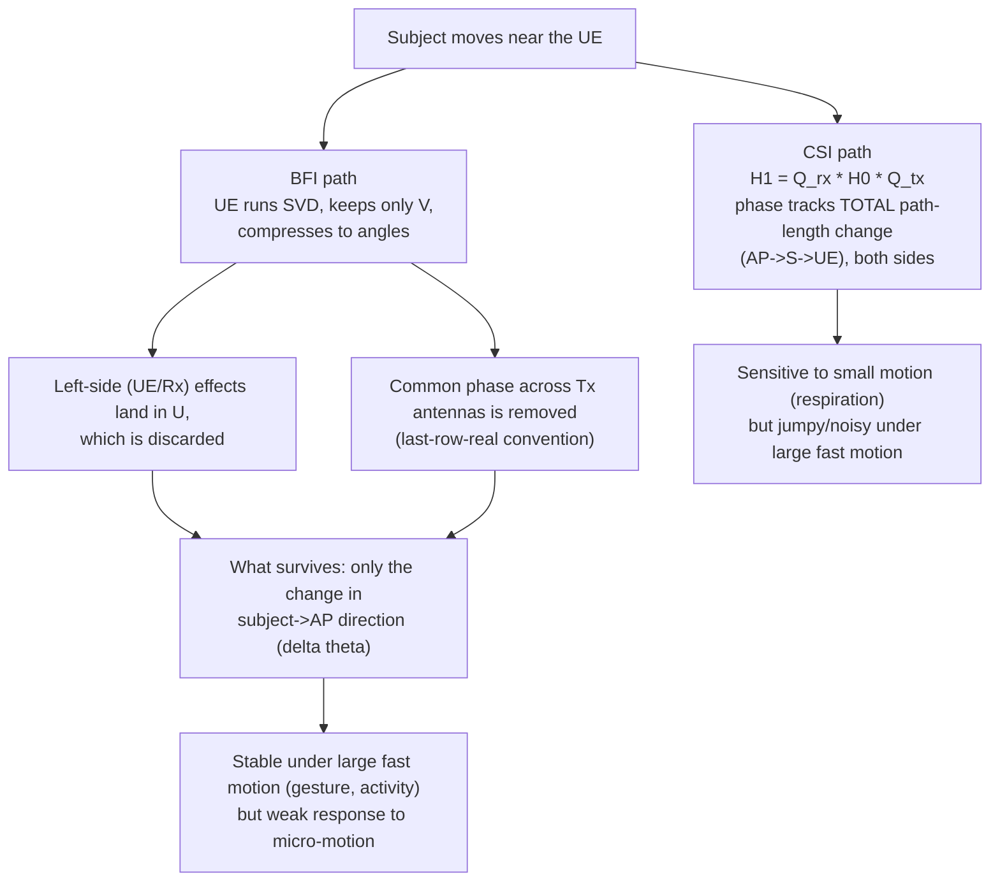

# Phase 5 — CSI vs BFI: To Compress or Not to Compress?

**Source:** Paper §3.3 (To Compress or Not to Compress?), §5.1.2 (Comparison between CSI and BFI), Figs. 8, 9, 12

Phase 3 introduced BFI as "compressed CSI riding on uplink" and showed *how* it is produced (NDP → SVD → Givens angles). Phase 5 asks the sensing question: **what does that compression throw away, and does it matter for sensing?** Answer: it throws away exactly the part of the channel that is most sensitive to small motion — which makes BFI *steadier* but *blunter* than CSI.

## The setup (§3.3)

A downlink channel matrix for one subcarrier, $H_0\in\mathbb{C}^{N_{rx}\times N_{tx}}$ ($N_{tx}$ antennas at the AP, $N_{rx}$ at the UE). Instead of feeding $H_0$ back whole, the UE computes the SVD $H_0=USV^*$ and feeds back only $V$ (the beamforming matrix), compressed into angles — the BFI from [[03-phase3-sensing-strategies-and-traffic]]. The AP reconstructs $\tilde V$, whose columns match $V$'s **except for a column-wise phase shift that forces the last-row entries to be real** — a normalization convention in the standard, and, as the math below shows, the reason BFI is blind to a whole class of motion.

## What a subject's motion does to the SVD (Fig. 8)

Picture the paper's geometry: subject in the near-field of the UE, far from the AP. The subject shifts slightly; every path through the subject changes length. The paper models the new channel as
$$H_1 = Q_{rx}\,H_0\,Q_{tx}$$
where the two diagonal phase matrices are:
- $Q_{rx}=\mathrm{diag}\!\big(\rho_1e^{-i\frac{2\pi}{\lambda}\Delta d_{R,1}},\dots,\rho_{N_{rx}}e^{-i\frac{2\pi}{\lambda}\Delta d_{R,N_{rx}}}\big)$ — change on the **UE side** ($\Delta d_{R,j}$: path-length change to the $j$-th Rx antenna, $\rho_j$: amplitude ratio new-vs-old position). Multiplies $H_0$ from the **left**.
- $Q_{tx}=\mathrm{diag}\!\big(e^{-i\frac{2\pi}{\lambda}\Delta d_T},\dots,e^{-i\frac{2\pi}{\lambda}[\Delta d_T-(N_{tx}-1)\,\ell\,\Delta\theta\sin\theta]}\big)$ — change on the **AP side** ($\Delta d_T$: path-length change from the first Tx antenna; $\ell$: spacing between adjacent Tx antennas; $\Delta\theta$: change in the direction from subject to AP). Multiplies $H_0$ from the **right**.

Since $H_0=USV^*$, left-multiplication perturbs $U$ and right-multiplication perturbs $V$. The paper's key step: $V'=Q_{tx}^*V$ — the **new $V$ only sees the AP-side matrix $Q_{tx}$**. (Strictly this is exact when $Q_{rx}$ is unitary, i.e. all $\rho_j=1$; the paper states the result without that qualifier, so treat it as the paper's approximation.) The UE-side motion effects go into $U$ — which is never fed back.

Then the reconstruction convention finishes the job. $Q_{tx}$ has a **common phase** $e^{-i\frac{2\pi}{\lambda}\Delta d_T}$ on every entry (that is the absolute path-length change) plus a **relative phase across Tx antennas** that depends on $\Delta\theta$. Forcing the last row real strips the common phase, leaving:
$$\tilde V'=\mathrm{diag}\!\big(e^{-i\frac{2\pi}{\lambda}(N_{tx}-1)\ell\Delta\theta\sin\theta},\;\dots,\;e^{-i\frac{2\pi}{\lambda}\ell\Delta\theta\sin\theta},\;1\big)\,\tilde V$$

**Conclusion (paper's words, made concrete): BFI changes only when the *direction from the subject to the AP* changes ($\Delta\theta$) — it "does not concern the UE at all."**

## Why that means "stable but insensitive"

- **CSI phase** $\propto$ total path length ($d_{A,S}+d_{S,E}$)$/\lambda$ — the Phase 1 quantity. With the subject 10 cm from the UE, a millimetre of motion moves this phase by a lot ($\lambda\approx6$ cm).
- **BFI** sees only $\Delta\theta$, and a subject 3 m from the AP barely changes direction when it moves millimetres near the phone.

*Sanity check (my own order-of-magnitude estimate under assumed numbers, **not** from the paper):* assume 4 Tx antennas at half-wavelength spacing, subject 3 m from the AP, a 1 mm sideways motion. Then $\Delta\theta\lesssim 10^{-3}/3\approx3\times10^{-4}$ rad and the BFI phase term is $\frac{2\pi}{\lambda}(N_{tx}-1)\ell\,\Delta\theta\sin\theta=3\pi\,\Delta\theta\sin\theta\lesssim3\times10^{-3}$ rad, whereas the CSI phase moves by roughly $\frac{2\pi}{\lambda}\times(\sim2\text{ mm})\approx0.2$ rad — roughly **70× (about two orders of magnitude)** larger. The paper never gives this number; it only reports the qualitative result and the empirical plots below.

The paper's resulting framing — treat CSI→BFI as **low-pass filtering**: fewer variations, but also lower signal strength.

## Empirical confirmation (Figs. 9 and 12)

- **Time domain (Fig. 9)**: respiration — both visible, CSI larger; gesture (front-back) and activity (jumping) — CSI is "drastic changes blended with noise and outliers," BFI is a stable, smoother waveform.
- **Fluctuation (Fig. 12a–c)**: standard deviation of detrended signals over 0.1 s windows — BFI is lower (more stable) in all three tasks, at the cost of sensitivity.
- **Spectrum (Fig. 12d–f)**: CSI keeps the respiration peak with a smooth spectrum but carries **excess high-frequency power** for gesture/activity; BFI **suppresses the high frequencies** while its respiration response is weaker.
- **The paper's explanation for CSI's high-frequency mess**: CSI phase is tied to relative displacement, so it's great for small motion — but *large, fast* motion causes abrupt phase jumps that "cannot be captured by insufficient sampling," producing irregular CSI. (Tie-in to [[03-phase3-sensing-strategies-and-traffic]]: with bursty, sparse sampling, big phase jumps between samples are exactly the failure mode — a plausible reason BFI's smoothness helps for gesture/activity, though the paper states the sampling argument, not this specific linkage.)

## The tradeoff, side by side

| | UL/DL-CSI | UL-BFI |
|---|---|---|
| What it carries | Full per-subcarrier complex channel | Only $V$'s angles (direction info) |
| Responds to | Total path-length change (both sides) | Subject→AP direction change $\Delta\theta$ only |
| Small motion (respiration) | Strong | Weak but "still viable" |
| Large fast motion (gesture/activity) | Noisy, outliers, high-freq excess | Stable |
| Sample rate under real traffic | Higher (every frame carries a preamble) | ~1/10 of DL frames, ~10 fps peak (Phase 3) |
| Where sensing runs | AP (UL) or UE (DL) | AP, or any device that overhears the cleartext action frames |

**Pick by application**, not by "which is better": stability vs. sensitivity. The paper also floats a future use — BFI might *filter out body-movement interference* for continuous vital-sign monitoring on a phone carried on the body (its refs [13, 71]) — flagged as future work, not tested.

## Caveats the paper states

- The analysis **assumes the subject is off the LoS path** — it does not cover e.g. hands directly operating the phone.
- The derivation is a single-subject, single-motion perturbation model; it explains the *trend* that the plots then confirm, not a quantitative prediction of BFI amplitude.

## Summary (3-liner)

BFI keeps only $V$ from the SVD, and the standard's last-row-real normalization strips the common phase — so subject motion near the UE (absorbed in $U$ and the common phase) mostly vanishes, leaving only the change in subject→AP direction $\Delta\theta$. That makes BFI a "low-pass filtered" CSI: steadier under big fast motion (gesture, activity), weaker on micro-motion (respiration). Choose CSI vs. BFI by the application's stability/sensitivity needs, not by "better/worse."

## See also
- [[00-overview]]
- [[03-phase3-sensing-strategies-and-traffic]]
- [[04-phase4-sparse-recovery]]
- [[06-phase6-evaluation-and-critical-reading]]
- [[../../multipeople/MUSE-Fi]] §4
