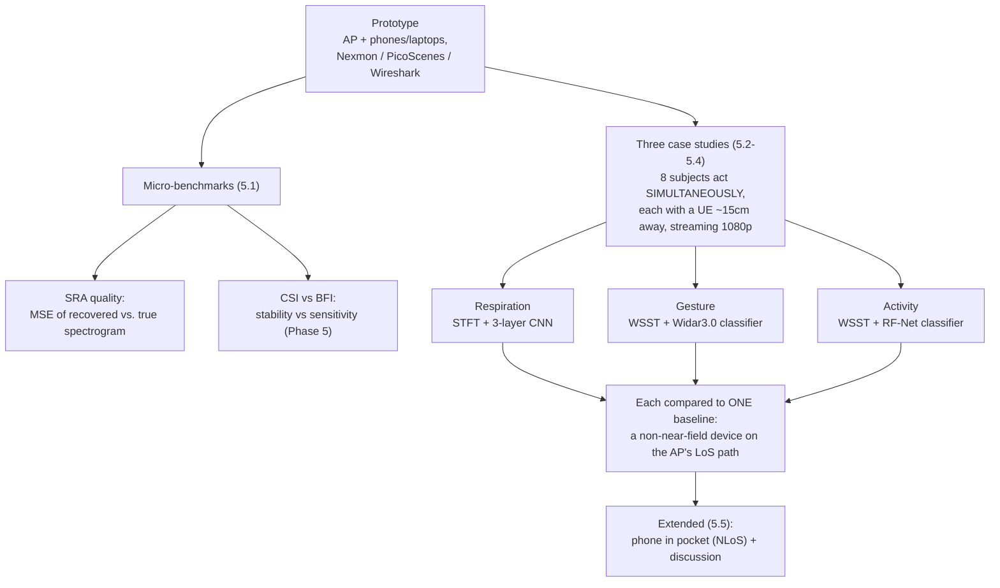

# Phase 6 — Evaluation + Critical Reading

**Source:** Paper §4 (Prototyping & Experiment Setup), §5 (Evaluations, incl. §5.5 Extended Experiments and Discussions), §6 (Related Work), §7 (Conclusion)

Everything before this phase was mechanism (physics → guarantee → data source → recovery → CSI-vs-BFI). Phase 6 asks: **what did they actually measure, against what, and how far can the numbers be trusted?** Two halves: (A) what the paper reports, (B) how to read it critically. Each flag below is tagged **[paper says]** or **[my reading]** so you can tell the paper's own admissions apart from my inferences.

## A. What the paper reports

### Prototype and setup (§4)
- **Hardware**: AP = Netgear Nighthawk X10; UEs = iPhone 13, OnePlus 10T, Acer TravelMate laptops. NICs use 802.11b/g/n/ac for UL-/DL-CSI, **802.11ac only for UL-BFI** (BFI doesn't exist earlier). CSI via **Nexmon** and **PicoScenes**; cleartext BFI read from **Action No-ACK frames with Wireshark**; analysis in Matlab. (Which device used which tool isn't stated.)
- **Common to all three case studies**: (i) every UE sits in the near-field of its subject and continuously streams 1080p video to imitate daily usage (so traffic is *real, bursty*, per Phase 3); (ii) **all subjects act simultaneously**; (iii) held in a typical indoor meeting room, with a different furniture arrangement per experiment. Layout (Fig. 10): subjects A–H around a table, AP in the middle; the 15 cm UE–subject gap is "only meant to indicate a near-field layout rather than be fixed to that value."
- **Baseline**: one extra Wi-Fi device on the AP's **LoS path but not in any subject's near-field**, collecting CSI and BFI.
- **Stated scope (§4.2)**: the evaluations "by no means aim to show competitive performance against existing single-person monitoring systems"; the goal is to validate physical separability and quantify the benefit over non-near-field sensing.

### Micro-benchmarks (§5.1)
- **SRA (§5.1.1)**: one subject; MSE between recovered and ground-truth spectrograms vs. the proportion of sparse slices (0.1–0.5). Reported as low on normalized data — respiration lowest (below 2×10⁻³), gesture and activity higher (below 5×10⁻³ and 7×10⁻³ respectively, per the text). The paper's own discussion: **gesture is hardest to recover** (hands are closer to the UE than the body, so gestures carry more complicated time-frequency patterns); **respiration easiest** (stable, periodic).
- **CSI vs BFI (§5.1.2)**: covered in [[05-phase5-csi-vs-bfi]].

### The three case studies, side by side

| | Respiration (§5.2) | Gesture (§5.3) | Activity (§5.4) |
|---|---|---|---|
| Subjects | 8, simultaneous | 8, simultaneous | 8, simultaneous |
| Task | breathing rate | 6 gestures: circle, front-back, slide, star, wave, zig-zag | 6 activities: bending, jumping, rotating, sitting down, standing up, walking |
| Volume | 80 min total; NeuLog chest-belt ground truth | 500 reps each → 24,000 series × 256 samples | 200 reps each → 9,600 series × 256 samples |
| Spectrogram | STFT (low-frequency focus) | WSST | WSST |
| Model | 3-layer CNN → rate | Widar3.0 classifier | RF-Net classifier |
| **MUSE-Fi** | median & mean error **< 1 bpm** | mean accuracy **> 98%** | mean accuracy **> 98%** (every class > 0.98) |
| **Baseline** | median **7 bpm**, mean **8 bpm** | **57%** | ≈ half (paper: 8 points below its gesture baseline, ≈ 49%); worst class *standing up* 0.33 |

Supporting detail from the paper:
- **Respiration separation proof (Fig. 14)**: subjects sequentially hold their breath for 20 s; each subject's spectrogram shows a clear signal at the ground-truth rate that **drops exactly during that subject's breath-hold** — direct evidence signals don't bleed across subjects. Baseline spectrogram is a smear. **Average spectral entropy: 1.2 bit (MUSE-Fi) vs. 2.4 bit (baseline)** — the paper reads this as a much narrower set of plausible respiration rates.
- **Gesture confusion (Fig. 15)**: baseline's worst pair is circle vs. slide — both smooth hand motions over the phone that look alike from the far field but separate in the near field.
- **Activity**: the baseline's drop vs. gesture is attributed to greater interference from large-scale, rapid activities.

### Extended experiments and discussion (§5.5)
- **Phone in pocket (NLoS)**: gesture and activity accuracy stays **> 92%**, similar to the on-desk LoS case. Explanation: signals diffract around the body while near-field domination still holds.
- **Generalizability (argued)**: environment dynamics matter little *because of* near-field domination; layout changes show up as additive biases that SRA's normalization removes.
- **Key-factor analysis**: domination assumes a LoS UE–AP path, but survives body-blocked LoS; if LoS is blocked and traffic travels via reflections, domination extends to the *shortest NLoS path*, provided it's clear of unrelated environmental motion.
- **Stated future work**: sensing security, and coexistence with other co-channel systems.

### Related work — how the paper positions itself (§6)
- 60 GHz 802.11ad radar-style systems (ViMo, mmTrack): limited adoption, high device cost.
- Widar2.0: multiple antennas for spatial resolution → only *partial* multi-person support.
- Yang et al. [65]: **Fresnel zone model** to place transceivers and reduce interference — needs accurate subject location and fixed transceiver placement (see the correction in [[01-phase1-near-field-domination]]).
- MultiSense [67]: multi-person respiration as blind source separation with ICA.
- PhaseBeat / TR-BREATH: root-MUSIC to separate signals. SPARCS: sparse micro-Doppler recovery, but for wideband mmWave, "does not fit narrowband Wi-Fi."
- The name overlap with MUSE (MU-MIMO user scheduling) is coincidental.

## B. Critical reading

**[paper says]**
1. **The baseline is deliberately narrow.** It is one device off the near-field, so the 98%-vs-~50% gaps measure *near-field vs. far-field*, not MUSE-Fi vs. other multi-person methods. The paper says so itself (§4.2), and never compares empirically against MultiSense/ICA or Widar2.0 despite citing them.
2. **Idle traffic breaks it.** "Highly sparse data traffic for idle UEs may be beyond recovery and lead to invalid sensing results" (§5.5) — the system degrades exactly when the phone isn't in active use.
3. **BFI privacy gap.** BFI rides cleartext action frames, so any nearby device can extract someone's sensing signal; deferred to a companion work. Security and co-channel coexistence are future work.
4. **User registration is hand-waved** — the mechanics are deferred to an "extended report" (Phase 3).
5. **Geometric assumptions.** Near-field domination presumes a LoS UE–AP path; the BFI analysis presumes the subject is off the LoS (not, e.g., hands on the phone).

**[my reading — from the text I read; not independently verified against the figures]**
6. **SRA is validated on the kind of data it was trained on.** Its MSE is measured on held-out *non-sparse* slices with *artificially* injected gaps (single subject) — the only possible check for a self-supervised design, but the text doesn't independently show that the synthetic masks $\mathcal{T}(\cdot)$ match real traffic sparsity, and I didn't see an ablation of *downstream accuracy with vs. without SRA*. There is also a small internal inconsistency: the MSE bounds are listed "respectively" for respiration/gesture/activity as 2/5/7×10⁻³, while the prose says gesture has the largest loss.
7. **Results aren't split by strategy.** The case-study sections don't say whether UL-CSI, DL-CSI, or UL-BFI produced the headline numbers, so the Phase 5 CSI-vs-BFI tradeoff can't be checked against the task accuracies.
8. **Capacity is theory beyond 8 people.** Evaluations use 8 simultaneous subjects (4 in the §2.4 pre-experiment); the ≈51-subject $N_{max}$ from Phase 2 is an idealized, symmetric-motion figure.
9. **Controlled geometry.** Seated subjects around one table, UE ≈15 cm away, meeting rooms; the pocket test covers gesture/activity only. I saw no sweep of UE–subject distance to find where domination breaks down empirically, and no respiration-with-phone-in-pocket result.
10. **Evaluation protocol is under-specified.** Beyond the SRA's 70/30 split, the text I read doesn't say whether the classifiers' test sets are cross-subject, cross-session, or cross-room — which changes how much "98%" means. (Directly relevant to our own few-shot / cross-domain angle.)

## Connections to this project

- **Same physics, opposite topology** vs. [[../simwisense/00-overview]] — SiMWiSense's proximity result (closest dedicated monitor wins, ≈30-point accuracy drop with distance) is the empirical twin of Phase 2's analytic VIR bound; full contrast table in [[../../multipeople/MUSE-Fi]] §3.
- **SRA solves a problem our data doesn't have.** SiMWiSense and Wilight work on dense, dedicated-capture CSI; sparsity from real contention traffic is MUSE-Fi's problem, not ours. The two sanitization ideas target different noise: Wilight's adjacent-subcarrier ratio cancels per-packet common phase noise ([[../wilight/03-phase3-ratio-sanitization]]); SRA repairs missing *time samples*. The text I read describes SRA's input as raw CSI phase and mentions only outlier removal and low-pass filtering for noise, so combining a ratio-style sanitizer with SRA is a *possible* idea, not something either paper claims.
- **Classifier lineage.** MUSE-Fi's activity model is RF-Net (meta-learning for one-shot RF activity recognition); see [[../../multipeople/SiMWiSense-FREL]] for the FREL connection.

## Summary (3-liner)

Eight simultaneous subjects, real streaming traffic, near-field placement: MUSE-Fi reports sub-1-bpm respiration error and ≈98% gesture/activity accuracy versus 7–8 bpm and ≈50–57% for a single far-field baseline device, with pocket (NLoS) gesture/activity still above 92%. Read those gaps as "near-field beats far-field," not "beats prior multi-person methods" — the paper itself scopes it that way, and it also admits idle-device traffic may be unrecoverable, BFI leaks in cleartext, and registration is unspecified. Open questions on my reading: SRA's real-traffic fidelity, per-strategy results, capacity beyond 8 subjects, and the classifier train/test protocol.

## See also
- [[00-overview]]
- [[05-phase5-csi-vs-bfi]]
- [[04-phase4-sparse-recovery]]
- [[../../multipeople/MUSE-Fi]] §6–§7
