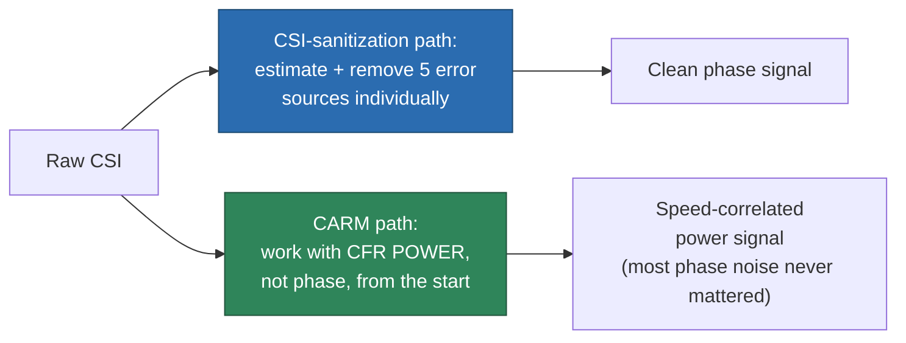

# CARM: The CFR-Power Model — an Alternative to Per-Error Sanitization

> **TL;DR:** [[CSI-sanitization]] fixes phase noise by modeling and removing five hardware error sources one at a time. CARM (MobiCom 2015 / JSAC 2017) takes a different route entirely: work with **CFR power**, not phase, so most of that phase noise never has to be corrected in the first place. Paired with a PCA-based denoising step, this is a genuinely different — and in some ways more elegant — philosophy for the same underlying problem: getting a clean, movement-speed-correlated signal out of noisy commodity CSI.

## 1. Where this fits

[[CSI-sanitization]] is the vault's primary answer to "commodity Wi-Fi CSI is corrupted by hardware error — here's how to fix each source." CARM is the likely intellectual precursor to [[scattering-model]] and [[CSI-feature-extraction]]'s Doppler section — it derives essentially the same $H(f,t) = H_{static} + H_{dynamic}$ split and speed-from-phase-rotation-rate result, but does the noise-handling step completely differently.

## 2. The core move: use power, not phase

Recall from [[CSI-sanitization]] that phase is where most hardware error (CFO, RCO, SFO/PDD) lives. CARM's insight: instead of trying to extract a clean *phase* signal and removing five separate error sources from it, split CFR into static + dynamic components and work with **CFR power** (magnitude-squared) instead.

The key derivation: CFR power, expanded out, turns out to be a sum of a constant offset plus **sinusoidal terms whose frequencies are exactly the movement speeds** of dynamic scatterers — the same "phase rotates at a rate set by speed" physics as [[scattering-model]] §3, but recovered from a *power* measurement rather than requiring clean absolute phase. Since CFO, RCO, and SFO/PDD are primarily phase-domain corruptions, working in the power domain sidesteps needing to explicitly estimate and subtract most of them.

**The tradeoff:** this is coarser-grained than full sanitization — you give up absolute phase information entirely, which [[CSI-sanitization]]'s harder-to-fix errors (SFO/PDD) already partially cost you anyway. For classification-style tasks (movement/activity detection, not precise ranging), this is often an acceptable, much cheaper trade.

## 3. PCA-based denoising — a second, independent technique

CARM's second contribution: CSI streams across subcarriers/antennas are correlated (they're linear combinations of the same underlying multipath signal). Build a correlation matrix across the CSI stream, eigendecompose it, and observe that:

- **PC1 (the largest component) is dominated by correlated noise**, not signal — discard it.
- **PCs 2–6 carry the actual activity-relevant signal** — keep these for feature extraction.

This is a genuinely different denoising philosophy from [[CSI-sanitization]]'s per-subcarrier calibration-template approach (§2 there: divide each subcarrier by its own fixed hardware-error template). CARM's PCA approach doesn't need a pre-measured template at all — it exploits statistical structure in the live data itself.

## 4. Rest of the CARM pipeline (brief)

For completeness — the parts that aren't about noise handling:

- **Activity detection:** monitor the 2nd eigenvector's smoothness and the 2nd PC's variance as an activity indicator, against an adaptively-thresholded (EMA) baseline.
- **Feature extraction:** 12-level Discrete Wavelet Transform spanning 0.15–300Hz, giving a 27-dimensional feature vector per 200ms window.
- **Classification:** an HMM per activity, trained via Baum-Welch.
- **Multi-link fusion:** likelihood-fusion or feature-fusion across multiple Tx-Rx links beats simple majority voting, improving cross-environment accuracy by ~8 percentage points.

## 5. Results and what they tell us

96.5% cross-validation accuracy (8 activities, 25 volunteers, Intel 5300), 12m detection range for walking, 5m for small motions (98%+ true-positive rate, only 1.4 false alarms/hour). Cross-environment/cross-person generalization: 72–90% depending on environment — worse in a workshop with reflective anti-static flooring, a concrete reminder that surface material affects the scattering environment (see [[scattering-model]]'s static-vs-dynamic scatterer framing). Accuracy plateaus at ~800 samples/sec — consistent with a ~300Hz ceiling on human movement frequency (Nyquist-adequate), and drops sharply below 400/sec.

## 6. Why this is worth holding alongside CSI-sanitization

Two defensible philosophies for the same underlying problem, both with real evidence behind them:

| | [[CSI-sanitization]] | CARM's CFR-power + PCA approach |
|---|---|---|
| What's removed | 5 named hardware error sources, individually | Whatever's correlated-noise-shaped, statistically |
| Requires | Pre-measured calibration templates (coax cable, per-NIC) | Nothing pre-measured — works on the live data |
| Preserves | Full phase information (where fixable) | Only power/magnitude-domain information |
| Best suited to | Ranging, AoA — tasks that need absolute phase | Classification/detection — tasks that only need relative, speed-correlated signal |

Worth noting: most of the general HAR literature (see the model-survey update in [[wireless-sensing-DL]] §7) skips the full 5-error sanitization pipeline entirely and either does something CARM-like (statistical denoising) or nothing at all — full physical sanitization appears more common in ranging/localization papers than in classification-only HAR work.

## See also
- [[CSI-sanitization]]
- [[scattering-model]]
- [[CSI-feature-extraction]]
- [[wireless-sensing-DL]]
