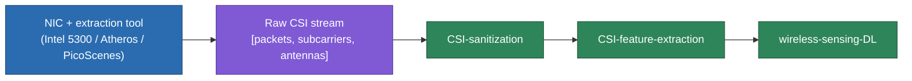

# CSI Data Collection Tooling

> **TL;DR:** everything upstream in this vault ([[CSI-fundamentals]] through [[wireless-sensing-DL]]) assumes you already have a stream of CSI matrices to work with. This note is where those numbers actually come from — the commodity hardware/firmware tools that expose CSI, and the one major public dataset (Widar3) referenced throughout the vault's Doppler/BVP discussion.

## 1. Why this is hardware-specific, not protocol-specific

Recall the correction worth internalizing: [[CSI-fundamentals]] mentions "802.11n uses 57 subcarriers over 20MHz" as if it's a general Wi-Fi fact. It isn't, strictly — it's the number the **Intel 5300 NIC's CSI tool** reports. 802.11n itself defines more subcarriers than that; which ones a system can actually *read out* as CSI depends entirely on which extraction tool/firmware you're using. This note exists to make that hardware-dependence explicit rather than implicit.

## 2. Three named extraction tools

| Tool | Standard / chipset | Subcarriers exposed | Platform |
|---|---|---|---|
| **Intel 5300 CSI Tool** | 802.11n, Intel IWL5300 | 30 subcarrier *groups* (each representing 2 or 4 adjacent subcarriers depending on 20/40MHz bandwidth) → ~57 usable values at 20MHz | Modified Intel driver, Linux |
| **Atheros CSI Tool** | 802.11n, Atheros ath9k chipsets | Full per-subcarrier resolution (more than Intel 5300) | Open-source, runs on Ubuntu and OpenWRT/Linino embedded devices |
| **PicoScenes** | 802.11ac/ax (newer, wider-band standards) | Full per-subcarrier CSI, supports up to 27 concurrent NICs | Cross-platform, outputs structured (e.g. MATLAB struct) records |

**Practical implications of the choice:**
- Intel 5300 is the most common in older/legacy papers (it's what [[CSI-sanitization]]'s original calibration-function naming — `nonlinear_calib`, `agc_calib`, `rco_calib`, `cfo_calib`, `sto_calib_mul`/`sto_calib_div` — and SiMWiSense's own hardware descriptions are built around), giving only 30 antenna-pair groups' worth of subcarrier data even though the underlying 802.11n signal carries more.
- Atheros gives finer subcarrier resolution and is fully open-source, making it common for embedded/low-cost deployments (e.g. MUSE-Fi-style setups piggybacking on commodity routers) and for NTU-Fi-style datasets ([[SenseFi]] uses it with 114 subcarriers).
- PicoScenes is the only one of the three built for 802.11ac/ax — the wider channels there (80/160MHz) mean more subcarriers and finer delay/ToF resolution (recall [[CSI-feature-extraction]] §2.1: resolution scales with bandwidth), at the cost of needing newer/more capable hardware. SiMWiSense's 80MHz/242-subcarrier setup is this generation.

## 3. Widar3 — the dataset behind BVP and adversarial-learning examples

The Widar3.0 dataset, referenced throughout [[CSI-feature-extraction]] (BVP, §5) and [[wireless-sensing-DL]] (the CNN/CNN+RNN/adversarial/complex-NN model examples), is a concrete, sizeable public gesture dataset:

- **258,000** gesture instances
- **8,620 minutes** of total recording
- **75 domains** (combinations of location/orientation/subject — this is exactly the variability BVP and adversarial domain adaptation exist to handle)

Concrete architecture numbers tied to this dataset (Widar3.0's own CNN, distinct from SiMWiSense's embedding network): input tensor `[T_MAX, 6, 121, 1]` (time × 6 receiver links × 121 Doppler frequency bins), `Conv3D` kernel `16@(5,3,6)`, `MaxPooling3D (2,2,2)`, dense layers `256 → 128 → n_class`, RMSprop optimizer at lr=0.001, dropout 0.5, batch size 32, 200 epochs.

## 4. Where this fits in the pipeline

This is the missing first block: every downstream note assumes this hardware step already happened.

## See also
- [[CSI-fundamentals]]
- [[CSI-sanitization]]
- [[CSI-feature-extraction]]
- [[SiMWiSense-system-architecture]] — a concrete 80MHz/242-subcarrier instance of this
