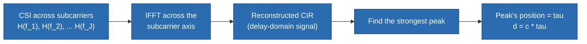
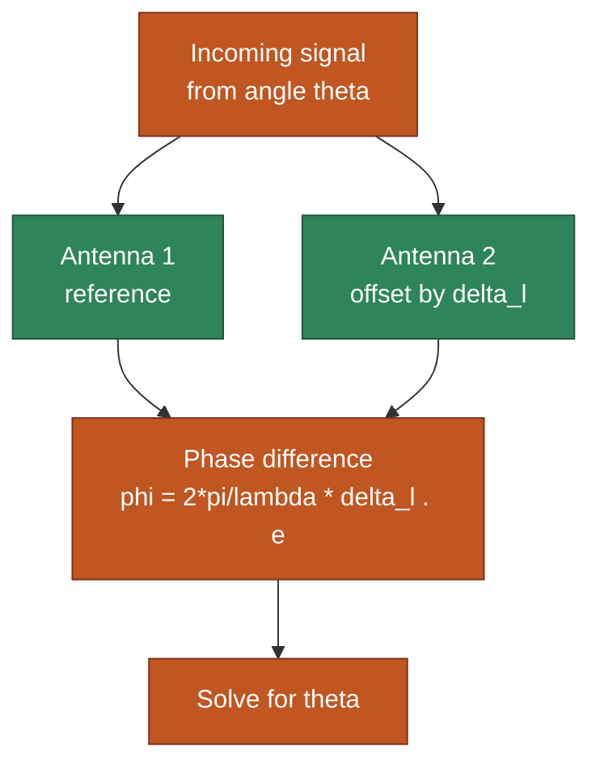
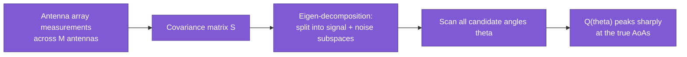
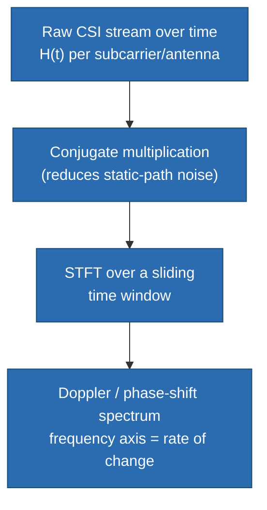
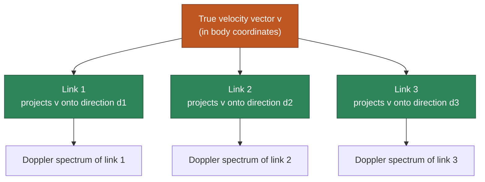

# CSI Feature Extraction

> **TL;DR:** [[ray-tracing-model]] promised distance from ToF and angle from AoA/AoD; [[scattering-model]] promised speed from Doppler. This note is where those promises get cashed in as actual algorithms — plus BVP, a feature that fixes a real weakness in the raw Doppler spectrum.

## 1. Where we left off

Two notes, two "backward" problems set up but not solved:
- [[ray-tracing-model]] §3: *"measure $\tau_n$ and phase-across-antennas from CSI, get distance and angle."* — this note shows **how**.
- [[scattering-model]] §4: solved speed already via the ACF — that algorithm *is* one of this note's features, just covered there because it was inseparable from deriving the scattering model itself.

Everything here operates on CSI: $\mathbf{H} = \{H(f_j)\}$, one complex number per subcarrier, per packet, per antenna, collected over time.

## 2. Time of Flight (ToF) — distance

**The idea:** CIR is literally a plot of "signal strength vs. delay" (from [[CSI-fundamentals]] §3). If you can compute CIR from CSI, the *position* of its strongest peak tells you the ToF of the dominant (usually shortest/LoS) path — and ToF converts directly to distance via $d = c\tau$.

**How to get there:** CSI is a sampled version of $H(f)$ across subcarriers — a frequency-domain object. CIR is its time-domain twin. So: take the **inverse Fourier transform (IFFT)** of the CSI samples across the subcarrier axis, and you're back in the delay domain.

The `naive_tof` function from the tutorial does exactly this: IFFT each packet's CSI, keep only the first half of the result (causality — a real path can't have negative delay, so the second half is a mirror artifact of the FFT), and report the index of the strongest peak, converted from "sample index" to seconds using the bandwidth.

**Why this is only approximate ("naive"):**
- **No Tx/Rx clock synchronization.** Commodity Wi-Fi devices don't share a clock, so there's an unknown constant time offset baked into every measurement — you get *relative* ToF changes reliably, but *absolute* distance has a bias you can't remove without extra calibration (this bias is exactly what [[CSI-sanitization|CSI sanitization]] tackles next: SFO and PDD).
- **Limited bandwidth limits time resolution.** IFFT resolution in the delay domain is inversely proportional to bandwidth — a 20 MHz channel can only resolve delays down to roughly the fraction of a wavelength that 20 MHz allows, which works out to **meter-level ambiguity**. Two paths whose distances differ by less than that can't be told apart.

### 2.1 Why "naive" — unpacking the two limitations

**Reason 1 — no Tx/Rx clock synchronization → the peak's absolute position is offset by an unknown constant.**

To read a *true* physical delay off the IFFT peak, Tx and Rx need to agree on when $t=0$ is — when the signal actually left. Commodity Wi-Fi devices have independent, unsynchronized crystal oscillators, and the Rx's packet-detection logic also takes a small, imprecise amount of time to even recognize "a packet has started." The net effect: the peak sits at $\tau_{true} + \epsilon_t$, not $\tau_{true}$, where $\epsilon_t$ is an unknown, roughly session-constant clock-skew offset. You can't tell, from a single measurement, how much of the peak's position is real propagation delay vs. clock skew. The number still moves correctly when the *real* ToF changes (fine for relative tracking — "did this path get 5cm longer?"), but its absolute value isn't trustworthy as real distance without extra calibration to estimate and subtract $\epsilon_t$. That calibration is exactly what [[CSI-sanitization]] covers next (SFO/PDD removal).

**Reason 2 — limited bandwidth → limited ability to tell two close-together paths apart.**

This is a resolution limit, not a bias — think of it like camera pixel size. A wider-bandwidth signal is effectively a sharper pulse in time, and how sharp that pulse can be is capped by available bandwidth:

$$\Delta\tau_{min} \approx \frac{1}{BW}$$

For a 20 MHz Wi-Fi channel: $\Delta\tau_{min} \approx 1/(20\times10^6) = 50\text{ns} \Rightarrow \Delta d_{min} = c \cdot \Delta\tau_{min} \approx 15\text{ m}$ — the rough distance two paths' lengths must differ by before their peaks separate into two distinct spikes in the IFFT output instead of blurring into one. Real systems do better via interpolation and multiple antennas (hence the paper says "meter-level," not "15-meter-level"), but the core limit holds: **more subcarriers within a fixed bandwidth doesn't buy finer distance resolution — only more bandwidth does.** If the true LoS path and a strong nearby reflection differ in distance by less than this resolution, `naive_tof` can't separate them; it reports one smeared, possibly-biased peak instead of two.

**Why "naive" fits both:** the function performs the textbook-correct operation (IFFT → find peak), but silently assumes away a hardware-synchronization problem (reason 1) and a fundamental sensor-resolution limit (reason 2). Correct in principle, incomplete in practice — exactly what "naive" signals.

## 3. Angle of Arrival / Departure (AoA / AoD) — direction

**The idea:** a single antenna can measure *that* a signal arrived, but not *from which direction*. Add a second antenna a known distance away, and the same path arrives at both antennas with a phase difference — because it traveled a (very slightly) different distance to each one. That phase difference encodes the angle.

$$\phi_{AoA} = \frac{2\pi}{\lambda}\, \boldsymbol{\Delta l} \cdot \boldsymbol{e}$$

where $\boldsymbol{\Delta l}$ is the vector between the two antennas and $\boldsymbol{e} = (\cos\theta, \sin\theta)$ is the unit direction of arrival.

**Simple case — one path, phase-difference algebra:** if you can assume there's only one dominant path (e.g. strong LoS), you can directly solve the equation above for $\theta$ given the measured phase difference. This is what `naive_aoa` in the tutorial does: unwrap the phase across antennas, compute the phase difference, then solve a small nonlinear least-squares problem for the 3D direction vector. Its big limitation is right there in the name — it assumes **one path only** and breaks down the moment multipath is present, which in a real room is almost always.

**Real case — multiple paths, MUSIC algorithm:** MUSIC (MUltiple SIgnal Classification) handles the realistic multipath case. The intuition, without the full derivation:
- Stack the measurements from $M$ antennas into a vector $\boldsymbol{X}$.
- $\boldsymbol{X}$'s covariance matrix $\boldsymbol{S}$ has $M$ eigenvalues/eigenvectors. If there are $D < M$ real incident signals, exactly $D$ of those eigenvalues correspond to actual signal energy, and the remaining $M-D$ correspond to noise.
- This splits the $M$-dimensional space into two orthogonal subspaces: a **signal subspace** and a **noise subspace**.
- A true direction of arrival, projected into the noise subspace, will be (almost) orthogonal to it — i.e. close to zero. MUSIC scans all possible $\theta$ and plots $Q(\theta) = 1/(\boldsymbol{a}^H(\theta)\boldsymbol{E}_N\boldsymbol{E}_N^H\boldsymbol{a}(\theta))$ — this blows up (peaks sharply) exactly at the true AoAs, because that's where the denominator goes to (near) zero.

### 3.1 How MUSIC actually decides "real vs. fake" — orthogonality, not a phase spike

Easy misread: it's tempting to think that after splitting signal/noise subspaces, MUSIC re-examines the measured phase data looking for a spike. It doesn't. The real vs. fake distinction is a **geometric orthogonality test against candidate angles**, done like this:

1. For **every candidate angle** $\theta$ you want to test (a full sweep, not just where a signal was measured), build the **steering vector** $\boldsymbol{a}(\theta)$ — a purely hypothetical pattern answering "if a signal really arrived from $\theta$, what phase differences would it produce across my $M$ antennas?" (this is where the phase-difference formula from §3 lives).
2. Test that hypothetical pattern against the noise subspace already found from the covariance matrix: compute $\boldsymbol{a}^H(\theta)\,\boldsymbol{E}_N\boldsymbol{E}_N^H\,\boldsymbol{a}(\theta)$ — how much of $\boldsymbol{a}(\theta)$ leaks into the noise subspace.
3. The key geometric fact: true signal directions' steering vectors, by construction, span the **signal** subspace — the noise subspace's orthogonal complement. So for a $\theta$ that's a real AoA, $\boldsymbol{a}(\theta)$ is (almost) perfectly orthogonal to the noise subspace → that quantity goes to (near) zero → its reciprocal $Q(\theta)$ **blows up into a sharp peak**. For a $\theta$ that isn't a real direction, $\boldsymbol{a}(\theta)$ has substantial overlap with the noise subspace → the quantity stays large → $Q(\theta)$ stays small/flat.

So "true vs. fake" is decided by **scanning candidate angles and checking geometric orthogonality to the noise subspace**, not by finding a spike in the raw measured phase data — the phase-difference math only enters indirectly, baked into how $\boldsymbol{a}(\theta)$ is constructed for each candidate angle.

**Why this needs $M > D$:** MUSIC requires more antennas than incident paths, because it needs a genuinely nonempty noise subspace to test against — with only $M=2$ antennas and $D \geq 2$ real multipath directions, there's no room left for a noise subspace at all, and MUSIC can't separate them. This is the practical reason commodity CSI hardware with only 3 antennas (Intel 5300) has limited AoA-resolving power in cluttered, multipath-rich rooms.

The same machinery (with a different steering-vector setup) estimates AoD at the transmitter side, and extends from 2D angle to full 3D azimuth+elevation.

## 4. Phase Shift / Doppler Spectrum — movement

**The idea:** ToF and AoA describe *static* geometry (a snapshot). Movement shows up differently: as a **change in phase across consecutive packets**, because a moving object continuously changes the length of the path it's contributing to.

$$\Delta\phi_n(i) = \phi_n(i+1) - \phi_n(i) \implies \Delta d_n(i) = \frac{\Delta\phi_n(i)}{2\pi}\lambda$$

A single phase-difference number is noisy and limited, so in practice this is extended over a sliding window using the **Short-Time Fourier Transform (STFT)** — the same tool you'd use for a spectrogram of an audio signal. Applied to a CSI stream, the STFT reveals a **Doppler spectrum** (also called the phase-shift spectrum): a plot of *how much energy is changing at each rate*, over time.

Different gestures/motions carve out visibly distinct shapes in this time-frequency spectrogram — this is *the* standard input feature for gesture recognition and fall detection, and it's exactly what feeds the CNN/RNN models in [[wireless-sensing-DL|Deep Learning on CSI]] next.

### 4.1 What STFT actually does here — sliding windows, and what the axes mean

**"Consecutive packets" means a sliding window over the packet stream**, not literally continuous time. CSI arrives as a discrete sequence of packets (e.g. sampled at ~1 kHz). Rather than one global FFT over an entire multi-second recording — which would tell you *which* frequencies were present somewhere in the clip but throw away *when* — STFT slides a short window (e.g. 100–500ms) along the packet sequence, computes an FFT of just what's inside that window, then slides forward and repeats. That's the "Short-Time" in Short-Time Fourier Transform: many small, local FFTs instead of one big global one, so the *when* is preserved.

**The tradeoff is the same Fourier uncertainty principle from §2.1, just on the other axis.** There, resolving two close *delays* required wide *frequency span* (bandwidth) — narrow frequency support blurs time resolution. Here it's the mirror image: resolving two close *Doppler frequencies* requires a long *time window* — a short window blurs frequency resolution. Window length is a real design choice: too short and you can't tell two similar-speed motions apart; too long and you blur together motion changes that happened within that window.

**What the spectrogram's axes actually mean:**
- **X-axis (time):** which sliding window this column came from.
- **Y-axis (frequency):** not an arbitrary frequency — specifically a **candidate rate of phase-change-per-second**. This is the *same quantity* as the two-packet phase difference above: $\Delta\phi_n(i)/\Delta t$ is literally a phase-change-per-second measurement, i.e. a frequency. A scatterer moving at roughly constant velocity makes the CSI stream inside a window behave like a signal rotating steadily at some frequency $f_d$ tied to that velocity (same Doppler relationship as [[scattering-model]]).
- **Cell value (color/intensity):** how much energy matched that exact frequency, at that time.

**So is the FFT measuring something different from the two-packet phase difference? No — it's a robust, multi-component generalization of the same idea.** The Fourier transform works by correlating the window's data against a bank of candidate rotating references, one per frequency bin, and reporting how strongly each one matched. Compare the two approaches directly:

| | Two-packet phase difference | STFT over a window |
|---|---|---|
| Samples used | 2 (one pair) | All samples in the window |
| Noise robustness | Low — one bad sample ruins the estimate | High — averaged evidence across many samples |
| Simultaneous motions | Can't represent more than one — different-speed movements blend into one meaningless number | Shows up as separate peaks at their own frequencies (e.g. fast hand + near-stationary torso = two distinct peaks) |
| Output | One noisy scalar | A full spectrum: strength at every candidate rate at once |

Both are measuring the exact same physical thing — rate of phase change, tied to velocity via the Doppler relationship — the STFT just extracts it far more robustly, and can represent multiple simultaneous rates where a single two-point difference structurally cannot.

Note this is the same underlying physics as the [[scattering-model]]'s ACF-based speed estimate (§4 there) — both exploit "moving objects continuously rotate phase at a rate set by their speed." The ACF approach collapses everything to one scalar speed estimate; the STFT/Doppler-spectrum approach keeps a richer time-frequency picture, which is why it's preferred as an ML model input rather than as a single number.

## 5. Body-coordinate Velocity Profile (BVP) — the domain-independence fix

**The problem with the raw Doppler spectrum:** it's specific to the exact geometry of one Tx-Rx link. The *same* gesture, performed at a different location in the room or facing a different direction, projects onto that link's Doppler spectrum completely differently — so a model trained on one location/orientation combination generalizes poorly to another. This is a real, practical failure mode, not a theoretical concern.

**Widar3.0's fix:** instead of using the raw per-link Doppler spectrum as the feature, define a feature in the **person's own body coordinate frame** — independent of where they're standing or which way they're facing relative to any particular link.

The geometric idea: any 2D velocity vector $\vec v = (v_x, v_y)$ around the person's body projects onto each Wi-Fi link's Doppler spectrum at a frequency determined only by the *known, fixed* locations of that link's Tx and Rx (not by the person's position/orientation):

$$f^{(i)}(\vec v) = a_x^{(i)} v_x + a_y^{(i)} v_y$$

Each link "sees" the same underlying velocity vector projected onto a different direction — exactly like light through different colored filters revealing different aspects of the same object.

**Recovering BVP from multiple links:** with $M \geq 2$ links, each giving a different projection of the same underlying velocity distribution, you can set up the inverse problem: given several Doppler spectra (the observations) and the known link geometry (which determines each link's projection direction), solve for the velocity distribution $\boldsymbol{V}$ that would produce them. Because a person's actual velocity components are sparse (only a few directions/speeds are physically present at once, not a continuum), this is solved as a sparse-recovery ($\ell_0$-style) optimization using **compressed sensing**, matching each link's predicted vs. observed spectrum with **Earth Mover's Distance (EMD)** rather than plain Euclidean distance — EMD tolerates the small quantization/bin-mismatch errors and unknown per-link scaling that would otherwise break a naive least-squares fit.

**The payoff:** BVP is a feature that describes *what the person's body is doing*, decoupled from *where they're standing relative to any specific link*. That's what makes it usable as a stable, transferable ML input — precisely the same goal that [[wireless-sensing-DL|adversarial domain adaptation]] attacks from the model side rather than the feature-engineering side. You'll see both approaches to the same problem in the next note.

## 6. Feature summary

| Feature | Model lineage | Algorithm | Recovers | Typical use |
|---|---|---|---|---|
| ToF | [[ray-tracing-model]] | IFFT of CSI across subcarriers, find peak | Distance | Ranging, localization |
| AoA / AoD | [[ray-tracing-model]] | Phase-difference algebra (1 path) or MUSIC (multipath) | Direction | Localization, tracking |
| Doppler / phase-shift spectrum | [[scattering-model]] | STFT over sliding window | Motion, over time | Gesture recognition, fall detection, DL model input |
| BVP | [[scattering-model]] + Widar3.0 | Multi-link projection + compressed sensing (EMD) | Domain-independent motion | Cross-location/orientation gesture recognition |

## Up next

→ [[CSI-sanitization|CSI Sanitization]] — now that you know what ToF/AoA/Doppler actually are, this covers the hardware noise sources that corrupt each of them, and how to remove that noise before trusting these features.

## See also
- [[CSI-fundamentals]]
- [[ray-tracing-model]]
- [[scattering-model]]
