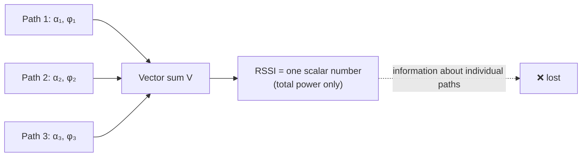
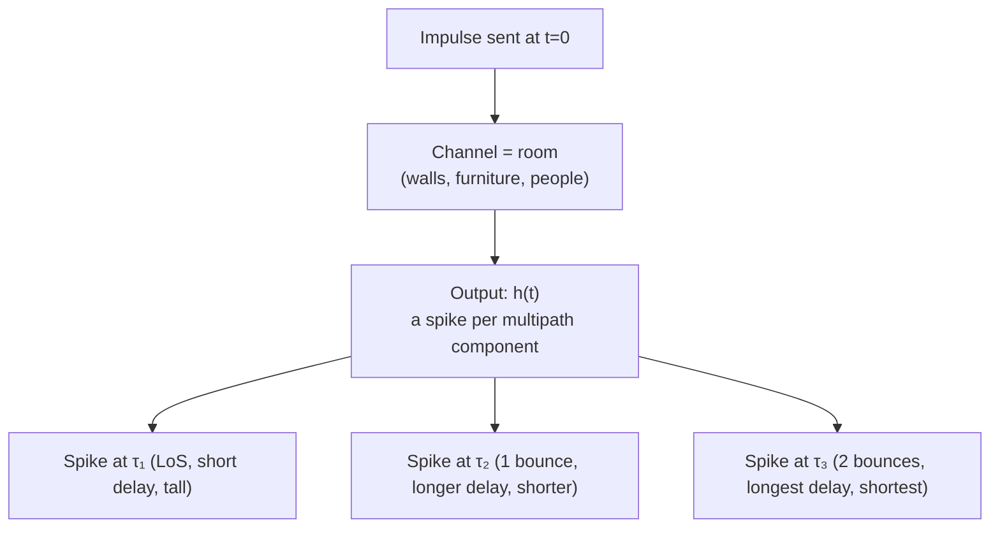
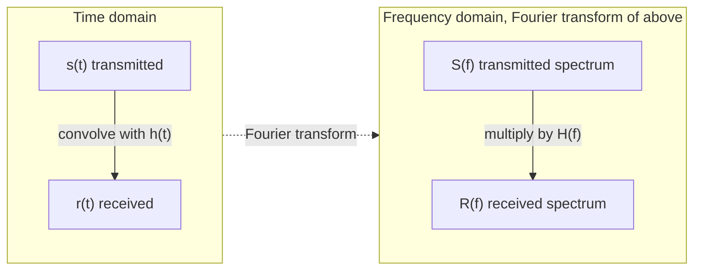
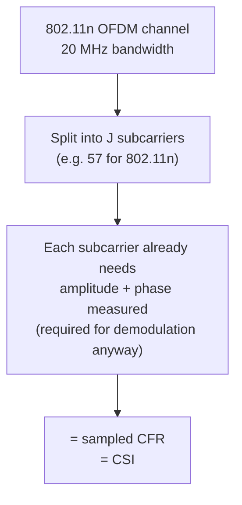
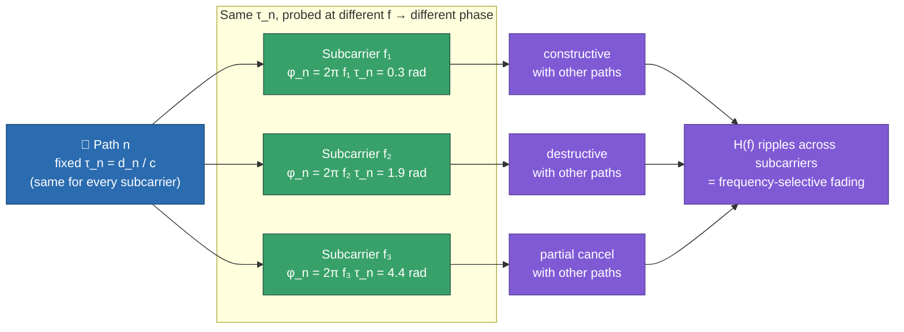
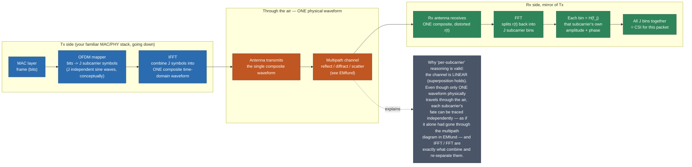

# CSI Fundamentals: RSSI vs CSI, CIR and CFR

> **TL;DR:** RSSI collapses the whole multipath sum into one number (useless for sensing) → OFDM gives us many frequency subcarriers instead of one → CSI is the per-subcarrier complex amplitude+phase, i.e. a sampled version of the channel's frequency response → CIR (time domain) and CFR (frequency domain) are two views of the exact same physical multipath picture from [[EMfund|EM Fundamentals]], related by a Fourier transform.

## 1. Where we left off

From [[EMfund|EM Fundamentals]]: a transmitted sine wave splits into multiple paths (reflect/diffract/scatter), each with its own attenuation $\alpha_n$ and distance-dependent phase $\phi_n$, and the receiver sees the **superposition** of all of them. This note formalizes "the superposition" into something we can actually measure and put numbers on.

## 2. RSSI — the crude, single-number view

The simplest thing a receiver can report is total received power: **RSSI** (Received Signal Strength Indicator).

$$V = \sum_{n=1}^{N} \|V_n\| e^{-j\phi_n}, \qquad \text{RSSI} = 10\log_{2}\left(\|V\|^2\right)$$

RSSI is just "how loud is the sum of everything." The problem: because it's a sum of many complex numbers with different phases, RSSI can swing wildly from **constructive** interference (phases align, signal gets louder) to **destructive** interference (phases cancel, signal gets quieter) — even when nothing in the room has meaningfully changed, and even for a perfectly static link. A tiny change in one multipath component can flip the sign of the sum. RSSI throws away *which* paths contributed what, so it can't distinguish "someone walked into the room" from "random multipath fluctuation." This is why RSSI-based sensing is essentially dead in modern research — it's the equivalent of trying to understand a song by only knowing its total loudness.

## 3. CIR — Channel Impulse Response (time domain)

Instead of collapsing everything to one number, model the **channel itself** (the room, walls, people — everything between Tx and Rx) as a linear filter. If you fed the channel a perfect, infinitely short pulse (an impulse) at time 0, what would come out the other end? You'd see a series of delayed, scaled, phase-shifted copies of that impulse — one per multipath component:

$$h(t) = \sum_{n=1}^{N} \alpha_n e^{-j\phi_n}\, \delta(t - \tau_n)$$

This is called the **Channel Impulse Response (CIR)**. Each term is one path from the multipath diagram in [[EMfund]]: $\tau_n$ is that path's travel time, $\alpha_n$ its complex attenuation (magnitude loss + material-reflection phase), and $\delta(\cdot)$ is the Dirac delta — a spike at exactly $\tau_n$.

CIR literally *is* the multipath picture from [[EMfund]], just written as a formula instead of a diagram — a plot of "signal strength arriving vs. time delay."

## 4. CFR — Channel Frequency Response (frequency domain)

Multipath doesn't just spread the signal in time — because different frequencies pick up different phase shifts over the same distance (recall $\phi_n = 2\pi f \tau_n$ from [[EMfund#2.1 Why do different paths have different phase shifts?]] — phase depends on $f$!), multipath also distorts the signal differently **at each frequency**. This is called **frequency-selective fading**, and it's described by the **Channel Frequency Response (CFR)** — literally the Fourier transform of CIR:

$$H(f) = \mathfrak{F}\{h(t)\}$$

CFR is a complex number at every frequency $f$: it has both a magnitude (how much that frequency is attenuated) and a phase (how much that frequency is shifted). CIR and CFR are two representations of the *same* physical channel — one indexed by delay, one indexed by frequency.

**How the two connect to the actual transmitted/received signal:**

| Domain | Relationship | Meaning |
|---|---|---|
| Time | $r(t) = s(t) \otimes h(t)$ | received = transmitted **convolved** with channel |
| Frequency | $R(f) = S(f)\,H(f)$ | received spectrum = transmitted spectrum **× (multiplied by)** channel response |

Convolution in time becomes plain multiplication in frequency — this is why devices prefer to compute CFR directly rather than CIR: division/multiplication is cheap, deconvolution is expensive. If you want CIR after the fact, you just take the inverse Fourier transform of CFR.

## 5. Where OFDM comes in — from CFR to actual CSI numbers

Here's the bridge from theory to what you actually get from hardware. Wi-Fi standards (802.11a/g/n/ac/ax) use **OFDM** (Orthogonal Frequency Division Multiplexing) — instead of transmitting on one frequency, the channel bandwidth is split into many narrow **subcarriers**. How many you can actually *read out* as CSI is hardware/tool-specific, not just protocol-specific — e.g. the Intel 5300 NIC's CSI tool reports 30 subcarrier groups over 802.11n/20MHz, giving ~57 usable values; other extraction tools expose different counts (see [[CSI-data-collection]]). Each subcarrier is essentially its own mini-frequency-probe of the channel.

This is convenient for us: OFDM receivers, by design, already have to measure the amplitude and phase received on each subcarrier in order to demodulate the data. That per-subcarrier measurement **is** a sampled version of $H(f)$ — i.e., it *is* CFR, just sampled at a finite number of discrete frequency points instead of continuously.

$$H(f_j) = \|H(f_j)\|\, e^{j\angle H(f_j)}, \qquad j \in [1, J]$$

**This sampled CFR — one complex number per subcarrier — is what the wireless sensing literature calls CSI (Channel State Information).** It's not some separate exotic quantity; it's literally "CFR, sampled at the subcarrier frequencies OFDM already gives you for free."

$$\mathbf{H} = \{H(f_j)\ |\ j \in [1, J]\}$$

## 6. Why CSI beats RSSI — putting it together

| | RSSI | CSI |
|---|---|---|
| What it is | One scalar (total power) | Complex value per subcarrier (amplitude + phase) |
| Granularity | Whole-channel sum | Per-frequency (subcarrier-level) |
| Multipath info | Collapsed / lost | Preserved — each subcarrier reacts differently to the same multipath, so you can separate effects |
| Sensitivity | Coarse | Sensitive to sub-wavelength motion via phase (see [[EMfund]] §1) |
| Typical use | Rough signal quality indicator | Localization, tracking, gesture/activity recognition |

CSI gives you, per packet, a small "fingerprint" across frequency — $J$ complex numbers instead of 1. That fingerprint is what every later feature (ToF, AoA, Doppler) and every ML model in this vault will actually consume as input.

## 7. Why $H(f)$ differs per subcarrier — phase, not delay

Easy trap: it's tempting to think each subcarrier experiences a *different delay*. It doesn't. Each multipath component's delay $\tau_n = d_n/c$ is a pure function of path length and the speed of light — air is non-dispersive at Wi-Fi frequencies, so $c$ (and therefore $\tau_n$) is identical regardless of which subcarrier you ask about. The room's geometry doesn't know which subcarrier you're measuring.

What *does* change per subcarrier is the **phase that the same delay produces**, since phase is a function of both delay and frequency:

$$\phi_n(f) = 2\pi f \tau_n$$

Plug in a different $f$ (different subcarrier) with the *same* $\tau_n$, and you get a different $\phi_n$. Summed over all paths:

$$H(f) = \sum_{n=1}^{N} \alpha_n\, e^{-j 2\pi f \tau_n}$$

At one subcarrier frequency, several paths might land in phase and add constructively; at a neighboring subcarrier a few hundred kHz away, those same paths (same $\tau_n$'s, unchanged) can partially cancel — because the phase ruler ($f$) shifted, not the paths. This ripple across subcarriers is **frequency-selective fading**, and it's why $H(f)$ is genuinely frequency-specific despite describing one fixed physical channel.

**Bonus intuition:** a channel with widely spread-out delays (big, reflective room) makes $H(f)$ swing rapidly subcarrier-to-subcarrier. A channel dominated by one clean LoS path (small delay spread) makes $H(f)$ nearly flat across subcarriers. So the *shape* of CSI across the subcarrier axis itself encodes something about the room's delay spread.

## 8. A packet's journey — from bits to CSI

You already know the top of this stack (Application down to MAC/IP). Here's what happens once a Wi-Fi frame leaves the MAC layer and hits the PHY, told as one continuous journey down to the air and back up.

1. **MAC layer** hands the PHY a frame (bits) to send.
2. **PHY / OFDM modulation (Tx):** the bits are split across $J$ subcarriers, each subcarrier assigned its own complex data symbol (e.g. QAM). Conceptually you now have $J$ independent sine waves, one per subcarrier frequency, each carrying a piece of the data.
3. **IFFT:** rather than transmitting $J$ separate sine waves, the Tx combines them into a single composite time-domain waveform using an Inverse FFT. This composite waveform is what actually leaves the antenna — physically it's *one* signal, not $J$ separate ones.
4. **Through the air:** this single composite waveform is what experiences multipath — reflection, diffraction, scattering (from `EMfund`). It doesn't split apart into per-subcarrier copies flying through the room separately; there's one waveform, bouncing around as one.
5. **Why you can still reason "per subcarrier" anyway:** the propagation channel is a **linear system** (superposition holds for EM waves in this regime). Linearity means: the fate of a sum of signals equals the sum of the fates of each signal individually. So even though the *actual* transmitted thing is one composite waveform, you're mathematically allowed to trace each subcarrier's sine wave through the multipath channel *independently*, exactly like the ray-diagram picture in `EMfund` — as if it had been sent alone. Each subcarrier's sine wave picks up its own $\phi_n(f)$ per path (§7 above) and its own multipath superposition, then all $J$ of these independently-superimposed results are simply present together inside the one composite waveform that arrives at Rx.
6. **At the Rx antenna:** the composite received waveform $r(t)$ arrives — the same multipath-distorted single signal.
7. **FFT (Rx):** the receiver runs an FFT on the received composite waveform, which — thanks to that same linearity — cleanly separates it back into $J$ subcarrier bins. Each bin's complex value is exactly $H(f_j)$: that subcarrier's *own* accumulated amplitude/phase distortion from the multipath channel.
8. **CSI:** the full set of these $J$ complex bin values, one packet's worth, is the CSI record — $\mathbf{H} = \{H(f_j) \mid j \in [1,J]\}$ — which is what sensing algorithms actually consume.

So your instinct was right in spirit: each subcarrier effectively "has its own sine wave that superimposes independently at the Rx" — that's *true*, but only *because* linearity lets you decompose the one real, physical composite waveform into independent per-frequency stories. Physically only one waveform ever travels through the air; per-subcarrier superposition is the mathematically valid lens (via Fourier/linearity) for understanding what happens to that one waveform.

## Up next

→ [[ray-tracing-model|Ray-tracing Model]] — the first of the two formal ways to turn CSI back into geometric information (distance, angle) about the room.

## See also
- [[EMfund]]
- [[scattering-model]]
- [[CSI-sanitization]]
