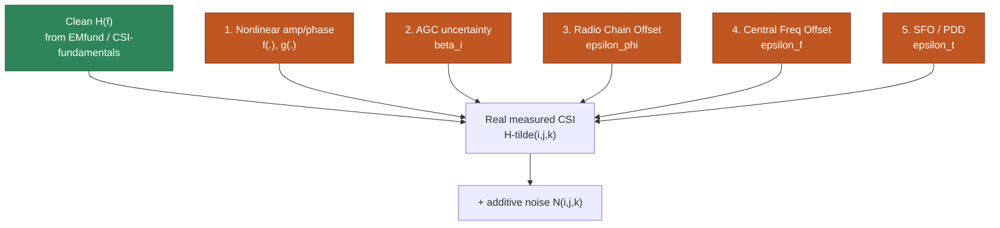
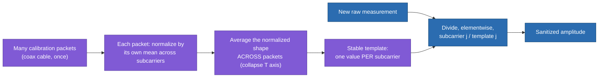
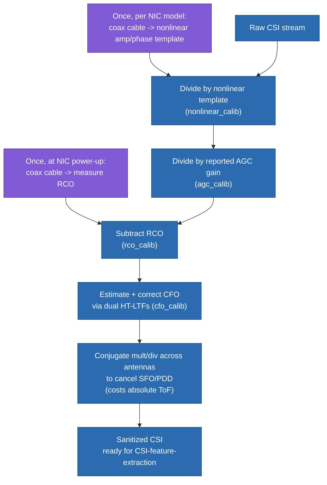

# CSI Sanitization

> **TL;DR:** everything in [[CSI-fundamentals]], [[ray-tracing-model]], [[scattering-model]], and [[CSI-feature-extraction]] assumed you measure $H(f)$ cleanly. Real commodity Wi-Fi hardware doesn't — five distinct hardware imperfections corrupt amplitude and/or phase before you ever see the data. This note is "here's what's actually wrong with your CSI, and how much of it you can fix."

## 1. Where we left off

[[CSI-feature-extraction]] kept flagging this gap without fully explaining it: `naive_tof`'s absolute distance was untrustworthy (§2.1, reason 1 — clock sync), `naive_aoa` needed a mysterious `est_rco` correction term passed in, and the paper's raw amplitude/phase curves looked messier than the clean sinusoids from [[EMfund]]. This note is where those loose ends get resolved.

The clean physics model was:

$$H(f) = \sum_{n=1}^N \alpha_n e^{-j\phi_n}$$

The **actual** measured CSI, once every hardware error is folded in, looks like this instead:

$$\tilde H(i,j,k) = \sum_{n=1}^N \beta_i\, f(\alpha_n)\, e^{-jg(\phi_n(i,j,k))} + N(i,j,k)$$
$$\tilde\phi_n(i,j,k) = 2\pi(f_c + \Delta f_j + f_D + \epsilon_f)(\tau_n(i,j,k) + \epsilon_t) + \epsilon_\phi$$

where $i$ indexes the packet, $j$ the subcarrier, $k$ the antenna. Five distinct error sources are hiding in those two equations — this note takes them apart one at a time.



## 2. Nonlinear amplitude and phase — a fixed, per-NIC-type distortion

**Cause:** imperfect analog filters inside the transceiver hardware. In theory, every subcarrier should get equal gain (flat amplitude curve) and a perfectly straight, linearly-increasing phase curve across subcarriers. In practice, even measuring through a direct coaxial cable (no radio channel at all — the cleanest possible test), the amplitude curve comes out **M-shaped** and the phase curve comes out **S-shaped**, purely from hardware imperfection.

$$\tilde H(i,j,k) = \sum_n f(\alpha_n)\, e^{-jg(\phi_n(i,j,k))} + N(i,j,k)$$

**Key experimental facts that make this fixable:**
- For a *given NIC model*, this nonlinear distortion is fixed and repeatable — measure it once, reuse forever for that hardware.
- The *middle* subcarriers are largely free of nonlinearity; the distortion mainly shows up toward the edges of the band.

**Fix — build a calibration template once:** connect Tx and Rx directly with a coaxial cable of known length (removing all real multipath), record CSI, then:
1. Normalize the amplitude curve → **amplitude template**.
2. Unwrap the phase, linear-fit the clean middle subcarriers, subtract that fit from the full curve → whatever's left over is the **nonlinear phase template**.

Later, any real CSI measurement gets divided by this template (`nonlinear_calib` in the tutorial code) — dividing by a normalized amplitude template cancels amplitude nonlinearity, and subtracting a phase template cancels phase nonlinearity.

### 2.1 The mechanism, concretely — not neighbor-differencing, per-subcarrier division against a fixed template

Easy misread: it's tempting to think this correction works by comparing *neighboring* subcarriers (e.g. subcarrier 1 vs. subcarrier 2). It doesn't. The nonlinearity is a **fixed, subcarrier-specific** distortion — subcarrier #5 always picks up exactly the same amplitude/phase error on that hardware, completely independent of what's happening at subcarrier #4 or #6. So there's no "rate of change" being exploited; each subcarrier is corrected **independently against its own known reference value**, obtained once from prior calibration.

**Stage 1 — build the template (once, offline, coax cable):**
1. Collect many calibration packets through a direct cable (no real multipath).
2. For *each individual packet*, normalize its amplitude curve by dividing by *that packet's own* mean amplitude across subcarriers — strips out per-packet overall scale, leaving only the relative per-subcarrier "wiggle" shape.
3. **Average that normalized shape across all calibration packets** (collapsing the packet/time axis, keeping the subcarrier axis fully intact) → one stable amplitude value *per subcarrier*. (Phase works the same way conceptually, except the per-packet step is "subtract the best-fit straight line through the clean middle subcarriers" rather than "divide by the mean" — see §2's derivation.)

**Stage 2 — apply the template to real data (every time, ongoing):**
4. For each new raw measurement, correct **per subcarrier, elementwise**:

$$\text{corrected}(j) = \frac{\text{raw measurement}(j)}{\text{template}(j)}$$

Subcarrier 5's raw value only ever divides by subcarrier 5's template value — never compared to a neighboring subcarrier.

Toy numeric example (illustrative, not real measurements):

| Subcarrier $j$ | Raw amplitude | Template (known NIC error, from Stage 1) | Corrected |
|---|---|---|---|
| 1 | 0.97 | 0.95 | 0.97 / 0.95 ≈ 1.021 |
| 2 | 1.10 | 1.08 | 1.10 / 1.08 ≈ 1.019 |
| 3 | 0.99 | 0.97 | 0.99 / 0.97 ≈ 1.021 |

Each row is corrected purely against its own column-matched template value — no differencing between rows (subcarriers).



## 3. Automatic Gain Control (AGC) uncertainty — a random per-packet volume knob

**Cause:** AGC is a receiver feature that automatically adjusts input gain so weak and strong signals both land in a good range for the ADC — necessary for normal Wi-Fi operation, but it means each *packet* gets its own, unpredictable gain multiplier $\beta_i$:

$$\tilde H(i,j,k) = \beta_i \sum_n \alpha_n e^{-j\phi_n(i,j,k)} + N(i,j,k)$$

This is pure amplitude corruption (no phase impact) but it's *per-packet random*, so comparing amplitude across packets is meaningless until removed.

**Fix — two options:** (1) disable AGC in the driver if possible, or (2) most NICs report the AGC gain they applied alongside the CSI — just divide the measured CSI by that reported gain (`agc_calib`).

## 4. Radio Chain Offset (RCO) — a per-antenna phase bias, fixed after power-up

**Cause:** each Tx/Rx antenna pair ("radio chain") has its own analog circuitry, introducing a random phase offset $\epsilon_\phi$ between chains. Crucially, this offset is **reset every time the NIC powers on**, but stays *constant* for the rest of that session:

$$\tilde\phi_n(i,j,k) = 2\pi(f_c+\Delta f_j+f_D)\tau_n(i,j,k) + \epsilon_\phi$$

**Why this one matters most for [[CSI-feature-extraction]]:** RCO directly biases the *phase difference between antennas* — and phase-difference-across-antennas is exactly what AoA/AoD estimation (§3 there) is built on. Recall `naive_aoa` took an `est_rco` argument — this is exactly what that was for. Without removing RCO, an AoA estimate is systematically wrong by a fixed angular bias, not just noisy.

**Fix:** once, right after power-up, connect Tx and Rx with a known-length coaxial cable and record the phase — this reveals the constant per-antenna offset (`rco_calib`). Subtract this measured offset from every subsequent phase reading for the rest of the session.

## 5. Central Frequency Offset (CFO) — a within-packet frequency drift

**Cause:** the Tx and Rx crystal oscillators aren't perfectly matched in frequency, causing a small residual frequency error $\epsilon_f$:

$$\tilde\phi_n(i,j,k) = 2\pi(f_c+\Delta f_j+f_D+\epsilon_f)\,\tau_n(i,j,k) = \phi_n(i,j,k) + \epsilon_f \tau_n(i,j,k)$$

This shows up as an overall *bias/drift* on the phase-frequency curve — effectively an unwanted up-and-down shift.

**Fix — exploit a built-in protocol feature:** 802.11 packets include multiple **HT-LTFs** (training fields used for channel estimation) within a single PPDU, spaced a strictly-controlled $\Delta t = 4\mu s$ apart. Since you know exactly how much time separates two HT-LTF measurements, the phase *difference* between them, divided by that known $\Delta t$, directly reveals $\epsilon_f$ (`cfo_calib`) — no external cable calibration needed, this one's self-contained within each packet.

## 6. Sampling Frequency Offset (SFO) & Packet Detection Delay (PDD) — the one you can't fully fix

**Cause:** two different physical effects that end up looking identical in the phase-frequency curve, so they're usually treated as one combined "time offset" $\epsilon_t$:
- **SFO** — a frequency-domain error from clock mismatch, equivalent to an apparent time shift.
- **PDD** — a genuine time delay: the Rx's packet-detection algorithm takes a small, imprecise amount of time to even recognize "a packet has started."

### 6.1 In plain terms — no formulas

**SFO:** the Tx and Rx have separate clocks, and those clocks never tick at exactly the same rate — always off by a tiny bit. Over the course of receiving a packet, that mismatch adds up and looks exactly like the signal took a bit longer (or shorter) to arrive than it really did. It's not a real delay from anything physical — it's an illusion of delay created purely by clock mismatch.

**PDD:** the receiver doesn't instantly know "a packet has arrived" the moment it actually does. Its detection logic takes a small, slightly inconsistent amount of time to notice and start measuring — so whatever it thinks is "time zero" is a bit later than the real start, and that lag varies a little packet to packet.

**Why they're lumped together:** both do the exact same thing to a measurement — quietly shift where "time zero" is assumed to be — so even though the causes differ (clock-speed mismatch vs. detection-timing glitch), the data can't tell them apart.

**The key intuition to hold onto:** this isn't an error *in* the signal — the room, the paths, the real propagation delay are all fine. The error is entirely about *where you think the stopwatch starts*. If that reference point is off by a little, every delay measured *from* it inherits the same offset — a perfectly correct measurement, taken against a slightly wrong starting point, produces a result that looks wrong even though nothing physical actually changed. It's a bookkeeping error, not a physical one — but since there's no independent way to know where the *true* t=0 was, it's indistinguishable from a real error in the data you actually get. This is also why it resists the clean calibration-template trick from §2: it's not a fixed, repeatable pattern per subcarrier that you can measure once — it shifts around per packet.

$$\tilde\phi_n(i,j,k) = 2\pi(f_c+\Delta f_j+f_D)(\tau_n(i,j,k)+\epsilon_t) = \phi_n(i,j,k) + 2\pi(f_c+\Delta f_j+f_D)\epsilon_t$$

**This is exactly [[CSI-feature-extraction#2.1 Why "naive" — unpacking the two limitations|reason 1 for why `naive_tof` was "naive"]]** — $\epsilon_t$ is precisely the clock-offset bias discussed there. This error is especially dangerous because it looks like a **change in slope** of the phase-frequency curve — which is exactly the signature real ToF differences produce too. That's why it's so damaging: it doesn't just add noise, it masquerades as legitimate ranging information.

**Fix — and its real cost:** there is no clean calibration-template trick here (unlike §2's coax-cable approach). The only available techniques are **conjugate multiplication or division across antennas** — for antenna pairs on the same NIC (which share the same clock, hence the same $\epsilon_t$), multiplying one antenna's CSI by another's complex conjugate (or dividing one by the other) makes the common $\epsilon_t$ term cancel out algebraically.

```matlab
% conjugate division: antenna a divided by the next antenna a_nxt
csi_remove_sto(:,:,a,:) = csi_src(:,:,a,:) ./ csi_src(:,:,a_nxt,:);
```

**The catch:** this cancellation only works because $\epsilon_t$ is *shared* across antennas on the same device — but the trick necessarily destroys the ability to recover **absolute** ToF, since you've mathematically thrown away the very term that carried the true propagation delay along with the error. You trade absolute distance for a clean, consistent measurement across antennas — which is exactly what feature-extraction methods that only need *relative* changes (AoA phase differences, Doppler over time) can tolerate, but absolute ranging (recovering a literal "10 meters") cannot fully escape.

## 7. Putting it together — the sanitization pipeline



## 8. Summary table

| Error | Domain corrupted | Behavior | Fixable? | Cost |
|---|---|---|---|---|
| Nonlinear amp/phase | Both | Fixed, repeatable per NIC model | Fully — one-time template | None once calibrated |
| AGC uncertainty ($\beta_i$) | Amplitude | Random per packet | Fully — disable AGC or divide by reported gain | None |
| RCO ($\epsilon_\phi$) | Phase (per antenna) | Random at power-up, then constant | Fully — one-time coax calibration per session | None once calibrated |
| CFO ($\epsilon_f$) | Phase (drift with $f$) | Per-packet, from clock mismatch | Fully — self-contained, dual HT-LTFs | None |
| SFO/PDD ($\epsilon_t$) | Phase (slope change, mimics ToF) | Per-packet, from clock + detection timing | Only partially — conjugate trick removes it but destroys absolute ToF | Lose absolute ranging capability |

**The one honest takeaway:** four of these five errors are fully fixable with one-time or per-packet calibration. The fifth (SFO/PDD) is the reason absolute distance from commodity Wi-Fi CSI is fundamentally hard — you can get clean, consistent *relative* measurements, but true "how many meters away" requires giving up something (the antenna-conjugate trick) or living with a real, calibration-resistant bias.

## Up next

→ [[wireless-sensing-DL|Deep Learning on CSI]] — now that CSI is understood, extractable, and sanitized, this is the final piece: how CNNs, RNNs, adversarial learning, and complex-valued networks actually consume this data for real sensing tasks.

## See also
- [[CSI-fundamentals]]
- [[CSI-feature-extraction]]
- [[CARM-CFR-power-model]] — a different philosophy for the same problem: work in the power domain instead of correcting phase error-by-error
