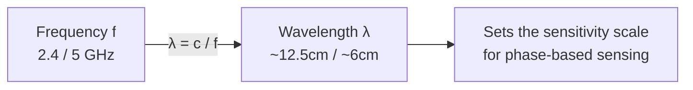
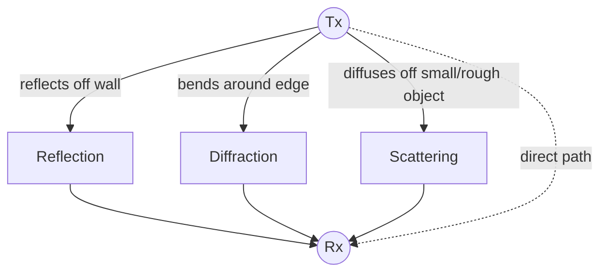
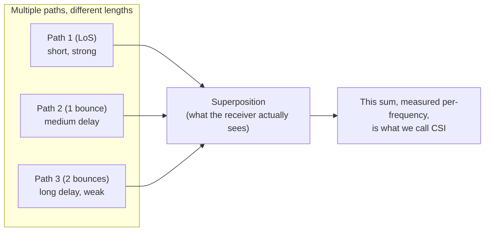
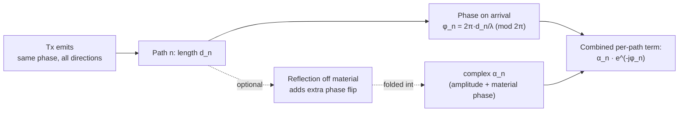
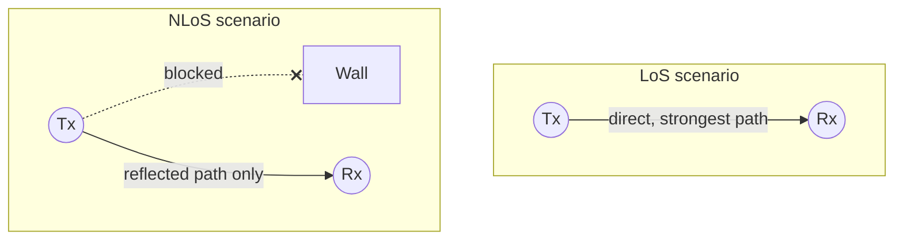

# Electromagnetic Fundamentals for Wireless Sensing

> **TL;DR:** waves → multipath (reflect/diffract/scatter) → superposition at Rx → amplitude loss + distance-dependent phase per path → why frequency/wavelength choice matters → why blocked LoS doesn't kill sensing.

> Ground floor of the whole stack. Everything else — CSI, ray-tracing models, scattering models, feature extraction — is built on top of the idea that **radio waves are physical objects that bounce, bend, and scatter off things in a room**, and the receiver sees the sum of all that bouncing.

## 1. What a radio wave actually is

A Wi-Fi signal is an **electromagnetic (EM) wave** — the same physical phenomenon as visible light, just at a much lower frequency. An EM wave is a coupled oscillation of electric and magnetic fields that propagates through space at the speed of light $c \approx 3\times10^8$ m/s.

Two numbers describe it:

- **Frequency ($f$)**: how many oscillations per second (Hz). Wi-Fi operates around **2.4 GHz** and **5 GHz** — that's 2.4 billion / 5 billion oscillations per second.
- **Wavelength ($\lambda$)**: the physical distance the wave travels in one oscillation.

They're linked by the wave equation:

$$\lambda = \frac{c}{f}$$

At 2.4 GHz, $\lambda \approx 12.5$ cm. At 5 GHz, $\lambda \approx 6$ cm.

**Why this number matters for sensing:** wavelength sets the sensitivity scale. A phase measurement is only meaningful relative to $\lambda$ — a hand moving 3 cm at 5 GHz shifts the phase by roughly half a wavelength, which is a *huge*, easily detectable change. This is the entire reason CSI phase can detect millimeter-to-centimeter scale motion (breathing, gestures) even though you can't see it with RSSI. Compare this to your networking background: at the MAC/IP layer you never care about wavelength — it's invisible below the PHY. Sensing lives *inside* the PHY layer, at the level your OSI-stack knowledge normally stops before reaching.

## 2. Why radio waves don't just travel in a straight line

If Wi-Fi signals only went straight from transmitter (Tx) to receiver (Rx), sensing would be impossible — the signal would carry zero information about the room. What makes sensing *possible at all* is that EM waves interact with physical objects in three ways during propagation:

| Phenomenon | What happens | Everyday intuition |
|---|---|---|
| **Reflection** | Wave bounces off a large, smooth surface (wall, floor, furniture) at an angle | Light bouncing off a mirror |
| **Diffraction** | Wave bends around edges/corners of an obstacle | Sound of someone talking heard around a corner even with no direct line of sight |
| **Scattering** | Wave hits a small or irregular object and diffuses in many directions | Light through fog — no clean bounce, just diffusion everywhere |

Because of this, a signal leaving the Tx arrives at the Rx via **many different paths simultaneously** — this is called **multipath propagation**. Each path has:

- a different **length** → different time delay
- a different **attenuation** (signal loss, from distance and from bouncing off lossy materials)
- a different **phase shift** (because phase depends on exactly how many wavelengths of distance were traveled)

The receiver doesn't see these paths separately — it sees their **sum**, a single superimposed waveform. This superposition is what CSI actually measures, and it's why a change anywhere in the room (a person moving their arm) perturbs the received signal in a measurable way, even though the person never touches the Tx or Rx.

### 2.1 Why do different paths have different phase shifts?

Quick clarification worth internalizing, since it's easy to mistake for something it isn't: the phase difference between paths is **not** the Tx emitting a different starting phase in different directions. Assuming a reasonably isotropic antenna, the Tx emits the *same* phase in every direction at any given instant.

What actually happens is a pure **distance / time-of-flight effect**. A sine wave has no markers on it — its phase at any point in space is just *where in the cycle you are*, and that's set entirely by how far you've traveled from the source. Since $\lambda$ stays fixed, phase accumulates at a constant rate of $2\pi$ radians per wavelength traveled:

$$\phi(d) = -2\pi \frac{d}{\lambda} \pmod{2\pi}$$

Each multipath component travels a different path length $d_n$ (equivalently, a different travel time $\tau_n = d_n / c$). Because $\lambda$ never changes, arriving after traveling 3.2 wavelengths vs. 3.7 wavelengths lands you at a different point in the cycle — a different phase. This is exactly the term $e^{-j\phi_n}$ in the CIR equation, with:

$$\phi_n = 2\pi f \tau_n = 2\pi \frac{d_n}{\lambda}$$

So "phase shift" and "time-of-flight" aren't two separate effects here — phase is literally how propagation delay shows up when the only thing you have to measure it with is a periodic waveform. (This is also *why* absolute ToF from phase alone is ambiguous beyond $\pm\lambda$: only the fractional part of $d_n/\lambda$ survives, so you can't distinguish 3.2 wavelengths of travel from 4.2 wavelengths by phase alone.)

**A secondary, smaller effect:** reflecting off a real surface (not vacuum) can itself introduce an abrupt phase flip depending on the material's reflection coefficient (e.g., reflecting off a denser medium can add a $\pi$ phase shift), independent of path length. This is folded into the complex attenuation term $\alpha_n$ — so $\alpha_n$ carries *material-induced* amplitude/phase change, while $e^{-j\phi_n}$ carries *distance-induced* phase change. Distance is the dominant, always-present effect; the reflection-coefficient phase is a secondary correction on top.

## 3. Line-of-Sight (LoS) vs Non-Line-of-Sight (NLoS)

- **LoS**: an unobstructed straight path exists between Tx and Rx. This path is usually the strongest and fastest-arriving component.
- **NLoS**: no direct path exists (blocked by a wall, or Tx/Rx in different rooms) — the receiver relies entirely on reflected/diffracted/scattered paths.

Wireless sensing is remarkable precisely because it still works in NLoS conditions — a camera is useless if blocked by a wall, but Wi-Fi signals diffract around corners and still carry usable information (recall the tutorial's fall-detection experiment: the volunteer was in a different room from the Wi-Fi link, and the system still recovered the fall speed accurately from NLoS multipath).

## 4. Why this matters going forward

Every later concept is a formalization of what's on this page:

- **CIR / CFR** (next note) is the mathematical way of writing "the sum of all these delayed, attenuated, phase-shifted paths" — first in time domain (CIR), then frequency domain (CFR).
- The **ray-tracing model** treats each path in the diagram above as a discrete, countable thing you can solve for (distance, angle).
- The **scattering model** gives up on tracking individual paths and instead treats the room statistically — appropriate when there are *too many* scatterers to count individually (a furnished room).
- **CSI sanitization** exists because real hardware doesn't measure this physics perfectly — before you can use the math above, you have to strip out hardware-induced noise.

## Up next

→ [[CSI-fundamentals|CSI Fundamentals: RSSI vs CSI, CIR and CFR]]

## See also
- [[wireless-sensing-overview]]
- [[ray-tracing-model]]
- [[scattering-model]]
