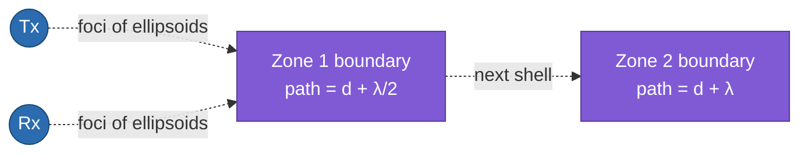

# Fresnel Zone Model

> **TL;DR:** [[ray-tracing-model]] needs few, countable paths; [[scattering-model]] gives up on paths entirely and recovers only aggregate speed. The Fresnel zone model is a third option: a geometric construction — concentric ellipsoids around Tx/Rx — that predicts *where* in a room a moving object produces the strongest, most regular CSI signature, without tracing individual rays or going fully statistical. It's the dominant model behind fine-grained tasks like respiration sensing.

## 1. Where this fits among the three CSI models

| | [[ray-tracing-model]] | [[scattering-model]] | Fresnel zone model |
|---|---|---|---|
| Core object | Discrete, traceable rays | Statistical ensemble of scatterers | Geometric zones (ellipsoids) around Tx/Rx |
| Recovers | Exact distance/angle | Aggregate speed | Location-within-zone, fine motion amplitude |
| Best suited to | Sparse, few dominant paths | Cluttered, rich-scattering, NLoS | Small, quasi-periodic motion (chest wall, finger) near a known Tx-Rx pair |
| Typical application | Localization, tracking | Intrusion/fall detection | Respiration, fine gesture/finger tracking |

All three answer "how do I turn CSI back into something physical?" — they just pick different physical structure to exploit.

## 2. The core construction: ellipsoids with Tx and Rx as foci

A **Fresnel zone** is one of a set of concentric ellipsoids defined by a simple rule: for zone $n$, the *total* path length from Tx → a point on the ellipsoid → Rx is exactly $n$ half-wavelengths longer than the direct Tx-Rx path length $d$:

$$d_n = d + n\frac{\lambda}{2}, \qquad n = 1, 2, 3, \dots$$

Tx and Rx sit at the two foci. Each successive ellipsoid is a shell where any reflecting/scattering point produces a reflected path exactly $n$ half-wavelengths longer than direct — which, from [[EMfund]]'s phase-vs-distance relationship, means the reflected path arrives at a *specific, predictable phase offset* relative to the direct path.

**Why this matters for sensing:** as an object moves and crosses from one zone into the next, the reflected path length changes by $\lambda/2$ — flipping the reflected signal from constructive to destructive interference (or vice versa) with the direct/static path. This produces a **predictable, boundary-crossing signature** in the received amplitude — a clean alternating pattern, not an arbitrary wiggle. Critically, **the center of a zone is the point of maximum sensitivity to motion** — a small displacement there produces the largest phase change per unit distance moved, because you're at the steepest part of the interference pattern.

## 3. Two named variants

The model-based sensing literature splits this into two related formulations, applied to different signal quantities:

- **Fresnel Penetration Model (FPM):** works on the **phase difference between subcarrier pairs** rather than raw amplitude — used to recover *location* (which zone, and where within it) from that phase-difference pattern.
- **Fresnel Diffraction Model (FDM):** works on **diffraction gain** — the amplitude change caused by an object partially blocking/grazing the Fresnel zone boundary — used to detect *movement* (motion crossing a zone edge) rather than exact position.

Both are reformulations of the same ellipsoid geometry, just reading off a different measurable quantity (phase-difference vs. amplitude/diffraction-gain) depending on whether the goal is localization or motion detection.

## 4. Why it's the go-to model for respiration and fine gesture sensing

Chest-wall displacement during breathing is small (millimeters) and quasi-periodic — exactly the regime where ray-tracing's "count the paths" assumption is irrelevant (there's no meaningful new *path* being created) and the scattering model's "aggregate speed" framing is too coarse (breathing isn't a bulk translational speed in the same sense as a footstep or a fall). The Fresnel zone model instead asks a much more specific, useful question for this regime: *is the chest positioned at a zone center (best sensitivity) or a zone boundary, and how does its small oscillation perturb the interference pattern there?* This geometric framing is what lets systems in this family report sub-breath-per-minute error rates — a much finer-grained claim than ray-tracing's meter-level ToF resolution or scattering's single aggregate-speed number.

The same "small motion near a zone" logic extends to **fine gesture/finger tracking** — a finger moving centimeters near a device produces a strong, trackable Fresnel-zone-crossing pattern even though it's far too small a motion for ray-tracing or scattering-model treatment.

## 5. Limitations

- **Requires knowing (or estimating) the zone geometry** — i.e., an approximate sense of where the target sits relative to Tx/Rx, since sensitivity varies sharply between zone-center and zone-boundary. A target positioned unluckily (at a boundary, where the constructive/destructive transition is least informative, or if the true position estimate is off) degrades performance.
- **Best suited to a single dominant reflector near a known position** — like ray-tracing, it assumes the region of interest isn't swamped by many overlapping uncontrolled reflectors; a rich-scattering room can blur the clean zone-crossing signature the same way it blurs ray-tracing's discrete spikes.
- Like the other two models, it's a *modeling choice* about which physical structure to exploit — not a universally superior method. Pick ray-tracing for sparse-path localization, scattering for cluttered-environment aggregate motion, and Fresnel zones for small, near-field, quasi-periodic motion where sub-wavelength sensitivity matters most.

## See also
- [[EMfund]]
- [[ray-tracing-model]]
- [[scattering-model]]
- [[CSI-feature-extraction]]
