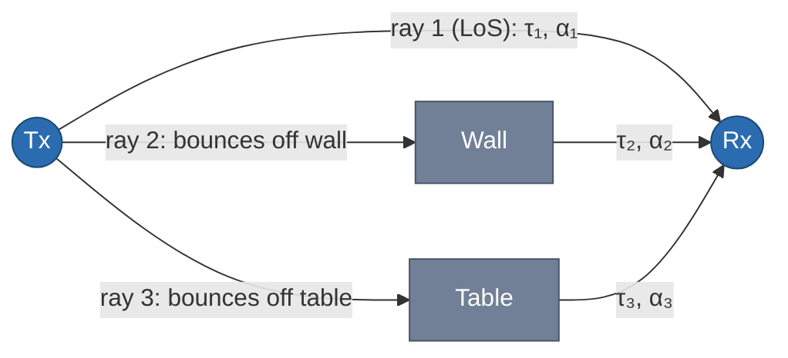
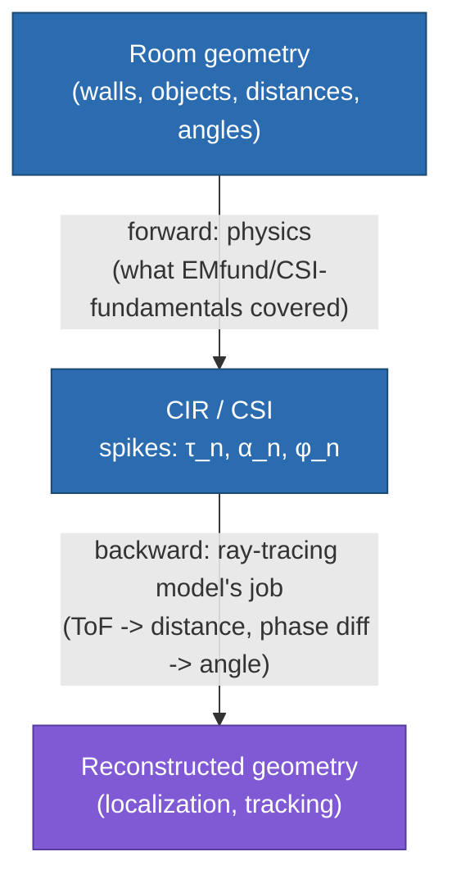
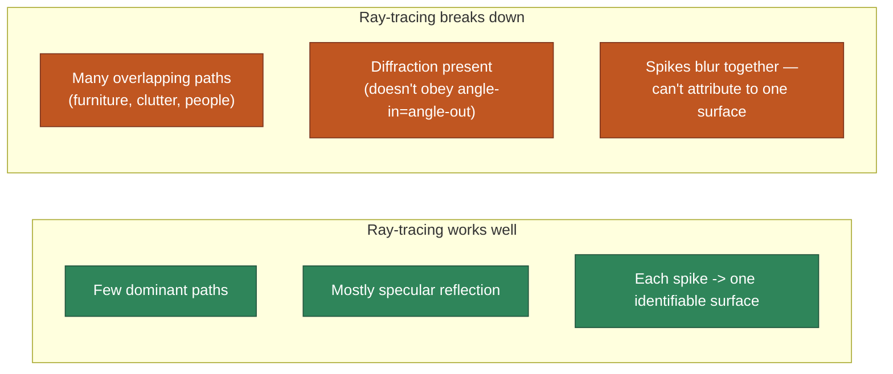

# Ray-tracing Model

> **TL;DR:** treat each multipath component in CIR as a real, traceable geometric ray (like a light ray bouncing off a mirror) → each ray's delay $\tau_n$ and phase give you distance, and phase differences across antennas give you angle → this lets you go *backwards* from CSI to actual room geometry → but it only works cleanly when paths are few, discrete, and countable — it breaks down in cluttered, rich-scattering rooms.

## 1. Where we left off

[[CSI-fundamentals]] gave you the math object: CIR, $h(t) = \sum_n \alpha_n e^{-j\phi_n}\delta(t-\tau_n)$ — a train of spikes, one per multipath component, each with its own delay and complex attenuation. That note treated it purely as signal processing: "here's how to measure the channel." This note asks the next question: **can we go the other way?** Given a measured $h(t)$ (or its frequency-domain twin $H(f)$, i.e. CSI), can we reconstruct *where things are* in the room?

The **ray-tracing model** is one specific assumption you can make to answer "yes" — and it's the same assumption used in the CAD/graphics sense of "ray tracing," just applied to radio instead of light.

## 2. The core assumption: rays are traceable geometric objects

Ray-tracing treats the room the same way geometric optics treats a mirror-filled room: signal energy travels in straight-line rays, and each time a ray hits a surface, it obeys clean, predictable **specular reflection** (angle in = angle out), possibly attenuating a bit but otherwise staying a single, well-defined ray. Under this assumption, each term in the CIR sum corresponds to one *actual, physical, traceable path* through 3D space — you could, in principle, draw it on a floor plan.

Each ray in the diagram maps directly onto one spike in $h(t)$: the spike's position on the time axis is that ray's travel time $\tau_n$, and its complex height is that ray's attenuation+phase $\alpha_n e^{-j\phi_n}$. Ray-tracing is the claim that this correspondence is **clean and countable** — a handful of distinct rays, each traceable back to a specific reflecting surface.

## 3. Going backwards: from CSI to geometry

This is the payoff. If each CIR spike really does correspond to one physical ray, then measuring the spike's properties tells you things about the room:

| Measured from CSI | Geometric quantity recovered | Covered in |
|---|---|---|
| $\tau_n$ (a spike's position on the delay axis) | **Distance** the ray traveled ($d_n = c\tau_n$) | Time of Flight — next section, [[CSI-feature-extraction]] |
| Phase *difference* of the same ray across multiple antennas | **Angle** the ray arrived/departed at | Angle of Arrival/Departure — [[CSI-feature-extraction]] |
| $\alpha_n$ magnitude | Rough sense of path loss / reflecting-material properties | (secondary) |

This is exactly the inverse of section 2's diagram: instead of "geometry → CIR," you're solving "CIR → geometry." That inverse problem is what lets ray-tracing power **localization and tracking** systems — if you know the distance and angle to enough distinct rays, you can triangulate where the Tx, Rx, or a reflecting object actually is in the room.

## 4. Why it's called a "model" — the assumption is doing real work

Notice ray-tracing doesn't add any new physics beyond what's already in $h(t)$ — it's an **interpretive assumption** layered on top: *"assume the paths are few enough and clean enough that each one is individually identifiable and attributable to a real reflecting surface."* This assumption is what makes the inverse problem (§3) solvable at all. Without it, $h(t)$ is just an unlabeled sum — you have no way to know which spike belongs to which wall.

This is a strong assumption, and it holds well in specific conditions:
- Sparse, uncluttered environments (few walls/objects to reflect off)
- A small number of dominant paths (e.g. LoS + one or two strong reflections)
- Line-of-sight or near-LoS conditions

### 4.1 The constraint is path countability, not LoS

Easy misread: it's tempting to think ray-tracing *requires* a direct line-of-sight path. It doesn't. LoS-heavy scenes are just the *easiest* case where the assumption holds (LoS + one or two strong reflections = a handful of clean, obviously-attributable spikes). But a clean **NLoS** scenario — say, one well-defined reflection bouncing around a corner with no direct path at all — is equally fine for ray-tracing, as long as that single path is still a well-defined specular bounce you can trace back to a real surface.

The actual constraint is **"are the paths few enough and clean enough to count and attribute individually?"** — not "does a direct path exist?" LoS-vs-NLoS and sparse-vs-cluttered are two different axes; ray-tracing specifically cares about the second one.

## 5. Where it breaks down

The assumption collapses in **rich-scattering environments** — a normal furnished room, with chairs, shelves, people, irregular surfaces. Two things go wrong simultaneously:

1. **Too many paths to count.** Instead of 3–4 clean rays, you effectively have hundreds of tiny reflected/scattered contributions overlapping in the CIR. There's no longer a clean one-spike-per-surface correspondence.
2. **Diffraction doesn't obey specular reflection.** Diffraction (bending around edges, from [[EMfund]]) isn't a clean "angle in = angle out" bounce — it doesn't fit the ray-tracing assumption at all, so paths involving diffraction are poorly modeled by this approach.

When this happens, trying to recover exact geometric parameters (a specific distance, a specific angle) from limited, messy CSI becomes unreliable — you're solving an inverse problem with far more unknowns (untraceable paths) than equations (subcarriers/antennas you measured).

## 6. What comes next

This limitation is exactly the motivation for the [[scattering-model|Scattering Model]] — instead of trying to individually trace every path (impossible in clutter), it gives up on per-path geometry entirely and instead treats *all* the scatterers statistically, extracting aggregate quantities (like a person's *speed*) rather than exact positions. Ray-tracing and the scattering model aren't competitors so much as tools suited to different environments — sparse/LoS-friendly vs. cluttered/rich-scattering.

## Up next

→ [[scattering-model|Scattering Model]] — the statistical alternative for cluttered, rich-scattering environments.
→ [[fresnel-zone-model|Fresnel Zone Model]] — a third alternative, for small near-field motion around a known Tx-Rx pair.
→ [[CSI-feature-extraction|CSI Feature Extraction]] — the concrete algorithms (ToF, AoA/AoD via MUSIC) that actually implement the "backward" arrow in §3.

## See also
- [[EMfund]]
- [[CSI-fundamentals]]
- [[fresnel-zone-model]]
