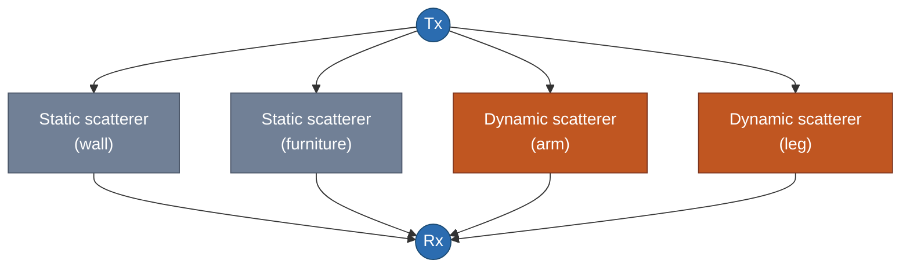
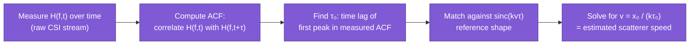

# Scattering Model

> **TL;DR:** ray-tracing fails when a room has too many paths to count individually → give up on tracing each path, treat every object as a scatterer re-radiating in all directions, and describe the room *statistically* → this trades "exact geometry" for "aggregate quantities" (like human movement speed) → works precisely where ray-tracing doesn't: cluttered, rich-scattering, NLoS environments.

## 1. Where we left off

[[ray-tracing-model]] ended on its failure mode: rich-scattering environments (furnished rooms, people, clutter) produce too many overlapping paths to individually count and attribute to a surface, and diffraction doesn't fit the clean specular-bounce assumption anyway. The scattering model is the direct answer to that failure — a different modeling *philosophy*, not a patch on top of ray-tracing.

## 2. The core move: stop counting rays, start counting scatterers

Instead of asking "which discrete rays exist, and where do they bounce?", the scattering model asks a cheaper question: **treat every object in the room — walls, furniture, a person's arms and legs — as a scatterer that re-radiates the incoming signal in all directions**, like a tiny secondary transmitter. You don't try to trace each ray's exact bounce path anymore; you just say "this scatterer contributes *some* signal to the receiver," and sum contributions across every scatterer in the room.

Each scatterer is conceptually a "virtual Tx" re-emitting toward the Rx. Crucially, scatterers split into two categories:

- **Static scatterers** ($\Omega_s(t)$): walls, furniture — don't move, so their contribution to the received signal doesn't change over time.
- **Dynamic scatterers** ($\Omega_d(t)$): a person's limbs, torso — moving, so their contribution's *phase* changes continuously as they move (recall: phase depends on distance traveled, from [[EMfund#2.1 Why do different paths have different phase shifts?]]).

$$H(f,t) = \sum_{o \in \Omega_s(t)} H_o(f,t) + \sum_{p \in \Omega_d(t)} H_p(f,t)$$

This split is the whole point of the model: static contributions are "clutter" you can filter out (they never change), and dynamic contributions are exactly the signal you actually care about for human sensing.

## 3. Why sum over direction instead of tracing rays

For each dynamic scatterer $p$, its contribution isn't one traceable ray — it's an integral over *every* direction $(\alpha,\beta)$ the scattered energy could leave in:

$$H_p(f,t) = \int_0^{2\pi}\!\!\int_0^{\pi} h_p(\alpha,\beta,f,t)\, \exp(-jk v_p \cos(\alpha) t)\, d\alpha\, d\beta$$

Don't worry about solving this integral by hand — the important structural fact is the term $\exp(-jkv_p\cos(\alpha)t)$: it says the *phase* of the scattered signal changes over time at a rate proportional to $k v_p \cos(\alpha)$, where $v_p$ is the scatterer's **speed** and $k = 2\pi/\lambda$ is the wavenumber from [[EMfund]]. A moving scatterer doesn't just add one static phase offset (like a static reflector would) — it adds a phase that *keeps changing* as it moves, at a rate set by how fast it's moving.

This is the scattering model's core insight: **you can't recover an exact position from this (too many unknowns, no clean per-path structure), but you can recover velocity**, because velocity is what controls how *fast* the aggregate phase rotates over time — a statistical/aggregate property that survives even when you've given up tracking individual rays.

## 4. From phase-rotation-rate to a measurable formula: the ACF

To actually extract that speed from real, noisy, multi-scatterer CSI, the model looks at how correlated $H(f,t)$ is with itself after a small time lag $\tau$ — the **autocorrelation function (ACF)**:

$$\rho_H(f,\tau) \triangleq \frac{\text{Cov}[H(f,t), H(f,t+\tau)]}{\text{Cov}[H(f,t), H(f,t)]} \approx \text{sinc}(kv\tau)$$

Intuition: if the scatterers are all moving at roughly the same speed $v$ (a reasonable approximation for, say, a person's torso during walking or falling), the signal at time $t$ and the signal a little later at $t+\tau$ stay correlated only as long as the accumulated phase rotation from that motion hasn't scrambled things too much. That falloff-with-lag shape happens to take the form of a $\text{sinc}$ function whose "width" is set by $v$ — a slow-moving person keeps signals correlated over a longer $\tau$; a fast-moving person (a fall) decorrelates quickly.

**Extracting speed in practice:** match the first peak of a reference $\text{sinc}(x)$ curve against the first peak of the *measured* ACF:

$$v = \frac{x_0}{k\tau_0} = \frac{x_0 \lambda}{2\pi\tau_0}$$

where $\tau_0$ is the time lag at which the measured ACF hits its first peak, and $x_0$ is the corresponding constant from the reference sinc function.

The tutorial's worked example: a volunteer walks then falls in a heavily furnished room, with the Wi-Fi link in a *different room* (NLoS, rich scattering — exactly where ray-tracing would fail). The ACF-derived speed estimate still cleanly distinguishes walking speed from the much faster fall speed. That robustness under NLoS and clutter is the scattering model's payoff for giving up exact geometry.

## 5. Ray-tracing vs scattering model — side by side

| | Ray-tracing model | Scattering model |
|---|---|---|
| Core assumption | Few, discrete, specular, traceable paths | Many scatterers, treated statistically |
| What it recovers | Exact geometry: distance, angle, position | Aggregate quantity: speed |
| Best suited to | Sparse environments — few, countable, specular paths (LoS or a clean single-bounce NLoS both qualify) | Cluttered, rich-scattering, NLoS environments |
| Typical applications | Localization, tracking | Speed-oriented tasks: intrusion detection, fall detection |
| Fails when | Too many overlapping paths, diffraction present | You need *exact position*, not just speed — the model deliberately discards per-path geometric detail, so it can't answer "where," only "how fast" |

Neither model is strictly "better" — they answer different questions, and the choice depends on both the environment (sparse vs cluttered) and what you actually need to know (position vs motion/speed).

## 6. What comes next

Both models exist to justify *why* certain features (ToF, AoA — ray-tracing lineage; Doppler/speed, BVP — scattering lineage) are meaningful things to extract from CSI in the first place. Now that both modeling philosophies are on the table, the next note gets concrete: the actual algorithms used to pull ToF, AoA/AoD, Doppler spectra, and BVP out of real CSI data.

## Up next

→ [[CSI-feature-extraction|CSI Feature Extraction]] — ToF, AoA/AoD (MUSIC), Doppler/phase-shift spectrum, and BVP.

## See also
- [[EMfund]]
- [[CSI-fundamentals]]
- [[ray-tracing-model]]
- [[fresnel-zone-model]]
