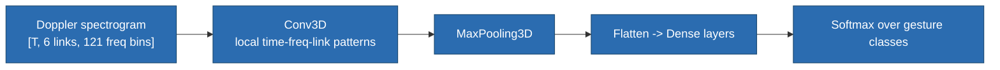
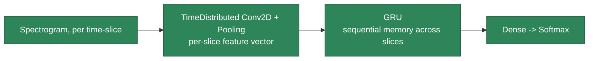
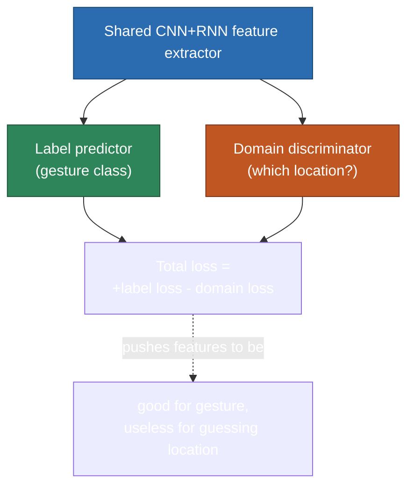
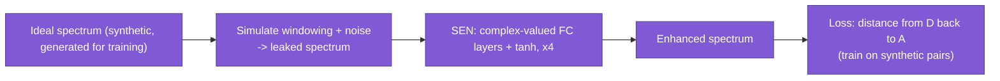

# Deep Learning on CSI

> **TL;DR:** [[CSI-feature-extraction]] gave you Doppler spectrograms and BVP as inputs; [[CSI-sanitization]] gave you clean data to compute them from. This note is what actually consumes them — the paper's four models (CNN, RNN, adversarial learning, complex-valued NN), plus a broader, paper-independent survey of what else is used in practice today.

## 1. Where we left off

Everything upstream converges here. A gesture-recognition pipeline: raw CSI → [[CSI-sanitization|sanitize]] → [[CSI-feature-extraction|extract]] a Doppler spectrogram (via STFT, §4) → feed that spectrogram into a neural network → predict a gesture class. This note covers what that last network looks like.

## 2. CNN — treating the spectrogram as an image

The Doppler spectrogram from [[CSI-feature-extraction]] §4 is a tensor of shape roughly `[time, links, frequency-bins]` (in the tutorial's Widar3 setup: `[T_MAX, 6, 121]` — 6 receivers, 121 frequency bins). Since a spectrogram is fundamentally a 2D (or, with multiple links, 3D) grid of intensity values, it's directly usable as CNN input the same way you'd feed an image.

The tutorial's architecture: one `Conv3D` layer (kernel spanning time × links × frequency simultaneously) → `MaxPooling3D` → flatten → two dense layers → softmax over gesture classes. Straightforward image-classification-style CNN, just with a 3D kernel instead of 2D because there's a third axis (links) alongside time and frequency.

**What it's good at:** local time-frequency shape — the kernel's receptive field. **What it structurally can't do well:** track how a feature evolves across the *entire* gesture duration once that duration exceeds the kernel's reach — which is exactly the gap RNN fills next.

## 3. CNN + RNN — adding explicit sequential memory

Swap the 3D convolution for a per-time-slice 2D convolution (`TimeDistributed(Conv2D...)`), so each time-slice gets its own feature vector — then feed that *sequence* of feature vectors into a **GRU** (a simpler, close cousin of LSTM you already know). The GRU carries a hidden state forward across the sequence, so it explicitly tracks "how did the pattern change from the last few slides to now" — the exact "change from previous slide" mechanism from our chat.

Since you already know LSTMs well: this is functionally the same idea as any CNN-feature-extractor-into-RNN pipeline you've seen elsewhere (e.g. video action recognition) — nothing CSI-specific about the architecture itself, only about what's being fed in.

## 4. Adversarial learning — fixing what BVP fixed differently

Recall [[CSI-feature-extraction]] §5: raw Doppler spectra aren't domain-independent — the same gesture looks different depending on where the person stands/faces. BVP solved this by **feature engineering** (reconstruct a body-coordinate velocity profile via multi-link geometry). Adversarial learning attacks the *same* problem from the **model** side instead.

**The idea:** train the network with two competing objectives at once. A shared feature extractor (CNN+RNN, same as §3) feeds two separate heads:
- a **label predictor** — trying to correctly classify the gesture,
- a **domain discriminator** — trying to guess *which location the person was standing at* from the same shared features.

The trick is in the loss: the label predictor's loss is *added*, but the domain discriminator's loss is *subtracted* (implemented via a negative loss weight in the tutorial code). This pushes the shared feature extractor toward representations that are great for gesture classification *but useless for guessing location* — i.e., the network is explicitly punished for encoding domain (location) information at all, forcing it to learn domain-invariant features.

**BVP vs. adversarial learning — same goal, different mechanism:** BVP achieves domain independence by *construction* (explicit geometry-based math), requires knowing link positions and person location/orientation upfront. Adversarial learning achieves it by *training pressure* (the network learns to discard domain info on its own), requires no explicit geometric model — but needs labeled domain data during training (you must know which location each training sample came from, even if you never use that at inference time).

## 5. Complex-valued neural networks — not throwing away phase

**The problem being solved:** the standard STFT approach ([[CSI-feature-extraction]] §4) suffers from **spectral leakage** — because a finite window of data isn't perfectly periodic, its FFT smears energy across neighboring frequency bins instead of a clean single spike, blurring the resulting spectrogram. Classical windowing (Gaussian, Hamming, etc.) reduces this but never eliminates it.

**The idea:** instead of hand-designing a better window function, train a neural network — the **Signal Enhancement Network (SEN)** — to learn the mapping from a leaked, noisy spectrum back to the clean, ideal one. Since spectra are complex-valued (amplitude *and* phase, same "don't throw away phase" theme running through this whole vault since [[EMfund]]), the network itself needs complex-valued layers, not the standard real-valued ones you're used to.

**How a complex-valued fully-connected layer works, structurally:** a real-valued linear layer is just $y = Wx + b$. A complex number $z = a+bi$ multiplied by another complex number doesn't behave like independent real multiplication — real and imaginary parts mix ($~(a+bi)(c+di) = (ac-bd) + (ad+bc)i$). The tutorial's `m_Linear` layer implements exactly this cross-term mixing using two real-valued weight matrices (one for the real part's contribution, one for the imaginary part's), plus a "swap real/imaginary" trick to get the sign right on the cross term — because standard deep learning frameworks (PyTorch/TensorFlow) don't natively support complex-valued autodiff well, so this is a manual real-valued implementation of complex arithmetic.

**Why train on synthetic data:** you don't have "ground truth clean spectra" for real-world CSI — nobody knows the true underlying spectrum a real gesture produces. So the trick is to *start* from clean synthetic spectra (randomly generated), deliberately apply the same windowing-leakage process real hardware would cause, and train the network to reverse that known, simulated corruption. Once trained, it's applied to real, leaked spectra at inference time, where the ground truth is unknown but the corruption process is assumed similar enough to transfer.

## 6. Summary table — paper's four models

| Model | Solves | Key mechanism |
|---|---|---|
| CNN | Local time-frequency pattern recognition | Convolution + pooling over the spectrogram |
| CNN + RNN (GRU) | Sequential change over the full gesture | GRU carries memory across time-slices |
| Adversarial learning | Domain (location/orientation) independence | Shared features, label loss added, domain loss subtracted |
| Complex-valued NN (SEN) | Spectral leakage from STFT | Complex-valued layers, trained on synthetic leak/clean pairs |

## 7. Beyond the paper — broader model survey (unbiased)

The paper's four models aren't the only options — worth knowing what else exists, without bias toward what one paper happened to cover:

| Architecture | Why it could apply |
|---|---|
| **Temporal Convolutional Network (TCN)** | Dilated causal convolutions — a CNN-based alternative to RNN for long sequences, often faster to train, avoids RNN's vanishing-gradient issues |
| **Transformer / self-attention** | Models relationships between *any* two time-slices directly (not just adjacent ones), increasingly common for spectrogram classification generally |
| **1D-CNN over time** | Simpler/cheaper than 2D/3D CNN, sometimes competitive |
| **Autoencoder + classifier head** | Unsupervised feature learning first, lightweight classifier on the learned embedding |
| **Classical ML on hand-crafted features** (SVM, Random Forest, XGBoost/LightGBM on BVP/ACF-speed/etc.) | Not deep learning at all — often a strong, cheap baseline with limited data |
| **Random-kernel feature extraction** (WiRocket, a WiLDAR/MiniRocket-style method) | Hundreds of fixed, random (untrained, no backprop) 1D convolution kernels at multiple dilations, pooled via proportion-of-positive-values — extracts multi-scale time-frequency features essentially for free, then a lightweight classifier sits on top |

### 7.1 CNN vs. RNN — the "change from previous slide" question

Worth being precise here: a CNN applied over the *whole* spectrogram (like the tutorial's `Conv3D`, §2) does pick up short-range temporal patterns, but only within its kernel's fixed receptive field. It has no explicit notion of step-by-step evolution across an entire sequence. Tracking "what changed from the previous slide," across the *whole* gesture, is specifically what RNN/GRU (§3), TCN, or attention-based models are built for — CNN alone (per-frame or with a small fixed kernel) is better understood as "good at local shape," not "good at tracking change over time."

### 7.2 Ensemble methods — a real technique, one terminology note

Training several different models and combining their predictions (majority vote on hard predictions, or averaging softmax outputs) is a legitimate, well-established approach called **ensemble learning** — specifically **voting** or **model stacking** (training a meta-model on top of the base models' outputs). One clarification: **"Random Forest"** specifically refers to an ensemble of many decision trees — not the general "combine any models" technique. The broader principle (diversity of models → combine → often more robust than any single model) is real and commonly used, just goes by "ensemble/voting classifier" when the base models are different architectures (e.g. CNN + RNN + Transformer combined).

### 7.3 This survey table isn't neutral anymore — SenseFi's actual benchmark evidence

The table above was originally written without ranking the options. **SenseFi** (a standardized benchmark + open-source library comparing 11 architectures across 4 CSI datasets) provides real evidence that firms this up, and the direction is consistent enough to state plainly: **for CSI specifically, shallow/lightweight models beat deep ones, across the board.**

- CNN-5 and GRU/BiLSTM match or beat ResNet-18/50/101 and ViT on every one of SenseFi's 4 datasets, at a fraction of the parameters. ResNet-101 actively *overfits* on the cross-domain Widar dataset — 100% train accuracy, poor/unstable test accuracy.
- ViT underperforms on small/medium CSI datasets (sometimes losing to a plain MLP) — high FLOPs, needs more data than CSI datasets typically provide.
- Classical ML (Random Forest, SVM) is genuinely competitive with — and on the small UT-HAR dataset, beats — some deep models like vanilla RNN and LSTM. Not a strawman baseline; a real contender at this data scale.
- Transfer learning and unsupervised/self-supervised pretraining (AutoFi-style) both favor CNN-5/MLP/BiLSTM; plain RNN transfers especially poorly (51–66%), suggesting it tends to memorize rather than learn transferable features.

**WiLDAR is a second, independent data point for the same conclusion, via a completely different mechanism.** Rather than a smaller *trained* network, WiLDAR's WiRocket feature extractor uses random, untrained convolution kernels (no backprop at all) at multiple dilations, feeding a small residual + depthwise-separable-conv classifier (0.14M total params). It beats LSTM/GRU/RNN/T-UNet baselines on 3 public datasets, trains in ~60s on a Raspberry Pi 4B (vs. T-UNet's ~1150s), and — like SiMWiSense's raw-tensor design choice (§3 of [[SiMWiSense-system-architecture]]) — skips denoising almost entirely, relying on the model's own inductive bias to absorb noise rather than a preprocessing pipeline.

**Why this convergence matters:** three independent papers (SenseFi's ResNet overfitting, WiLDAR's random-kernel approach, and a small 2D-CNN-on-pseudocolor-CSI-images paper beating an attention-BLSTM on speed) land on the same result via different routes — CSI datasets are typically small (hundreds to low-thousands of samples per class), so shallow/lightweight models generalize better and heavy architectures (deep ResNets, full Transformers, attention-stacked BLSTMs) tend to overfit rather than be under-capacity. Treat "try a big model first" as the wrong default for CSI classification tasks specifically, even though it's a reasonable default in data-rich domains like image classification.

### 7.4 Tools to visualize NN architectures

Found via web search, not from memory, per instruction to avoid guessing:
- **[CNN Explainer](https://poloclub.github.io/cnn-explainer/)** — Georgia Tech Polo Club, peer-reviewed, specifically for CNNs. The one with real prior-knowledge confidence behind it.
- **[Neural-Visualizer](https://github.com/PeakScripter/Neural-Visualizer)** — broader coverage (ANN, CNN, RNN, LSTM, GAN, Transformer, Diffusion), found via search, not independently verified.
- **[nn-visual.com](https://www.nn-visual.com/)** — interactive, found via search, not independently verified.
- **TensorBoard** (bundled with TensorFlow/Keras) — professional-grade, for inspecting architectures you actually build, not a learning tool.

## See also
- [[CSI-feature-extraction]]
- [[CSI-sanitization]]
- [[EMfund]]
