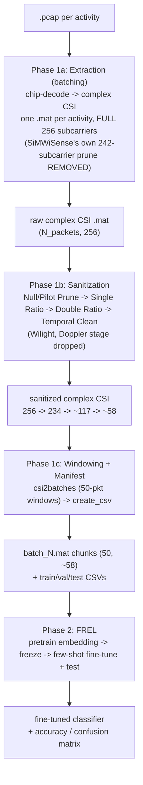

# Modified Pipeline — Wilight Sanitization + SiMWiSense FREL

> The actual experiment (per [[../project-log/00-aim-and-plan]]), collapsed to 2 phases: batch the raw CSI, sanitize it with Wilight's technique, then run SiMWiSense's FREL few-shot pipeline on it. No Doppler/STFT (not needed — FREL wants raw CSI tensors, not spectrograms). No separate plain-CNN baseline (`baseline_*.py`) — FREL only.

## Full pipeline diagram

## The 2 phases

1. **[[01-phase1-batch-and-sanitize]]** — pcap → per-activity `.mat` (extraction) → Wilight sanitization on that same `.mat` (null/pilot prune, ratio ×2, temporal clean) → SiMWiSense windowing + CSV manifest. This is "batching individually [to] `.mat`, then in that `.mat` we do preprocessing, then continue" — extraction and sanitization both happen on the **full per-activity stream**, before windowing, because Vote (needs ~100 packets) and Temporal Clean (needs a real time series) don't work statistically on a lone 50-packet window.
2. **[[02-phase2-frel]]** — embedding pretrain (needed once, just to get a frozen embedding — not treated as its own separate concern) → FREL few-shot fine-tune + test (`crossentropy`/`knn`). No `baseline_*.py` plain-CNN path.

## What changed vs. the original SiMWiSense-only pipeline

- SiMWiSense's own `non_zero` static prune (`CSI_extractor_SimWiSense.m`, 256→242) is **removed** — replaced entirely by Wilight's null/pilot/DC/pilot-tone prune (256→234).
- Everything between extraction and windowing is new: Single Ratio → Double Ratio → Temporal Clean (~234→~58 subcarrier-groups).
- `NoOfSubcarrier`/`inputshape` downstream (`main.py`, `dataGenerator.py`) must be updated to match the new, smaller count (~58, not 242) — flagged already in [[../project-log/02-devVM-and-next-steps]].
- Windowing (`csi2batches_SimWiSense.m`) logic itself is **unchanged** — it just now slices/windows the sanitized stream instead of the raw-pruned one.

## Open question carried over — now RESOLVED

The mask-alignment question is answered: the two repos use **different subcarrier ordering** (Wilight `fftshift`s, SiMWiSense does not), so an `fftshift` is required before any Wilight stage, and the index list must be remapped rather than copied. The real chain is `242 -> 226 -> 113 -> 56`, not `256 -> 234 -> 117 -> 58`. Evidence and derivation: [[../wilight/05-why-the-ratio-works]] §6; applied detail in [[01-phase1-batch-and-sanitize]].

Note also: the downloaded dataset contains **no `.pcap` files** — only the already-pruned 242-column `.mat`. Step 1a below ("remove SiMWiSense's own prune, keep 256") is therefore not executable without re-downloading raw captures.

## See also
- [[../project-log/00-aim-and-plan]]
- [[../project-log/02-devVM-and-next-steps]]
- [[../wilight/00-overview]]
- [[../simwisense/00-overview]]
