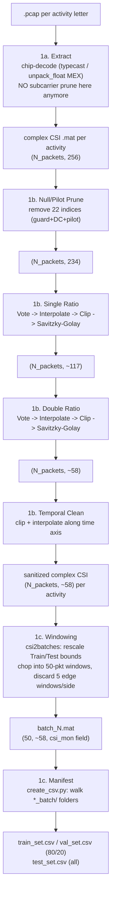

# Phase 1 — Batch, Sanitize, Window

**Sources:** `CSI_extractor_SimWiSense.m` (decode only, prune removed) → Wilight's `ratio_stage` + `temporal_clean` (from `Single_antenna_single_file_processing.py`) → `csi2batches_SimWiSense.m` → `create_csv.py`/`csv_main.py`

Everything from raw pcap to labeled 50-packet `.mat` chunks, with Wilight's sanitization spliced in right after extraction — before any windowing happens.



## Why sanitize before windowing, not after

Vote (Wilight's Phase-3 sub-step) needs a ~100-packet sample to make its "which subcarriers are structurally bad" decision, and Temporal Clean needs a real packet-index time series to compute per-column medians against. A single 50-packet window is too short for either to work statistically. So sanitization has to run on the **full, unwindowed per-activity stream** — the same object `CSI_extractor_SimWiSense.m` already produces — and windowing happens *after*, same as today.

## Step by step

**1a. Extract** (`CSI_extractor_SimWiSense.m`, modified): pcap → chip-specific decode (`typecast` for 4339/43455c0, `unpack_float` MEX for 4358/4366c0) → complex CSI, one `.mat` per activity. **SiMWiSense's own `non_zero` prune line is removed** — output stays the full 256 subcarriers, since pruning now happens in step 1b instead.

**1b. Sanitize** (new — Wilight's functions applied to the `.mat` from 1a):
- Null/Pilot Prune: static index mask, 256 → 234 (11 guard + 3 DC/adjacent + 8 pilot tones removed). See [[../wilight/02-phase2-null-pilot-pruning]].
- Single Ratio: `ratio_stage` (Vote → Interpolate → Clip → Savitzky-Golay), 234 → ~117.
- Double Ratio: same `ratio_stage` applied again, ~117 → ~58.
- Temporal Clean: clip + interpolate along the time axis, same ~58 width. See [[../wilight/03-phase3-ratio-sanitization]] and [[../wilight/04-phase4-temporal-clean-and-doppler]] for the full sub-step breakdown.
- **No Doppler/STFT** — stops here, hands off the sanitized complex `.mat` directly.

**1c. Window + manifest** (unchanged mechanics, per [[../simwisense/01-phase1-data-pipeline]]): `csi2batches_SimWiSense.m` slices Train/Test ranges and chops into 50-packet windows on the *sanitized* stream; `create_csv.py` walks the resulting folders into CSV manifests exactly as before.

## RESOLVED — index alignment (checked 2026-09-19 against the real data)

Full derivation and evidence in [[../wilight/05-why-the-ratio-works]] §6. Summary:

**1. Ordering differs.** Wilight's `csi_extractor.py` applies `np.fft.fftshift`; `CSI_extractor_SimWiSense.m` **never does**. SiMWiSense arrays run subcarrier 0..127 then -128..-1 — not physical frequency order. Since `ratio_stage` divides *adjacent* columns and runs Savitzky-Golay *across the frequency axis*, **an `fftshift` must be applied before any Wilight stage**.

*Evidence:* mean `|CSI|` per column over 2000 packets of `m1/A/A.mat` shows a dead run (amp ~3-6 vs a 572 overall mean) at original indices 123-127 and 131-133 — exactly the 11-wide VHT80 guard band under the no-shift mapping.

**2. The mask cannot be copied literally**, and there are no `.pcap` files — the downloaded data is already the 242-column output of stage 1a, so "remove SiMWiSense's own prune" is not available. Working from 242 instead, remove:

- the **8 dead guard columns** SiMWiSense left in: cols 117–124
- the **8 pilot tones**: cols 5, 33, 69, 97, 144, 172, 208, 236

```
242  ->[remapped mask]->  226  ->[single ratio]->  113  ->[double ratio]->  56
```

So `NoOfSubcarrier` = **56** (or **113** if we stop after single ratio) — not the ~58 assumed elsewhere in these notes, because SiMWiSense's prune is *more* aggressive around DC (±5 vs Wilight's ±1).

## See also
- [[00-overview]]
- [[02-phase2-frel]]
- [[../wilight/00-overview]]
- [[../simwisense/01-phase1-data-pipeline]]
