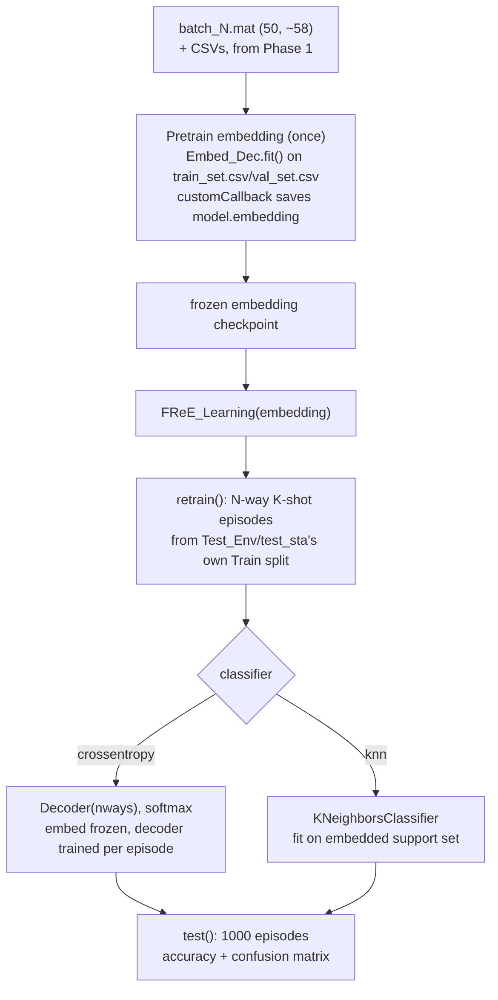

# Phase 2 — FREL (No Separate CNN Baseline)

**Files:** `models.py` (embedding, used only as infra) → `dataGenerator.py` + `TrainTest.py: model_training` (pretrain, needed once) → `metalearn.py` + `utils.py` (`FReE_Learning`) → `TrainTest.py: model_testing`

Takes the sanitized, windowed, labeled chunks from Phase 1 and runs them through SiMWiSense's existing, unmodified FREL machinery. `baseline_*.py` (the plain-CNN, non-few-shot comparison path) is deliberately left out — FREL is the only classification path in this pipeline.

## Why pretraining is still here even though "only FREL"

FREL's `retrain`/`test` need a **frozen embedding to start from** — `FReE_Learning.__init__` literally loads one off disk. There's no way to skip producing it; it's not a separate concern in this pipeline though, just the one-time setup step FREL needs. The embedding itself is a small CNN (`EmbeddingNet` — 4×Conv2D-BN-ReLU blocks, see [[../simwisense/02-phase2-model-architecture]]), but that's an implementation detail of "what FREL fine-tunes on top of," not a standalone classification path — unlike `baseline_*.py`, which trains a full CNN classifier as its own alternative to FREL and is excluded here.

## Step by step

1. **Pretrain** (`model_training` in `TrainTest.py`): builds `Embed_Dec(inputshape, nclasses)` with `inputshape = (50, ~58, 2)` (updated for the new subcarrier count from Phase 1), trains on `train_set.csv`/`val_set.csv` for 15 epochs, `customCallback` saves only `model.embedding` to disk on improvement.
2. **Load + freeze** (`FReE_Learning.__init__`, `metalearn.py`): reloads that saved embedding.
3. **Few-shot fine-tune** (`retrain`): samples N-way K-shot episodes via `FewshotDataGen` from the target environment/station's own Train CSV; embedding stays frozen (`training=False`), only the classifier head trains:
   - `crossentropy`: fresh softmax `Decoder(nways)`, trained via `meta_train_step_softmax`.
   - `knn`: `KNeighborsClassifier`, fit once on embedded support vectors, no gradient training.
   - (`proto` exists in `utils.py`/`metalearn.py` but isn't looped over by `TrainTest.py`'s driver — not included here either, matching current SiMWiSense behavior.)
4. **Test** (`test`): 1000 more episodes against the target Test CSV, reports accuracy + confusion matrix per classifier.

## What must change from stock SiMWiSense

Only `NoOfSubcarrier`/`inputshape` — passed as a CLI arg / hardcoded constant in `main.py` — needs updating to match Phase 1's new output width (~58 instead of 242). Nothing in `models.py`, `metalearn.py`, `utils.py`, or `TrainTest.py` needs code changes; they're shape-agnostic already.

## See also
- [[00-overview]]
- [[01-phase1-batch-and-sanitize]]
- [[../simwisense/02-phase2-model-architecture]]
- [[../simwisense/04-phase4-few-shot-adaptation]]
