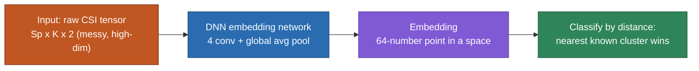

# FSL — Embedding (Simpler)

> A plain-language companion to [[SiMWiSense-FREL]] §1.1. What "embedding" actually means in few-shot learning, why it's called that, and the full input → DNN → embedding → classification pipeline.

## Why it's called "embedding"

"To embed" = to place something into a space. An **embedding** is both the act and the result of taking a raw, high-dimensional, messy input and **placing it as a single point in a lower-dimensional space of numbers** where distance is meaningful (nearby points = similar things).

So the word refers to the **representation** — not to classification. The "classify a new thing" part is the *payoff* that happens afterward; the term "embedding" itself points at the earlier step: turning the input into a point.

## The pipeline, start to finish

The correct order is **input → DNN → embedding → distance-based classification.** A common confusion is to say "embedding then DNN" — but it's the DNN that *produces* the embedding, so they're the same step, not two separate ones.

### Image case (the analogy)

1. **Input:** a raw image — e.g. 224×224×3 ≈ 150,000 pixel numbers. Too high-dimensional and messy to compare directly (two photos of the same cat have totally different raw pixels).
2. **DNN (the embedding network):** feed it through a trained CNN, but stop *before* the final classification layer. Out comes a small vector — e.g. 64 numbers. **This vector is the embedding.** Producing it is the DNN's whole job here.
3. **The embedding space:** those 64 numbers are coordinates. The network was trained so similar images land near each other, different ones far apart.
4. **Classification (by distance):** to classify a new image, embed it → get its 64-number point → check which known cluster it's nearest to.

### CSI case (SiMWiSense)

1. **Input:** the preprocessed CSI tensor (`Sp × K × 2` — samples × subcarriers × real/imaginary, from [[SiMWiSense-system-architecture]]). High-dimensional and messy — same problem as raw pixels.
2. **DNN (embedding network, Fig. 8):** 4 conv layers → global average pooling → a **64-number vector**. That vector is the embedding of this CSI window.
3. **Embedding space:** trained (on base subjects/activities) so same-activity or same-subject windows cluster together.
4. **Classification by distance:** a new subject's registered examples → embed them → they form a new cluster → future queries classified by nearest cluster.

## One adjustment worth keeping straight

It's tempting to say "they take the irregular data that doesn't fit any class, and classify based on that." Slight fix: the embedding network doesn't *detect* that something is irregular or new — it embeds **everything the same way**, old or new. What makes a new class usable is that a **human registers a few labeled examples** of it, and those get embedded into the same space. The network treats new and old data identically; it never "notices" novelty on its own (this is the FSL-vs-novelty-detection distinction from [[SiMWiSense-FREL]] §1.1).

## One-liner

**Embedding = using a trained DNN to turn a messy CSI tensor into a small point in a well-organized space; classification is then just "which known cluster is this point nearest to."** The DNN produces the embedding; distance does the classifying.

## See also
- [[SiMWiSense-FREL]]
- [[SiMWiSense-system-architecture]]
