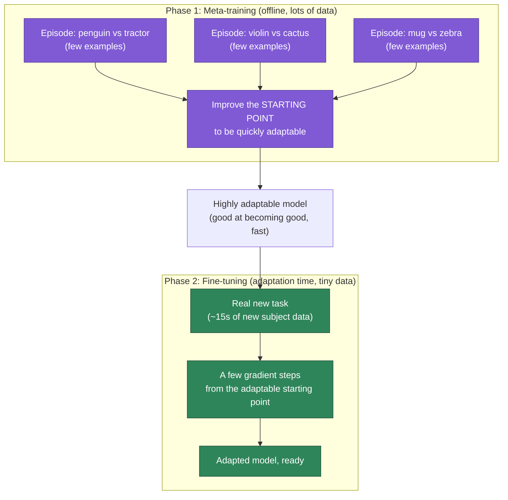
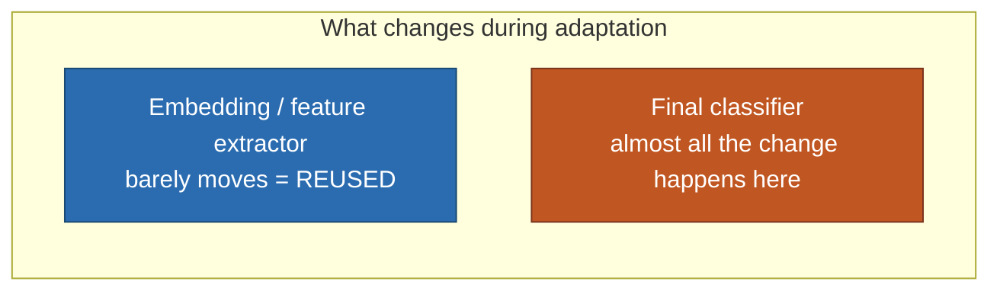

# FSL — Meta-Learning (Simpler)

> A plain-language companion to [[SiMWiSense-FREL]], sibling to [[FSL-embedding]]. What "meta-training" and "fine-tuning" actually mean, why meta-training is subtler than "just train a classifier," and how FREL simplifies it.

## The two phases

- **Phase 1 — meta-training:** done once, offline, with lots of data.
- **Phase 2 — fine-tuning:** done at adaptation time, with tiny new data (SiMWiSense: ~15s).

The rough intuition "classify, then fine-tune at run-time" captures Phase 2 correctly. The part that needs sharpening is Phase 1 — because **"meta-training" ≠ "just train a classifier."**

## What meta-training actually does — "learning to learn"

Ordinary training says: *"here are all my classes, learn to separate them."*
Meta-training says something one level up: *"learn to become good at adapting quickly to a new task from just a few examples."* It practices the **adaptation skill itself**, over and over.

How it practices: instead of one big classification problem, it samples **thousands of tiny fake tasks** (episodes). Each episode:

1. Randomly pick a few classes and a few examples each (an $N$-way $K$-shot mini-task).
2. Simulate adapting to *just* that mini-task.
3. Check how well the adapted model did on held-out examples of that same mini-task.
4. Use that result to improve the model's **starting point** — not to solve any one task, but to make the model better at being *quickly adaptable* for whatever task comes next.

Repeat over many random mini-tasks → the model ends up not good at any specific class, but specifically good at **becoming good, fast, from few examples.** That's the "meta" — learning *about learning*.

### Image analogy

Think of training a student for exams:
- **Ordinary training** = memorizing the answers to one specific exam. Great for that exam, useless if the questions change.
- **Meta-training** = practicing on hundreds of *different* mock exams, each on a different topic, so the student learns *how to study efficiently* — how to get up to speed on a brand-new topic from just a few practice questions. When the real, never-seen exam arrives, they don't know its answers, but they know how to learn them fast.

The image-classification version: don't train "cat vs dog vs bird." Instead, run thousands of episodes — "penguin vs tractor (5 examples each)," then "violin vs cactus," then "mug vs zebra"... — never to master any of these, but to become excellent at separating *any* new 5-example classes handed over later.

## Phase 2 — fine-tuning (the run-time intuition, correct)

A genuinely new subject/environment shows up with only ~15s of data. Because Phase 1 already made the model highly adaptable, you take that well-prepared starting point and do a **few gradient steps on the tiny new dataset** — quickly nudging it to fit the new task. This is exactly the "fine-tune at inference/adaptation time" intuition.

## The important nuance for SiMWiSense

Classical meta-training uses the fancy nested loop above — simulate adaptation on a fake task, then improve the starting point (this is MAML-style). **FREL deliberately does NOT do this.** FREL keeps the two-phase *structure* but replaces the fancy meta-training with something much cheaper: it **merges all the little tasks into one big dataset and does plain ordinary joint training** — no simulated-adaptation inner loop at all (see [[SiMWiSense-FREL]] §3, Eq. 4).

It gets away with this because of the **"feature reuse" finding** (Raghu et al., *"Rapid Learning or Feature Reuse?"*): most of meta-learning's benefit comes from learning good *reusable features*, which plain training already provides — so the expensive inner-loop simulation buys little extra. The only place real adaptation happens is Phase 2 (fine-tuning on genuinely new data), done once, for real.

## What "feature reuse" actually means — and yes, it's the embedding that gets reused

**What is a "feature" here?** The embedding network converts a raw CSI tensor into a 64-number vector, where each number captures some *learned property* of the signal — motion speed, periodicity, signature shape, etc. Those learned properties **are** the "features." The embedding network is, literally, a feature extractor.

**Where the term comes from — the finding.** The paper *"Rapid Learning or Feature Reuse?"* asked *why* MAML-style meta-learning works, testing two competing hypotheses:
- **"Rapid learning":** it works because the network *rapidly re-derives good features from scratch* for each new task during adaptation (the feature extractor meaningfully changes when adapting).
- **"Feature reuse":** it works because it learns *one good set of features up front* that are already useful for new tasks — and adaptation barely changes the feature extractor at all; it mostly just adjusts the final classifier on top.

Their result: **overwhelmingly feature reuse.** Measuring how much each layer changed during adaptation, the early/middle layers (the feature extractor = the embedding) barely moved. Almost all the useful change happened in the *last* layer (the classifier). The expensive feature-learning part was already done during meta-training and got **reused as-is** for new tasks; adaptation was mostly just re-fitting the classifier on top of those effectively-frozen features.

**Why this justifies FREL's design.** Once you know adaptation *barely changes the embedding anyway*, the logic follows directly: why pay for the fancy bi-level meta-training loop, and why even allow the embedding to update during adaptation, if it doesn't meaningfully move? So FREL:
1. Trains the embedding once (cheaply, ordinary joint training).
2. **Freezes it** — this is the "reuse": the same feature extractor, unchanged, serves every new subject/environment.
3. Only retrains the tiny classifier on the 15s of new data.

FREL isn't a hack — it's a *direct consequence* of the feature-reuse finding: since research showed the embedding is what carries over and the classifier is what actually needs adjusting, build exactly that and skip what the finding proved unnecessary.

**Confirmed one-liner for feature reuse:** the embedding (the learned features) stays fixed and gets reused across all new tasks; only the lightweight classifier changes.

## One-liner

**Classical meta-learning = (1) meta-train by rehearsing adaptation on many fake tasks, (2) fine-tune on the real new task. FREL keeps the two-phase structure but swaps the fancy meta-training for cheap ordinary joint training, and only truly adapts (fine-tunes) once, in Phase 2.**

## See also
- [[SiMWiSense-FREL]]
- [[FSL-embedding]]
