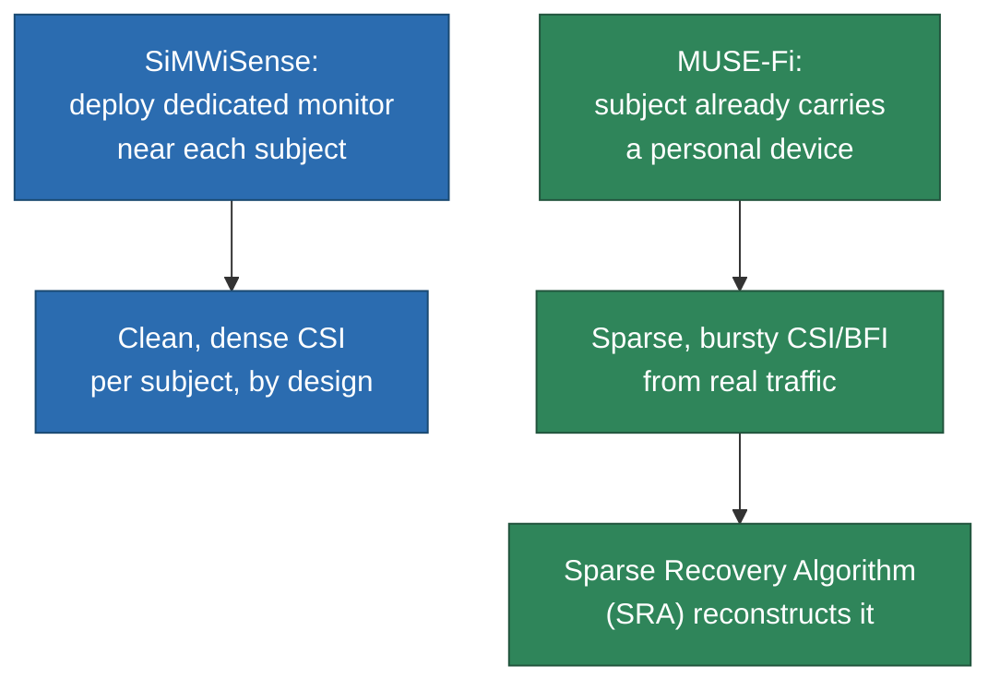

# MUSE-Fi: Contactless Multi-person Sensing Exploiting Near-field Wi-Fi

> Same underlying physics as [[SiMWiSense]] — a near scatterer dominates a link's CSI variation — applied through the opposite deployment topology: instead of placing a *dedicated monitor* next to each subject, MUSE-Fi exploits the personal device (phone) each subject already carries as that near-field sensor, riding on their existing AP link. Zero dedicated sensing hardware, at the cost of having to recover signal from real, sparse, bursty communication traffic instead of purpose-built dense capture.

## 1. The core mechanism — near-field domination, not range resolution

Commodity Wi-Fi bandwidth (even Wi-Fi 7's 320MHz) can't give the range resolution needed to physically separate multiple people via ToF the way GHz-bandwidth radar can (recall [[CSI-feature-extraction]] §2.1: resolution $\approx 1/BW$). MUSE-Fi sidesteps range resolution entirely with a different lever: **most people today carry a personal Wi-Fi device that maintains its own AP link.** If that device sits close to its owner (near-field, ~0.2m), the owner's motion dominates the channel variation on *that specific link* — swamping everyone else in the room, who are meters away, firmly in the far field of that same link.

This turns "separate people in space" into "separate people by link identity" — each personal-AP link is already a physically pre-separated, subject-specific sensing channel, for free, because the person owns the identifying device.

The channel gain for a reflection path Tx(AP) → subject S → Rx(personal device) follows the same reflection-term structure as [[scattering-model]]'s per-scatterer contribution:

$$h_{A,S,E}(t) = \frac{\lambda^2\sqrt{G_{A,S,E}}}{(4\pi)^2 (d_{A,S}(t)\, d_{S,E}(t))^{\alpha/2}} \exp\!\left(-i\frac{2\pi}{\lambda}(d_{A,S}(t)+d_{S,E}(t))\right)$$

— amplitude falls off with the two-hop path length product, phase accumulates with total distance/λ, exactly [[EMfund]]'s phase-distance relationship. MUSE-Fi shows numerically that under realistic near-field parameters, the **phase-variation term dominates the amplitude-variation term** — a quantitative version of [[EMfund]]'s qualitative claim that phase, not amplitude, carries sub-wavelength motion information.

## 2. VIR — a closed-form separability guarantee

MUSE-Fi defines a **variation-to-interference ratio (VIR)**: the target subject's channel-variation power divided by (interferer power + dynamic-channel noise power). From this they derive closed-form, Cassini-oval-shaped feasible regions describing:
- $N_{max}$ — how many subjects can be simultaneously separated (up to ~51 in their idealized numeric example)
- $\Delta d_{min}$ — the minimum spacing between subjects (empirically ~0.34m at typical AP distances) while domination still holds

This formalizes exactly what [[SiMWiSense-sensing-proximity|SiMWiSense's Level 1 experiment]] validated only *empirically* (a ~30-percentage-point accuracy drop with distance) — MUSE-Fi derives the same phenomenon analytically as a closed-form bound.

**Caveat the paper itself flags:** the clean closed-form bounds assume roughly symmetric subject motion intensity ($v_S \approx v_I$) — different subjects doing very different things (one breathing, one gesturing) violates this. The authors confirm the *qualitative trend* holds under asymmetry but don't validate the quantitative $N_{max}$/$\Delta d_{min}$ numbers beyond small-scale, largely symmetric experiments. Treat the "51 subjects" figure as an illustration of the framework's scaling behavior, not a demonstrated capacity.

## 3. Contrast with SiMWiSense — same physics, opposite topology

| | [[SiMWiSense]] | MUSE-Fi |
|---|---|---|
| What's near the subject | A dedicated sensing monitor, deployed by the system | The subject's own phone — already near them |
| Link exploited | AP ↔ dedicated-monitor (purpose-built) | AP ↔ personal device (ordinary communication) |
| Deployment cost | $P$ extra CSI-capturing devices | Zero extra hardware |
| Traffic assumption | Continuous, sensing-friendly capture (implicit) | Real, bursty, contention-based traffic (explicitly modeled) |
| Multi-subject scaling | $P \times Q \to P+Q$ via [[SiMWiSense-class-explosion|class-explosion]] fix + [[SiMWiSense-cascaded-detection|cascading]] | No joint/cascaded classification needed at all — each link is already single-subject by construction |

MUSE-Fi's framing is explicit: prior "one link per subject" proposals don't exploit the fact that ordinary multi-user Wi-Fi *already* gives you subject-identifying links for free via personal devices — you just have to solve the traffic-sparsity problem that comes with real (not artificially dense) traffic instead.

## 4. Three sensing strategies, and the CSI-vs-BFI tradeoff

Three traffic sources can be used: **UL-CSI** (uplink, sensed at the AP), **DL-CSI** (downlink, sensed at the personal device), and **UL-BFI** (beamforming feedback information — a *compressed* version of CSI, carried on uplink action frames since 802.11ac for MIMO precoding).

A genuinely new result: via SVD of the CSI matrix, MUSE-Fi shows the reconstructed beamforming matrix's variation depends **only on the change in angle from subject to AP** — not on absolute phase/distance changes. This makes BFI a kind of **low-pass-filtered CSI**: more stable (fewer spurious artifacts, better for gesture/activity) but less sensitive to micro-motion like breathing. Whether to use CSI or BFI is an application-dependent stability/sensitivity tradeoff, not "one is strictly better" — a concrete, non-obvious engineering result the vault didn't previously have an example of.

## 5. Sparse Recovery Algorithm (SRA) — the main systems contribution

Because MUSE-Fi rides on *real* communication traffic (not artificial dense sensing traffic), frames arrive irregularly. SRA has two parts:

**(a) Data transformation pipeline:** Segmentation (mark windows sparse/non-sparse by sample-count threshold) → Resampling (evenly space samples, low-pass filter, tag missing instants as "no-data") → Transformation to spectrogram (same rationale as [[CSI-feature-extraction]]'s STFT — raw time-domain motion isn't recognizable) → Normalization (min-max to $[0,1]$, with "no-data" tagged $-1$ so it's distinguishable from real low values).

**(b) A dilated-convolution TCN autoencoder** recovers missing samples — chosen over LSTM/U-Net for efficiency (fewer params, runs on resource-limited APs/UEs) and long-range dependency capture via exponentially increasing dilation (χ = 1, 2, 4, 8 across 4 blocks) rather than recurrence.

**Self-supervised training, the clever part:** you can never collect ground-truth *sparse* CSI with a known dense ground truth (sparsity happens because frames are genuinely missing). Fix: take only non-sparse slices (full data, serving as ground truth), synthetically inject realistic "no-data" gaps to manufacture sparse inputs, and train the TCN-AE to reconstruct the original via MSE. No labeling cost, fully offline.

For gesture/activity spectrograms specifically, MUSE-Fi swaps STFT for **WSST (wavelet synchrosqueezed transform)** to handle non-stationary signals better — a different answer to the same spectral-leakage problem [[wireless-sensing-DL]] §5's complex-valued SEN tries to *learn past* with a neural network. Two different fixes for the same STFT weakness, worth holding side by side.

## 6. Results

- **Respiration** (8 subjects, chest-belt ground truth): MUSE-Fi <1 bpm median/mean error vs. a non-near-field baseline's 7–8 bpm.
- **Gesture** (8 subjects × 6 gestures × 500 reps): 98%+ accuracy vs. baseline's 57%. Same classifier lineage as Widar3.0.
- **Activity** (8 subjects × 6 activities × 200 reps): 98%+ vs. baseline's 44–52%. Same classifier as RF-Net — the meta-learning-for-RF work that's also FREL's intellectual ancestor (see [[SiMWiSense-FREL]]).
- **NLoS** (phone in pocket, blocking LoS): still >92% accuracy — near-field domination survives NLoS, echoing [[EMfund]]'s point that diffraction preserves sensing capability even without a direct path.

## 7. Critical flags

- **The whole value proposition assumes an active, reasonably frequent link.** The paper admits late on that "highly sparse data traffic for idle UEs may be beyond recovery" — MUSE-Fi degrades exactly when someone isn't actively using their phone, a very common real-world state.
- **The baseline comparisons throughout are a single non-near-field device on the LoS path** — a deliberately weak strawman, not a comparison against actual competing multi-person approaches (e.g. ICA-based blind source separation like MultiSense, cited but never empirically compared). The 98% vs. 44–57% gaps say more about "near-field beats far-field" than "MUSE-Fi beats SOTA."
- **BFI is transmitted in cleartext**, sniffable by any nearby device — a real privacy gap (any bystander could extract someone's sensing signal without consent) that the paper explicitly raises and then defers to a "companion work."
- **User registration mechanics are hand-waved** — how MUSE-Fi associates a personal-AP link with a "registered" subject, or handles unregistered/adversarial devices, is deferred to an "extended report."

## See also
- [[SiMWiSense]]
- [[SiMWiSense-sensing-proximity]]
- [[scattering-model]]
- [[CSI-feature-extraction]]
- [[SiMWiSense-FREL]]
