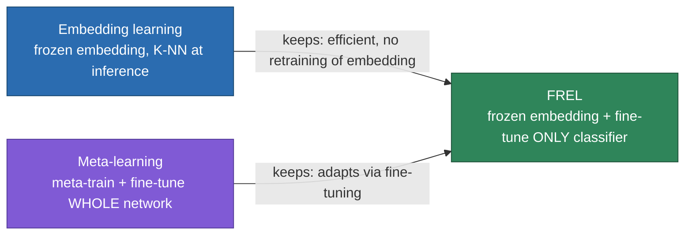
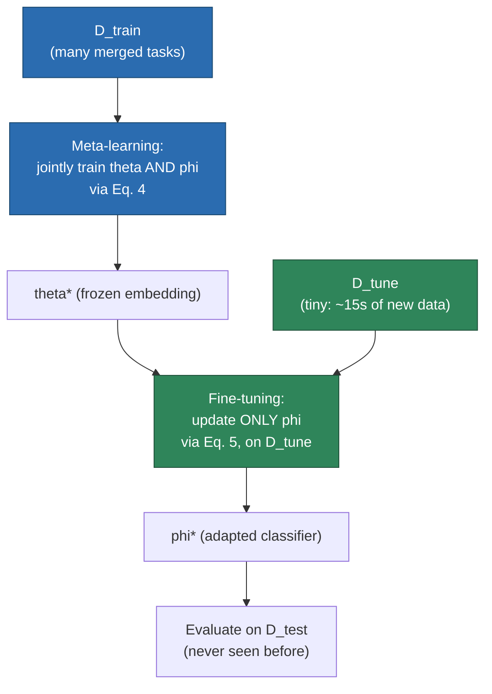

# SiMWiSense — Level 5: FREL (Few-Shot Learning)

> Part of [[SiMWiSense]]'s reading map. Previous: [[SiMWiSense-cascaded-detection]] (Level 4). This note covers Feature Reusable Embedding Learning (FREL) — the algorithm [[SiMWiSense-cascaded-detection]] ended on needing.

## 1. Two existing FSL approaches, and what FREL combines

Few-shot learning (FSL) aims to train models that generalize to new tasks from only a handful of labeled examples. Two established approaches existed before this paper:

- **Embedding learning:** train a DNN to map inputs into a latent space where examples of the same class cluster together. At inference time, the embedding network is *frozen* — a few labeled reference samples are placed into that space, and new queries are classified by nearness to those references (e.g. K-NN). No retraining happens at inference; the embedding does all the work upfront.
- **Meta-learning:** two phases — meta-training (learn shared structure across many different tasks) and fine-tuning (quickly adapt parameters using a few new data points per task). Unlike embedding learning, meta-learning *does* update parameters at adaptation time.

**FREL is the first approach to combine both.** A DNN learns the embedding (as in embedding learning), and a separate classifier decodes the latent features into labels — but unlike pure embedding learning, FREL *does* fine-tune the classifier during adaptation (borrowing meta-learning's flexibility), while *not* retraining the whole embedding network (keeping most of embedding learning's efficiency). The paper's own framing: it's a simplified variant of **MAML** (Model-Agnostic Meta-Learning), fine-tuning only the last few layers rather than the entire network — justified by prior work ("Rapid Learning or Feature Reuse?") showing that meta-learning's effectiveness comes mainly from *feature reuse*, not from re-deriving features from scratch at adaptation time.

### 1.1 Embedding learning, in full mechanical detail

1. Motivation correct: the whole reason this exists is the adaptation problem — new subjects/environments show up, and retraining from scratch on each one isn't feasible with only 15 seconds of data.
2. Two prior approaches, correct: embedding learning and meta-learning, both established before FREL combined them.
3. Embedding approach, correct, tightened slightly: during training (on the original base classes), the DNN learns to arrange inputs in a space so that same-class examples cluster together — that clustering behavior is the trained asset.
4. New task → run the (frozen) DNN to get embeddings, correct.
5. Human registers the new label, correct: a person explicitly provides a few labeled examples of the new subject/class — the model doesn't discover novelty on its own, exactly as we landed on last message.
6. Runtime queries classified by nearest landmark, correct: new embeddings at inference time get assigned to whichever registered landmark — old or newly added — they're geometrically closest to.

## 2. Formal setup

$$E_\theta: X \to Z \qquad C_\phi: Z \to Y \qquad F_\psi(X) = C_\phi(E_\theta(X)) = Y, \quad \psi = \{\theta, \phi\}$$

$E_\theta$ is the embedding network (parameters $\theta$), mapping raw input $X$ (the preprocessed CSI tensor from [[SiMWiSense-system-architecture]]) into a latent vector $Z$. $C_\phi$ is the classifier (parameters $\phi$), mapping $Z$ to the predicted label $Y$.

**Task structure — $N$-way $K$-shot:** each training batch is a "task" $\tau_j = \{(x_i^j, y_i^j)\}_{i=1}^m$ with $N$ classes ("ways") and $K$ examples per class ("shots"), so $m = N \times K$. This is standard FSL terminology — worth having explicit since you'll see "$N$-way $K$-shot" everywhere in few-shot learning literature, not just here.

## 3. Phase 1 — meta-learning

The formal objective, minimizing expected loss across a whole *set* of tasks $\mathcal{T} = \{\tau_j\}_{j=1}^n$:

$$\min_{\{\theta,\phi\}} \frac{1}{n}\sum_{j=1}^{n}\left[\frac{1}{m}\sum_{i=1}^{m} \mathcal{L}(C_\phi(E_\theta(x_i^j)) = y_i^j)\right] \tag{2}$$

**The key simplification:** rather than solving this task-by-task, merge every task into one combined dataset:

$$D_{train} = \tau_1 \cup \dots \cup \tau_n \tag{3}$$

This reduces Eq. 2 to an ordinary deep learning problem — plain gradient descent over the merged dataset:

$$\{\theta,\phi\} \leftarrow \{\theta,\phi\} - \alpha \frac{1}{mn}\sum_{i=1}^{mn} \nabla_{\{\theta,\phi\}} \mathcal{L}(C_\phi(E_\theta(x_i)), y_i) \tag{4}$$

Nothing exotic here — this is standard joint training of embedding network + classifier together, just on data assembled from many small tasks rather than one big uniform dataset. The output is an optimal embedding $\theta^*$.

## 4. Phase 2 — fine-tuning

With $\theta^*$ fixed (frozen), the classifier alone is refined on a small held-out dataset $D_{tune}$. Each iteration randomly samples a fresh $K$-shot, $N$-way task $\tau$ from $D_{tune}$ and updates only $\phi$:

$$\phi \leftarrow \phi - \beta \frac{1}{m}\sum_{i=1}^{m} \nabla_\phi \mathcal{L}(C_\phi(E_{\theta^*}(x_i)), y_i) \tag{5}$$

Performance is then evaluated on $D_{test}$ — data never seen during either meta-learning or fine-tuning.

## 5. SiMWiSense's specific setup

- **Embedding network (Fig. 8):** 4 convolutional layers, each 64 channels, $3\times3$ kernels, followed by batch norm + ReLU. Max pooling ($2\times2$) after the first 3 conv layers. After the 4th, **global average pooling** compresses to a 64-dimensional latent vector — this is $Z$.
- **Classifier:** deliberately just a single fully-connected layer, *no* nonlinearity (no ReLU on top). This is a design choice for isolating what FREL itself contributes, rather than letting a complex classifier head's own capacity muddy the comparison. They also test an **untrainable K-NN** classifier as a comparison point (matching how the prior state-of-the-art FSEL baseline was set up) — this isolates exactly how much fine-tuning itself (vs. the embedding alone) is contributing.
- **The mini-dataset problem, and why it matters:** typical FSL benchmarks (Omniglot, Mini-ImageNet) contain *many* tasks with few samples each — pretrain across many tasks, then fine-tune/test on one specific task. Wireless sensing can't do this: the environment keeps generating genuinely new tasks the model has never seen, so there's no way to assemble a "comprehensive" task set upfront. SiMWiSense's fix: use a deliberately tiny $D_{tune}$ — only 15 seconds of data — making the problem harder in *two* ways at once, few samples **and** few tasks, which is a more realistic (and more difficult) version of the standard FSL setting.
- **Learning strategy:** 5-shot learning (5 samples per class per mini-batch), Adam optimizer in both phases, learning rates $\alpha = \beta = 0.01$, cross-entropy loss for both phases (chosen for simplicity — the paper notes alternatives like deep k-means or prototypical loss exist but weren't needed here).

## 6. What "adaptation" means here — and what it doesn't

Two things worth pinning down before the algorithm details, since they're easy to conflate:

**FREL is not a filter on CSI.** A filter — like everything in [[CSI-sanitization]] (nonlinear amp/phase correction, AGC removal) or the STFT windowing in [[CSI-feature-extraction]] — operates on the *signal itself*: raw CSI numbers in, cleaned/transformed CSI numbers out. The CSI data never changes under FREL. What changes is the **model's parameters** — specifically, a small part of them, quickly, using very little new data. That's what "adaptation" means in this context: a structured, small-data version of transfer learning/fine-tuning, not a signal-processing step.

**FREL is applied twice, independently — not once.** The paper is explicit: *"We utilize this algorithm in both subject detection and activity detection stages."* So "adaptation to a new person" isn't one operation, it's two separate adaptations solving two separate problems from [[SiMWiSense-cascaded-detection]]:

- **Stage 1's adaptation problem:** does this new person's CSI signature form a recognizable, distinguishable class at all? Since FREL's embedding is few-shot/prototype-based (its K-NN variant classifies queries by *"a plurality vote of the K nearest supports"*), adding a new subject is closer to "drop a few new reference points into an already well-organized embedding space" than "add an output neuron and retrain." The embedding space — shaped by meta-training across many prior subjects — is already structured so a new person's signature likely lands somewhere sensible; the new person just needs a handful of examples to mark their specific spot.

- **Stage 2's adaptation problem — the harder one, since it's about *content*, not just *identity*:** different people perform the "same" activity differently (different body size, speed, personal style — this is the same category of problem [[CSI-feature-extraction]]'s BVP and [[wireless-sensing-DL]]'s adversarial learning solved, just with "domain" now meaning *person* instead of *location/orientation*). FREL's meta-learning phase trains this stage's embedding on *many different people* performing the *same* activities, so the embedding is already exposed to a range of personal gesture styles before it ever meets a new person — a softer, statistical version of what adversarial learning does explicitly (expose the model to enough diversity that it can't overfit to any one person's style). When a genuinely new person's "wave" looks slightly different from every wave the embedding has seen, only the small classifier on top gets fine-tuned on that person's 15-second sample — nudging the decision boundary just enough to correctly map *this person's* version of "wave" to the right label, without relearning what "wave" means from scratch.

**One-line summary:** adaptation ≠ filtering the signal, and adaptation ≠ growing an output space from scratch. It's fine-tuning a lightweight classifier on top of an embedding that was already trained on a diversity of people/environments, using a tiny new sample from whatever's new.

## Up next

Level 6 — reading the experimental results (proximity confirmation, baseline CNN numbers, subcarrier-resolution tradeoff, FREL vs. CNN vs. FSEL comparisons).

## See also
- [[SiMWiSense]]
- [[SiMWiSense-cascaded-detection]]
- [[CSI-feature-extraction]]
- [[wireless-sensing-DL]]
