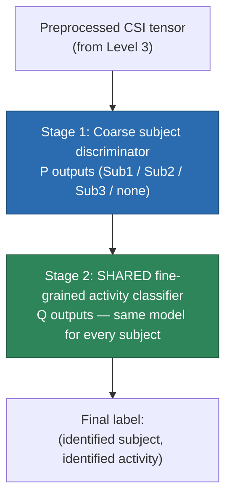

# SiMWiSense — Level 4: Cascaded (Two-Stage) Detection

> Part of [[SiMWiSense]]'s reading map. Previous: [[SiMWiSense-system-architecture]] (Level 3). Next: Level 5 (FREL few-shot learning).

Level 2 got the naive $Q^P$ joint-classification problem down to $P \times Q$ by decentralizing — one dedicated classifier per subject/monitor, each a full $Q$-way activity classifier. Level 3 previewed that each monitor's learning block actually contains *two* classifiers, not one. This note is how those two combine to push complexity down further, from $P \times Q$ to $P + Q$.

## 1. The two-stage structure (Figure 6)

**Stage 1 — coarse subject discrimination:** each monitor runs a classifier that answers *"which subject (or nobody) is dominating my CSI right now?"* — output space of size $P$ (in the paper's setup: Sub1, Sub2, Sub3, or "no activity"). This runs per-monitor, same as the decentralized classifiers from Level 2.

**Stage 2 — fine-grained activity classification:** once Stage 1 has identified a subject, a *second* classifier determines what activity that subject is performing — output space of size $Q$. The key design choice: **this second-stage model is shared across every subject and every monitor.** There isn't a separate $Q$-way activity classifier per subject (which is what the plain $P \times Q$ decentralized version from Level 2 implied) — there's exactly *one* activity classifier, reused regardless of which subject Stage 1 identified.

## 2. Why this reaches $P + Q$, not $P \times Q$

This is a subtlety worth being precise about, because it's easy to conflate "number of trained models" with "number of output classes" — they're not the same count here.

The complexity metric the paper is actually counting is **the total number of distinct output classes the system needs to define across its stages**, not the literal count of separately-deployed neural networks. Stage 1 needs $P$ distinguishable outputs. Stage 2 — because it's a *single shared model*, reused everywhere — needs only $Q$ distinguishable outputs, once, system-wide, rather than $Q$ outputs *per subject* ($P \times Q$ total) like the plain decentralized version. Add them: $P + Q$.

Compare directly against Level 2's progression:

| Approach | Output space size | Why |
|---|---|---|
| Naive joint classifier | $Q^P$ | One model tracks every subject's state simultaneously |
| Decentralized (Level 2) | $P \times Q$ | $P$ independent classifiers, each still needs its own full $Q$-way output |
| Cascaded (this level) | $P + Q$ | $P$-way subject ID (Stage 1) + **one shared** $Q$-way activity classifier (Stage 2) |

The insight enabling the last step: activities themselves (waving, sitting, drinking) don't inherently depend on *whose* CSI you're looking at — the *shape* of "waving" in CSI should generalize across subjects reasonably well, so there's no fundamental need to train a separate waving-detector per subject. Only *who is present* is genuinely subject-specific, which is exactly what Stage 1 alone has to determine.

## 3. Closing a loop back to Level 1

Here's a detail worth catching explicitly: [[SiMWiSense-sensing-proximity|Level 1]]'s experiment (Figure 11, "subject identification performance") wasn't just a proximity sanity check in isolation — it was **literally evaluating this paper's Stage 1 coarse classifier's accuracy**. The 95–97% numbers you saw there are Stage 1's real performance. Level 1 validated the physics; this level shows exactly where that validated physics gets deployed as one specific, named component of the final architecture.

## 4. The problem this doesn't solve — setting up Level 5

The paper is explicit about a real limitation of the cascaded design, right after introducing it: even for the *same* activity, different people move differently — personal gait, pace, and gesture style all show up as different CSI patterns for what's nominally "the same" activity label. On top of that, subjects can join or leave the system, and Wi-Fi channel conditions drift over time (this is the exact kind of environmental/hardware variability [[CSI-sanitization]] partially addresses at the physical layer — but here it's showing up as a *learning* problem, not just a calibration problem). The paper's own conclusion: **it's impractical to have one universal, fixed classifier — the system needs to swiftly adapt to new subjects and channel conditions with minimal new data.**

That adaptation requirement is exactly what Level 5's FREL algorithm is built to solve.

## Up next

→ [[SiMWiSense-FREL|Level 5 — FREL: the few-shot learning algorithm]]

## See also
- [[SiMWiSense]]
- [[SiMWiSense-class-explosion]]
- [[SiMWiSense-sensing-proximity]]
- [[CSI-sanitization]]
