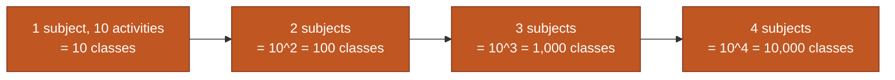
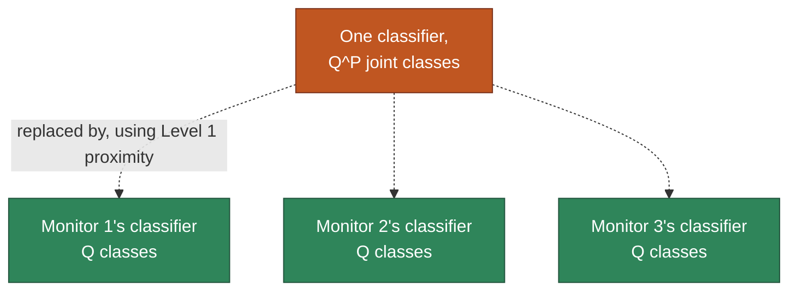

# SiMWiSense — Level 2: The Class-Explosion Problem

> Part of [[SiMWiSense]]'s reading map. Previous: [[SiMWiSense-sensing-proximity]] (Level 1). Next: Level 3 (system architecture).

Level 1 proved the physical assumption (proximity dominates) holds. Level 2 is the *systems* problem that assumption exists to solve: why can't you just train one big classifier on all subjects at once?

## 1. The naive approach: one classifier, the full joint state

Imagine trying to build a single model that looks at *all* the CSI in the room and outputs one label describing everything happening at once — "Subject 1 is waving, Subject 2 is sitting, Subject 3 is drinking," as a single combined class. If there are $P$ subjects and each can independently be doing any of $Q$ activities, the number of distinct joint states this classifier needs to tell apart is:

$$Q^P$$

Each additional subject doesn't *add* to the number of classes — it **multiplies** it by $Q$. That's what makes this exponential rather than linear: 3 subjects choosing among 10 activities each gives $10^3 = 1{,}000$ possible joint states; add a 4th subject and it jumps to $10{,}000$.

**Why this kills a practical classifier, beyond just "big number":** a softmax classifier needs training examples *per class*. With $Q^P$ classes, you'd need to have recorded (and labeled!) every subject performing every activity *in every possible combination with every other subject's activity* — which is absurd to collect, and gets worse the more subjects/activities you add. This isn't just computationally expensive, it's a data-collection impossibility past a handful of subjects.

## 2. A discrepancy worth flagging — read papers critically, not just trustingly

The paper actually gives two different-looking formulas for this, and it's worth walking through why, as a habit of careful reading rather than passive acceptance:

- **Abstract/Intro:** defines $n$ = subjects, $m$ = activities, and states the class count is "$n^m$" (rendered without the superscript in the extracted text), with the worked example "3 subjects and 10 activities correspond to more than 59,000 classes." Checking the arithmetic: $3^{10} = 59{,}049$ — the example only matches if the formula is **subjects raised to the power of activities** ($n^m$).
- **Section III-B:** defines $P$ = persons, $Q$ = activities, states the class count is "$QP$" (again, likely a flattened superscript — should read $Q^P$), and explicitly ties the fix back to "the overall complexity reduces to $P \times Q$." This version is **activities raised to the power of persons** ($Q^P$) — the more standard, intuitive reading (each of $P$ independent subjects picks from $Q$ activities). With the same numbers ($P=3$, $Q=10$): $10^3 = 1{,}000$ — which does *not* match the abstract's 59,000 example.

These two don't reconcile numerically, and I don't have a way to know which one the authors actually intended without more context — most likely a typesetting/consistency slip between two parts of the paper (superscripts are easy to lose in PDF extraction and easy to transpose by hand when writing two versions of the same claim). **The takeaway that matters either way: naive joint classification scales exponentially with the number of subjects, full stop** — the exact base/exponent assignment is secondary to that core fact, and Section III-B's version ($Q^P$) is the one that's actually used going forward, since it's what "reduces to $P \times Q$" refers to.

## 3. The fix: decentralize using Level 1's proximity result

This is where Level 1 stops being just a nice experimental confirmation and becomes the *engineering justification* for the whole system design. Since a monitor placed near Subject $i$ already predominantly captures Subject $i$'s motion (and only weak noise from everyone else), there's no need for one classifier to reason about all subjects jointly — you can assign **one independent classifier per monitor**, each responsible only for "what is *my* nearby subject doing," outputting one of $Q$ activity labels.

$$Q^P \quad \longrightarrow \quad P \times Q$$

The joint problem was multiplicative because one model had to track every subject's state simultaneously. $P$ separate models, each tracking only its own nearby subject, turns that multiplication into addition-of-work: $P$ classifiers, each with a manageable $Q$-sized output space.

This decentralization is only *valid* because of Level 1 — if proximity didn't dominate, a monitor's CSI would be a genuinely mixed signal from all subjects, and you couldn't cleanly assign "this monitor = this subject's classifier" at all. The two levels are tightly coupled: Level 1 is the physical justification, Level 2 is the systems payoff.

## 4. What's still not fully solved

$P \times Q$ is a huge improvement over $Q^P$, but it's not the paper's final answer — Section III-B goes one step further with a **cascaded two-stage detector** that reduces this to $P + Q$. That's Level 4. Before that, Level 3 covers the actual data pipeline (sensing → preprocessing → learning blocks) that feeds these per-subject classifiers in the first place.

## Up next

→ [[SiMWiSense-system-architecture|Level 3 — System Architecture]]

## See also
- [[SiMWiSense]]
- [[SiMWiSense-sensing-proximity]]
