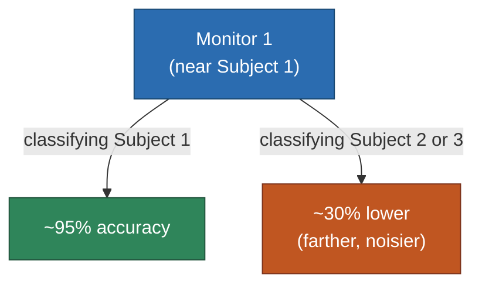

# SiMWiSense — Level 1: Sensing Proximity

> Part of [[SiMWiSense]]'s reading map. Previous: [[SiMWiSense]] Level 0. Next: Level 2 (class-explosion problem).

Level 0 established the *theoretical* claim (a near dynamic scatterer dominates a device's CSI). Section II of the paper is where that claim gets tested against real data, before any of the rest of the system is built on top of it — a sound move: validate the physical assumption first, then design the system around it.

**Setup:** 3 environments (classroom, office, kitchen), 3 subjects, 3 CSI monitors — one monitor assigned per subject. Monitors are spaced 1.5–3.0m apart from each other; each subject performs activities 1.5–2.0m from *their* assigned monitor. Subject $i$ is defined simply as "whoever is closest to Monitor $i$."

**The actual test:** for each monitor, try classifying *every* subject's activity using *that* monitor's CSI — not just the subject it was assigned to. This directly tests the Level 0 claim: if proximity really dominates, a monitor should classify its own nearby subject well and everyone else's activity poorly.

**Results (classroom environment):** Monitor 1 classifies Subject 1's activities at 95% accuracy. Using that *same* Monitor 1's CSI to classify Subject 2 or Subject 3 (who are farther away) drops accuracy by ~30% on average — because their motion is a weaker, more noise-prone contribution to Monitor 1's CSI, while Subject 1's motion (and noise from the other two, at that moment) still dominates. Critically, accuracy recovers to 96–97% for Subject 2 and Subject 3 the moment you switch to *their own* nearby monitors (M2, M3). The other two environments (office, kitchen) show the same pattern.

**Why this matters beyond "proximity is good":** this experiment is doing double duty — it's not just a sanity check, it's an *empirical confirmation of the scattering model itself*. The prediction from [[scattering-model]] (near dynamic scatterer dominates far ones in the CSI sum) is exactly what this data shows: same device, same physical channel, only the *distance to the subject being classified* changes, and accuracy swings by ~30 percentage points purely as a function of that distance. This is the scattering model's core claim, verified outside a controlled lab setup, in three different real rooms.

**One assumption worth flagging now (relevant again at Level 7):** this test — and the whole paper — assumes you already know which monitor is closest to which subject. Figuring that out in the first place is an indoor localization/fingerprinting problem, which the paper explicitly treats as solved and out of scope.

## Up next

→ [[SiMWiSense-class-explosion|Level 2 — The Class-Explosion Problem]]

## See also
- [[SiMWiSense]]
- [[scattering-model]]
