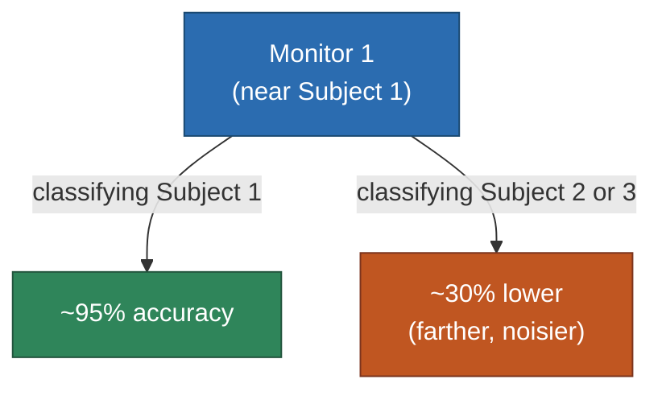
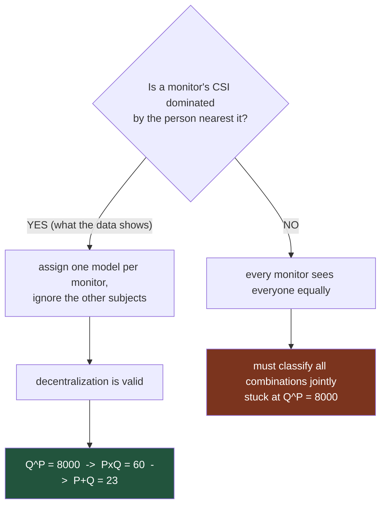

# SiMWiSense — Level 1: Sensing Proximity

> Part of [[SiMWiSense]]'s reading map. Previous: [[SiMWiSense]] Level 0. Next: Level 2 (class-explosion problem).

Level 0 established the *theoretical* claim (a near dynamic scatterer dominates a device's CSI). Section II of the paper is where that claim gets tested against real data, before any of the rest of the system is built on top of it — a sound move: validate the physical assumption first, then design the system around it.

**Setup:** 3 environments (classroom, office, kitchen), 3 subjects, 3 CSI monitors — one monitor assigned per subject. Monitors are spaced 1.5–3.0m apart from each other; each subject performs activities 1.5–2.0m from *their* assigned monitor. Subject $i$ is defined simply as "whoever is closest to Monitor $i$."

**The actual test:** for each monitor, try classifying *every* subject's activity using *that* monitor's CSI — not just the subject it was assigned to. This directly tests the Level 0 claim: if proximity really dominates, a monitor should classify its own nearby subject well and everyone else's activity poorly.

**Results (classroom environment):** Monitor 1 classifies Subject 1's activities at 95% accuracy. Using that *same* Monitor 1's CSI to classify Subject 2 or Subject 3 (who are farther away) drops accuracy by ~30% on average — because their motion is a weaker, more noise-prone contribution to Monitor 1's CSI, while Subject 1's motion (and noise from the other two, at that moment) still dominates. Critically, accuracy recovers to 96–97% for Subject 2 and Subject 3 the moment you switch to *their own* nearby monitors (M2, M3). The other two environments (office, kitchen) show the same pattern.

## Why this test exists at all — it is a premise check

Proximity is **not a component of the deployed system**. It is the load-bearing assumption everything after it is built on, tested directly instead of assumed.

With P = 3 subjects and Q = 20 activities. If the left branch failed, [[SiMWiSense-class-explosion|Level 2]]'s decentralization and [[SiMWiSense-cascaded-detection|Level 4]]'s cascade both collapse — so this experiment has to come first.

**Accuracy is used as a proxy for signal contribution.** Nobody measures the per-subject share of the CSI sum directly. Instead: hold device and room fixed, change only *which person you are trying to read*, and watch what happens to accuracy. A 30-point swing driven solely by distance is the evidence that the near subject's motion dominates.

## Domination, not exclusivity

Worth being precise about, because "dominates" invites an over-strong reading. The off-diagonal cells do **not** fall to chance — chance on 20 classes is 5%, and the far subjects still classify far above that. Their motion is genuinely present in the near monitor's CSI, only weaker and noisier.

That is exactly what [[scattering-model]] predicts: every moving body contributes a reflected path to the CSI sum, and each contribution attenuates with distance along both legs of its path. The near subject supplies the **largest** term, not the only one.

This residual interference from the other subjects is part of why each monitor's model ends up domain-specific and in need of adaptation — which is the problem [[SiMWiSense-FREL|Level 5]] exists to solve.

**Where this is implemented:** [[../simwisense/05-baseline-proximity]] walks `baseline_proximity.py` — nine independently trained plain CNNs per environment, one per *(recorder, subject)* cell, no FREL involved.

**Why this matters beyond "proximity is good":** this experiment is doing double duty — it's not just a sanity check, it's an *empirical confirmation of the scattering model itself*. The prediction from [[scattering-model]] (near dynamic scatterer dominates far ones in the CSI sum) is exactly what this data shows: same device, same physical channel, only the *distance to the subject being classified* changes, and accuracy swings by ~30 percentage points purely as a function of that distance. This is the scattering model's core claim, verified outside a controlled lab setup, in three different real rooms.

**One assumption worth flagging now (relevant again at Level 7):** this test — and the whole paper — assumes you already know which monitor is closest to which subject. Figuring that out in the first place is an indoor localization/fingerprinting problem, which the paper explicitly treats as solved and out of scope.

## Up next

→ [[SiMWiSense-class-explosion|Level 2 — The Class-Explosion Problem]]

## See also
- [[SiMWiSense]]
- [[scattering-model]]
- [[SiMWiSense-cascaded-detection]]
- [[../simwisense/05-baseline-proximity]]
