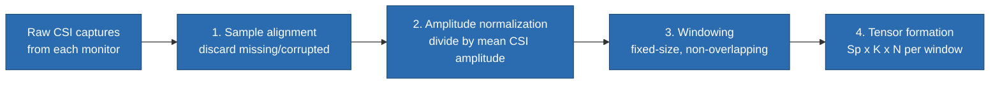
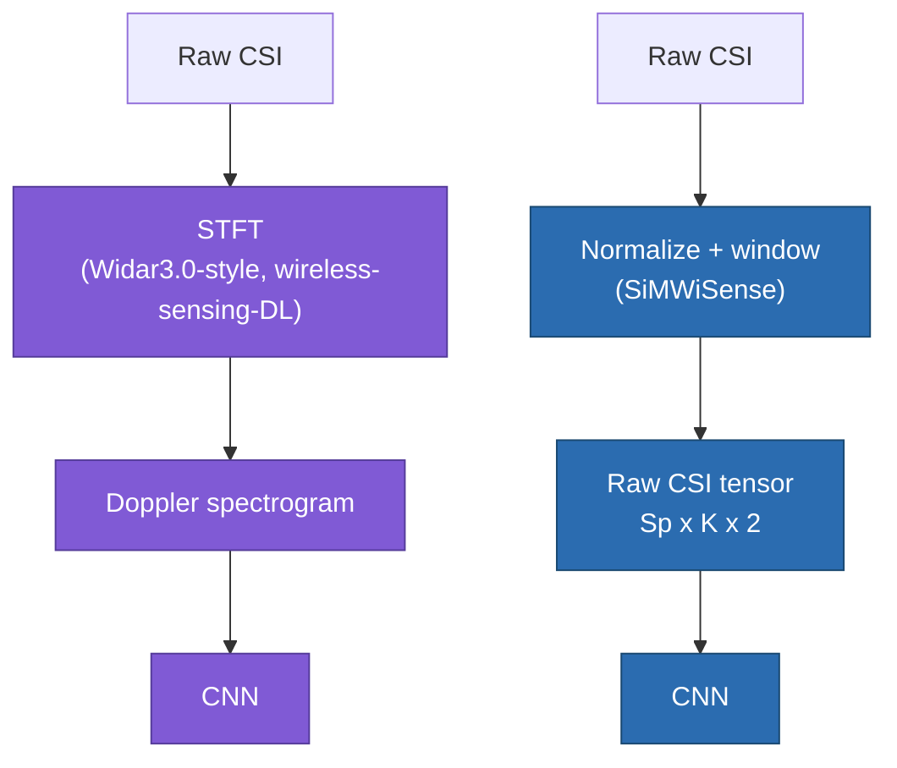

# SiMWiSense — Level 3: System Architecture

> Part of [[SiMWiSense]]'s reading map. Previous: [[SiMWiSense-class-explosion]] (Level 2). Next: Level 4 (cascaded detection).

Level 2 established *why* SiMWiSense needs one classifier per subject. Level 3 covers the actual data pipeline (Section III-A) that feeds those classifiers — three blocks: **sensing → preprocessing → learning**. This note covers sensing and preprocessing; the learning block gets its own deep dive starting at Level 4.

## 1. Sensing block — mostly a recap, different letters

Recall from [[SiMWiSense]] Level 0: the CSI matrix (Eq. 1, $H^{m,n}_r$) is the same sampled-CFR tensor from [[CSI-fundamentals]], just with the paper's own notation. Concretely, for an $M \times N$ system (M transmit antennas, N receive antennas), each monitor captures $S$ samples over interval $T$, across $K$ subcarriers — giving a $S \times K$ CSI matrix per antenna pair.

**A concrete number worth internalizing:** for an 80 MHz channel, the *total* subcarrier count is 256, but only $K=242$ of them actually carry data — the rest are null/guard subcarriers (spectral padding at the band edges, and a DC-null in the middle, standard OFDM practice to avoid interference at channel boundaries). This is the paper's real-world instance of the abstract $J$ subcarriers from [[CSI-fundamentals]].

## 2. Preprocessing block — four steps (Figure 5)

Raw captured CSI isn't fed straight to the learning block. Four steps happen first:

1. **Sample alignment:** discard any missing or corrupted CSI measurements before further processing — a basic data-hygiene step, not a physical calibration.

2. **Amplitude normalization:** divide out any abrupt amplitude change by normalizing against the mean CSI amplitude. **Worth contrasting directly with [[CSI-sanitization]]:** that note covered a full, physically-grounded fix for AGC uncertainty — dividing by the NIC's *reported* per-packet gain value, recovered from actual hardware calibration. SiMWiSense does something much lighter-weight: a blanket statistical normalization (divide by the mean), with no attempt to isolate AGC specifically from other amplitude effects. This is a useful, honest observation about how research systems are actually built in practice — full physical sanitization is valuable when precise absolute measurements matter (ToF, AoA), but a lot of applied ML-on-CSI work gets away with simpler heuristic normalization when the downstream task (classification) only needs *relative*, learnable patterns rather than physically exact values.

3. **Windowing (segmentation):** the total capture interval $T$ is split into $n$ **fixed-size, non-overlapping** windows $T_1, \dots, T_n$, with corresponding sample counts $S_1, \dots, S_n$. **Worth contrasting with [[CSI-feature-extraction]] §4.1's STFT:** that note's sliding window *overlaps* consecutive windows on purpose, specifically to track smooth, continuous change frame-to-frame. SiMWiSense's windows are non-overlapping, chopped cleanly end-to-end — because here, each window is meant to become one independent, self-contained training sample for classification, not a frame in a continuous spectrogram video.

4. **Tensor formation:** each window becomes a tensor of shape $S_p \times K \times N$, where $S_p$ is that window's sample count, $K$ is the subcarrier count, and — here's a notation trap worth flagging — **this $N$ is not the receive-antenna count from Eq. 1.** The paper reuses the letter $N$ for a different thing here: $N=2$, representing the real and imaginary parts of each complex CSI value. Same symbol, two different meanings in two different equations of the same paper — a smaller-scale version of the same "read critically, don't assume symbol consistency across sections" lesson from [[SiMWiSense-class-explosion]] §2.

## 3. A bigger design choice worth noticing: raw CSI tensor, not a Doppler spectrogram

This is the most important structural observation at this level, and it's easy to miss if you're reading on autopilot after [[CSI-feature-extraction]] and [[wireless-sensing-DL]].

Every DL model in [[wireless-sensing-DL]] — CNN, CNN+RNN, adversarial, complex-valued — took a **Doppler spectrogram** as input: raw CSI first goes through STFT to become a time-frequency image, *then* that spectrogram feeds the network. SiMWiSense's baseline CNN does not do this. Look at the actual numbers from Section IV-B: a 0.1s window with 50 samples, $K=242$ subcarriers, $N=2$ (real/imaginary) — giving an input tensor of $50 \times 242 \times 2$. That's a window of **raw, normalized CSI** — amplitude and phase (as real/imaginary components) directly, with no STFT, no spectrogram, no explicit Doppler feature extraction step at all.

**Why this matters:** it's a genuine, deliberate design choice, not an oversight — SiMWiSense is betting that a CNN with enough conv layers can *learn* whatever time-frequency structure it needs directly from raw windowed CSI, rather than requiring a human to hand-engineer the Doppler spectrogram feature first. This is the classic "hand-crafted feature vs. end-to-end learned feature" tradeoff you'll recognize from general deep learning — same tension as hand-crafted image features (SIFT/HOG) vs. letting a CNN learn its own filters from raw pixels. Neither choice is objectively better; it's a tradeoff between interpretability/data-efficiency (Doppler spectrogram, fewer parameters needed since the useful structure is already exposed) and end-to-end flexibility (raw tensor, more data-hungry but no hand-engineering bias). Keep this distinction active — it'll matter again if you ever compare this paper's reported accuracy against Widar3.0-style spectrogram approaches.

## 4. The learning block — a preview

Figure 4 shows the learning block as two classifiers per subject: a **subject classifier** and an **activity classifier**, fed by the preprocessed tensor above. How these two are actually structured together (jointly? separately? in what order?) is Level 4's cascaded architecture — and how they're made to generalize to *new* environments and subjects without full retraining is Level 5's FREL algorithm.

## Up next

→ [[SiMWiSense-cascaded-detection|Level 4 — Cascaded (Two-Stage) Detection]]

## See also
- [[SiMWiSense]]
- [[SiMWiSense-class-explosion]]
- [[CSI-fundamentals]]
- [[CSI-sanitization]]
- [[CSI-feature-extraction]]
- [[wireless-sensing-DL]]
