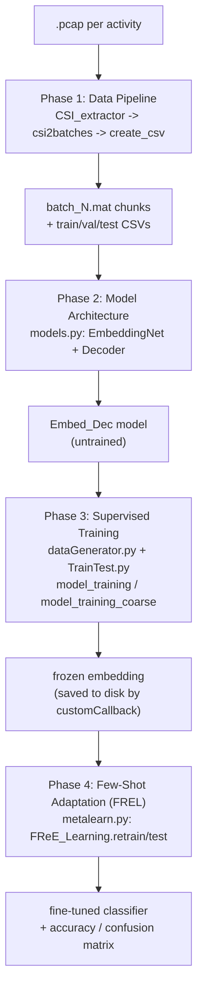

# SiMWiSense Pipeline — 4-Phase Plan

> Source: `resources/SiMWiSense`. Same 4-phase breakdown used in [[../project-log/00-aim-and-plan]] and walked file-by-file in [[../project-log/03-code-walkthrough]]. This vault mirrors [[../wilight/00-overview]]'s layout so both codebases read the same way.

## Pipeline diagram

## The 4 phases

1. **[[01-phase1-data-pipeline]]** — pcap → CSI extraction → 50-packet windows → CSV manifests. Full depth already in [[../project-log/03-code-walkthrough]] §1–4.
2. **[[02-phase2-model-architecture]]** — `models.py`: the embedding CNN + softmax decoder, and the custom training/checkpoint logic.
3. **[[03-phase3-supervised-training]]** — `dataGenerator.py` (batch loading) + `TrainTest.py`'s `model_training`: pretrains the embedding on the full labeled set.
4. **[[04-phase4-few-shot-adaptation]]** — `metalearn.py` + `utils.py`: freezes the embedding, fine-tunes only a classifier head via N-way K-shot episodes (FREL).

## Outside the 4 phases

- **[[05-baseline-proximity]]** — `baseline_proximity.py`, the plain-CNN script for the `proximity` test. Not part of the FREL pipeline: proximity trains and tests inside one *(recorder, subject)* cell, so there is no domain shift for FREL to absorb. It establishes the *premise* the cascade rests on.

## See also
- [[05-baseline-proximity]]
- [[../project-log/00-aim-and-plan]]
- [[../project-log/01-progress]]
- [[../project-log/03-code-walkthrough]]
- [[../wilight/00-overview]]
