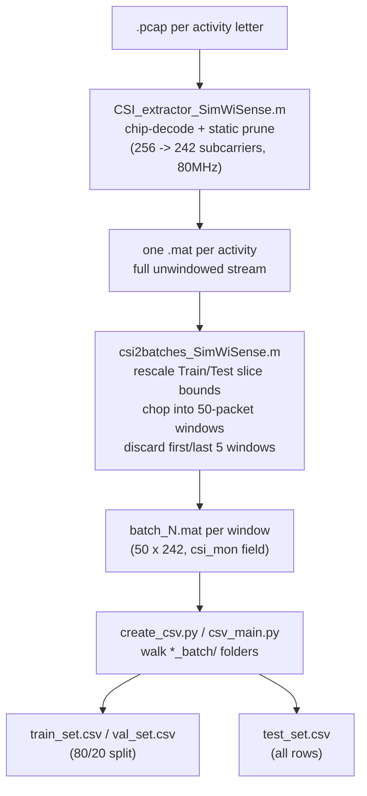

# Phase 1 — Data Pipeline

**Files:** `Matlab_code/CSI_extractor_SimWiSense.m` → `Matlab_code/csi2batches_SimWiSense.m` → `Python_Code/create_csv.py` + `csv_main.py`

Turns raw `.pcap` captures into labeled, model-ready `.mat` chunks + CSV manifests. This is the phase we're replacing the sanitization part of with Wilight — see [[../wilight/00-overview]].

## The 3 steps, briefly

1. **Extraction** (`CSI_extractor_SimWiSense.m`): pcap → chip-specific decode (`typecast` or `unpack_float` MEX) → complex CSI → static `non_zero` subcarrier prune → one `.mat` per activity.
2. **Windowing** (`csi2batches_SimWiSense.m`): slices each activity stream into proportionally-rescaled Train/Test ranges, chops into 50-packet windows, discards 5 edge windows per side, saves one `.mat` per window.
3. **Manifest** (`create_csv.py`/`csv_main.py`): walks the windowed `.mat` files, writes `filename,label` CSV rows (label = activity letter from the folder name), 80/20 train/val split.

Full step-by-step logic (already verified against source) lives in [[../project-log/03-code-walkthrough]] §1–3 — this file is the short pointer version to keep the phase layout consistent with [[../wilight]].

## See also
- [[00-overview]]
- [[02-phase2-model-architecture]]
- [[../project-log/03-code-walkthrough]]
