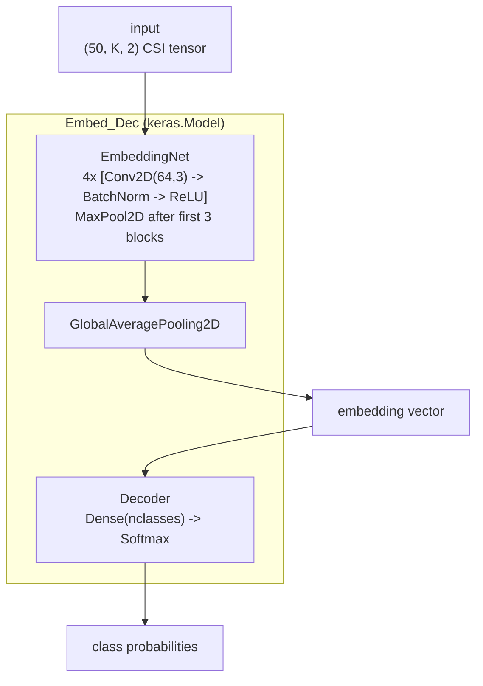

# Phase 2 — Model Architecture

**File:** `Python_Code/models.py`

Defines the embedding CNN + a swappable decoder, wired together so only the embedding gets checkpointed — this is what sets up Phase 4's "freeze embedding, fine-tune classifier" pattern.

## Logic, step by step

- **`ConvLayer`**: `Conv2D(filters, kernel) → BatchNorm → ReLU` — the repeated building block.
- **`EmbeddingNet(inputshape)`**: 4 `ConvLayer` blocks at 64 filters/3×3 kernel each, with `MaxPool2D` after the first 3 (not the 4th), ending in `GlobalAveragePooling2D` → a single embedding vector per sample. This is $E_\theta$ in the FREL formulation.
- **`Decoder(inputshape, nclasses, softmax=True)`**: one `Dense(nclasses)` layer, softmax optional (off for the ProtoNet path in Phase 4, where distances substitute for logits). This is $C_\phi$.
- **`Embed_Dec`**: a `keras.Model` subclass combining both, with custom `train_step`/`test_step` (manual `GradientTape`, standard forward-loss-backward) instead of relying on Keras's default `fit` internals — needed since it's tracking two sub-models' losses/metrics together.
- **`customCallback`**: on each epoch end, if validation loss improved, saves **only `model.embedding`** to disk (not the decoder, not the full `Embed_Dec`). Implements early stopping via a `patience` counter. This one line (`self.model.embedding.save(...)`) is the entire reason Phase 4 can "freeze the embedding" later — the decoder is deliberately never persisted here.

## See also
- [[00-overview]]
- [[01-phase1-data-pipeline]]
- [[03-phase3-supervised-training]]
