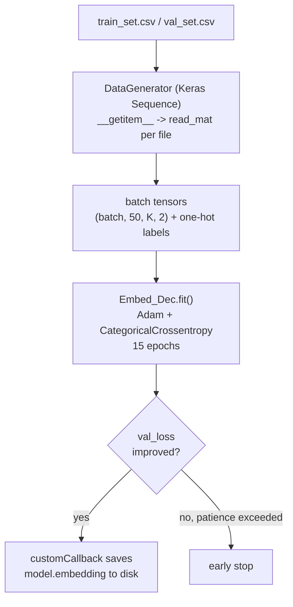

# Phase 3 — Supervised Training

**Files:** `Python_Code/dataGenerator.py` + `Python_Code/TrainTest.py` (`model_training`/`model_training_coarse`) — plus the standalone `baseline_*.py` scripts (not yet walked).

Pretrains the full `Embed_Dec` (embedding + decoder) on the entire labeled training set — this is what produces the frozen embedding Phase 4 depends on.

## Logic, step by step

- **`read_mat`** (called per-file by the generator): loads a `batch_N.mat`, derives the label from the filename's first letter (`'A'→0 ... 'T'→19`, hardcoded ladder — separate from the CSV's letter label), splits complex CSI into real/imag, reshapes to `(50, K, 2)`.
- **`DataGenerator`**: standard Keras `Sequence` — reads the CSV once at init, batches indices through `read_mat` lazily in `__getitem__`, shuffles indices each epoch.
- **`model_training`** (`TrainTest.py`): builds `Embed_Dec(inputshape, nclasses)`, compiles with `Adam` + `CategoricalCrossentropy`, builds `train_gen`/`val_gen`, calls `model.fit(train_gen, epochs=15, validation_data=val_gen, callbacks=customCallback)`. `model_training_coarse` is the same logic against `DataGenerator_Coarse`/`read_mat_coarse` (4-class subject-ID variant instead of 20-class activity).
- Not yet walked: the `baseline_*.py` scripts — a separate, non-FREL comparison path (plain CNN, no few-shot adaptation), out of scope for the current sanitization-swap experiment but worth checking later if we want a non-few-shot baseline too.

## See also
- [[00-overview]]
- [[02-phase2-model-architecture]]
- [[04-phase4-few-shot-adaptation]]
- [[../project-log/03-code-walkthrough]] §4–5 (execution trace)
