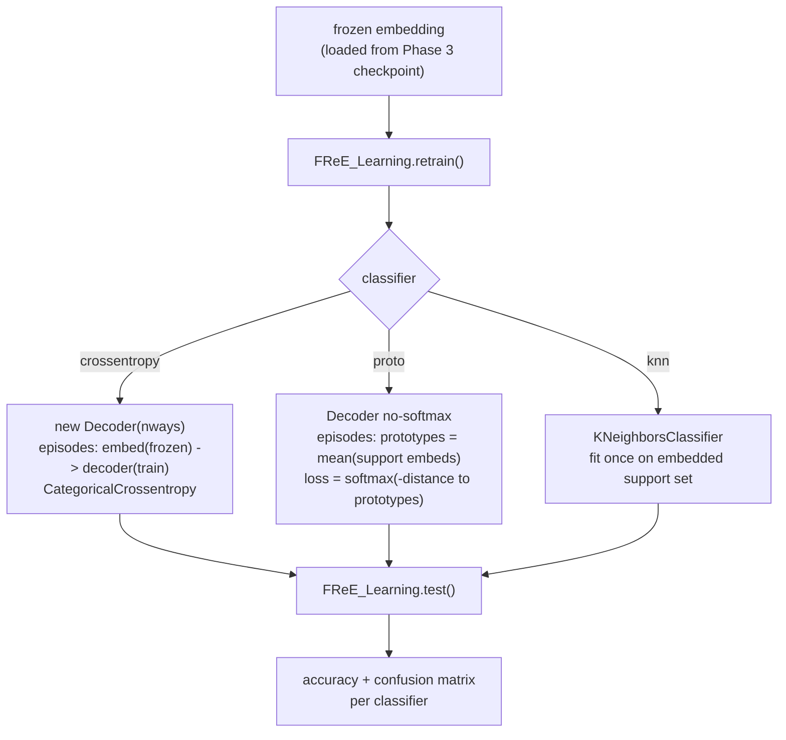

# Phase 4 — Few-Shot Adaptation (FREL)

**Files:** `Python_Code/metalearn.py` (`FReE_Learning`), `Python_Code/utils.py` (episode step functions), `Python_Code/TrainTest.py` (`model_testing`/`model_testing_coarse`)

Freezes the Phase 3 embedding, then fine-tunes only a lightweight classifier head on a handful of target-domain examples, via N-way K-shot episodes — this is the actual few-shot adaptation the whole project is about.

## Logic, step by step

- **`FewshotDataGen`** (`dataGenerator.py`, already covered in [[../project-log/03-code-walkthrough]] §4): samples `k` support + `q` query examples per class per episode, from the CSV, letter-labeled.
- **`FReE_Learning.__init__`**: loads the frozen embedding from disk (Phase 3's checkpoint).
- **`retrain(...)`**: branches on `classifier`:
  - **`crossentropy`**: a fresh `Decoder(nways)` (softmax), trained episode-by-episode via `meta_train_step_softmax` (`utils.py`) — embedding stays frozen (`training=False` on `embed(...)`), only the decoder's gradients get applied.
  - **`proto`**: a `Decoder` **without** softmax (raw embeddings), via `meta_train_step_proto` — computes per-class prototypes (mean of support embeddings), classifies queries by softmax over negative distance-to-prototype (`proto_loss` in `utils.py`). Implemented but, per [[../project-log/01-progress]] §3, **not currently looped over by `TrainTest.py`** (only `crossentropy`/`knn` are).
  - **`knn`**: no neural decoder at all — `KNeighborsClassifier(n_neighbors=5)` fit directly on embedded support vectors.
- **`test(...)`**: runs `iteration` (default 1000) more episodes, evaluates each classifier's accuracy, aggregates into a confusion matrix (`sklearn.metrics.confusion_matrix`, saved as a heatmap).
- **`model_testing`** (`TrainTest.py`): the driver — builds `meta_train_set`/`meta_test_set` from the **target environment/station's own** Train/Test CSVs, loops `["crossentropy", "knn"]`, calling `retrain` then `test` for each.

## See also
- [[00-overview]]
- [[03-phase3-supervised-training]]
- [[../project-log/01-progress]] §3 (FREL walkthrough notes, `proto` not wired in)
- [[../project-log/03-code-walkthrough]] §4–5
