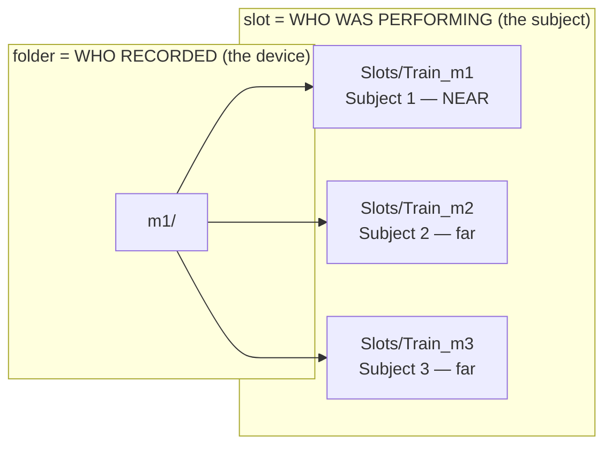
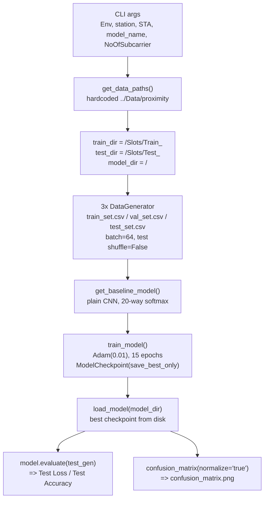
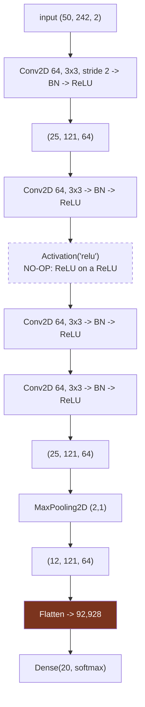
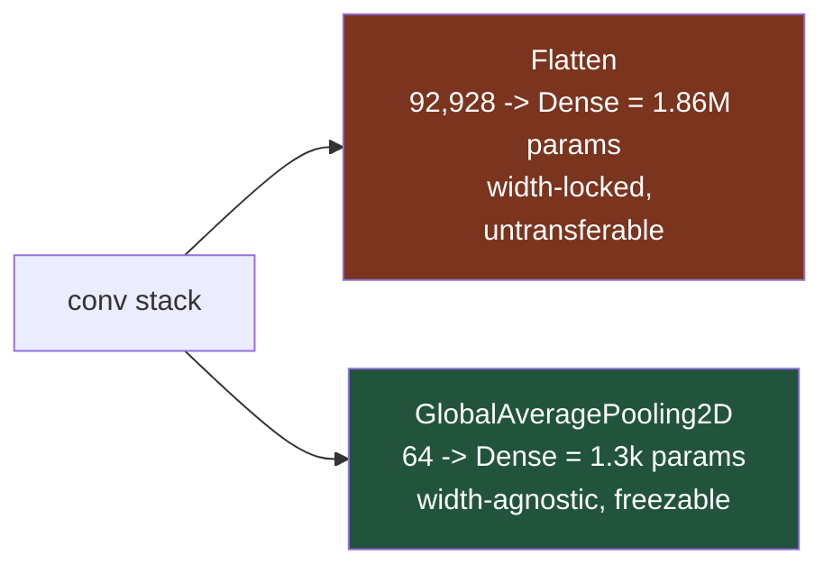

# Baseline — Proximity Test (`baseline_proximity.py`)

**File:** `Python_Code/baseline_proximity.py` (uses `dataGenerator.py: DataGenerator`)

The entire proximity experiment in one script: pick one *(recorder, subject)* cell, train a plain CNN on its Train block, test on its Test block, print accuracy, save a confusion matrix. **No embedding, no freezing, no episodes** — this is deliberately not the FREL path. Run it nine times to fill the grid.

> Why it exists: proximity is not a component of the deployed system, it's the **premise**. The cascade in [[../multipeople/SiMWiSense-cascaded-detection]] only works if a monitor's CSI is dominated by the person nearest it. This script measures whether that's true. See [[../multipeople/SiMWiSense-sensing-proximity]].

## The experiment: a 3x3 grid

One run = one cell. The two axes are independent and both are named `m1/m2/m3`, which is the main source of confusion:

Subject *i* is **defined** as whoever is closest to monitor *i*, so position and identity are one variable. All three monitors record the same session simultaneously (packet counts agree within 5–10% per activity), so `m1/Slots/Train_m2/` = *monitor 1's view of Subject 2*.

|                  | subject m1 | subject m2 | subject m3 |
| ---------------- | ---------- | ---------- | ---------- |
| **recorded m1**  | ~95%       | ~65%       | ~65%       |
| **recorded m2**  | ~65%       | ~96%       | ~65%       |
| **recorded m3**  | ~65%       | ~65%       | ~97%       |

The **~30-point diagonal/off-diagonal gap is the result** — same device, same room, same instant, only distance to the classified subject changes. That is the scattering model confirmed outside the lab.

> The README's arg names for this script (`<Closest_STA> <Train_Test_STA>`) describe the two axes the opposite way round. [[01-phase1-data-pipeline|Stage 1]] settles it: the extractor writes `m<k>/` from `m<k>/CSI_pcap/`, so the **folder is the recording device**, which forces the slot to be the subject.

## Pipeline

Train and test differ **only in the time block** — units 5–180 vs 180–240 of the same continuous recording. Same person, same device, same session. There is no domain shift anywhere in this script, which is exactly why FREL has no role here.

## The network

### Where the parameters are

| block                    | params        |
| ------------------------ | ------------- |
| conv1 (2->64 channels)   | 1,216         |
| conv2–4 (64->64) x3      | 110,784       |
| BatchNorm x4             | 1,024         |
| **Flatten -> Dense(20)** | **1,858,580** |
| **total**                | **~1.97 M**   |

**~94% of the model is the final dense layer**, and that layer is welded to the exact input width — change `NoOfSubcarrier` and it is a structurally different model.

Contrast with FREL's `EmbeddingNet` ([[02-phase2-model-architecture]]), which ends in `GlobalAveragePooling2D` -> 64-dim -> `Dense(20)` = **1,300 params**, width-agnostic:

That difference is not cosmetic. A 1.86M-parameter head bolted to a flattened feature map is precisely what you **cannot** transfer to a new room and **cannot** retrain from 15 seconds of data. The gap between this file and `models.py` is the gap between *measuring an effect* and *building a deployable system*.

## Gotchas (verified against source)

| # | line | issue |
|---|---|---|
| 1 | `:26` | `from sklearn.metrics import plot_confusion_matrix` — **removed in scikit-learn >= 1.2, so the script fails at import**. Never called; delete the line. |
| 2 | `:75` | `Activation('relu')` immediately after a `ReLU()` — no-op. |
| 3 | `:92-105` vs `:140-142` | `main()` builds three callbacks, then calls `train_model()` which builds its own identical three. `main()`'s are dead. |
| 4 | `:93` | `ReduceLROnPlateau(patience=15)` with `epoch=15` — **can never fire**. No LR decay at all, at `Adam(0.01)`. |
| 5 | `:94` | `EarlyStopping(min_delta=0.05, patience=10)` — a 0.05 loss-improvement threshold is aggressive; this one plausibly does fire. |
| 6 | `:31` | `num_classes = 20` is unused — `main()` uses `len(labels)`. Looks authoritative, isn't. |
| 7 | `:65`, `:138` | `fc1=256, fc2=128` passed in, never referenced. |
| 8 | `:38` | first positional arg is named `Test` but holds the **environment** (`Classroom`). |
| 9 | `dataGenerator.py:149` | `__len__ = floor(N/batchsize)` silently drops the trailing partial batch — up to 63 test windows never predicted. That's why `:133` slices `Y_true[:len(Y_pred)]`. |
| 10 | — | **No input normalization anywhere.** Raw complex values (amplitudes ~200–1300 across subcarriers) go straight in; only the first BatchNorm absorbs the scale. The paper describes amplitude normalization; the released code does not do it. |

Gotcha 10 matters for us directly: that missing normalization is part of what Wilight's ratio stage would be replacing. See [[../modified/00-overview]].

## See also
- [[00-overview]]
- [[01-phase1-data-pipeline]]
- [[02-phase2-model-architecture]]
- [[../multipeople/SiMWiSense-sensing-proximity]]
- [[../multipeople/SiMWiSense-cascaded-detection]]
