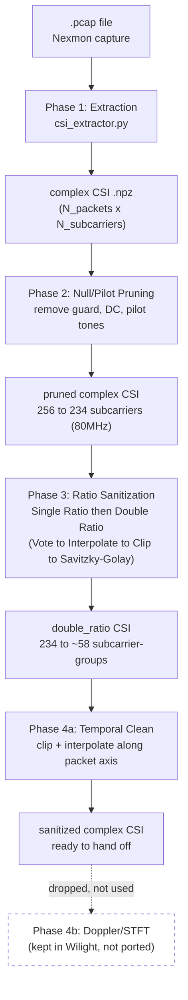

# Wilight Pipeline — 4-Phase Plan

> Source: `resources/Wilight-Code-CSI-Doppler`. This vault mirrors the 4-phase breakdown already used for [[SiMWiSense]] so both codebases read the same way. See [[../project-log/00-aim-and-plan]] for why we want this pipeline (ratio sanitization swapped into SiMWiSense).

## Pipeline diagram

## The 4 phases

1. **[[01-phase1-extraction]]** — `csi_extractor.py`: raw `.pcap` → complex CSI `.npz`.
2. **[[02-phase2-null-pilot-pruning]]** — remove guard/null/DC/pilot subcarriers (256 → 234 at 80MHz).
3. **[[03-phase3-ratio-sanitization]]** — Single Ratio + Double Ratio, each with Vote → Interpolate → Clip → Savitzky-Golay.
4. **[[04-phase4-temporal-clean-and-doppler]]** — Temporal Clean (kept) + Doppler/STFT (dropped for our integration).

## The theory behind it

**[[05-why-the-ratio-works]]** — the hardware model the ratio cancels, the algebra of *what* cancels and why the pass runs twice, and the two costs (dimension halving, and the ratio sitting near 1 because adjacent subcarriers are highly correlated). Also records the two blockers found when checking this against our actual SiMWiSense `.mat` files.

## What we actually need

Only **Phases 1–3 + Temporal Clean (start of Phase 4)**. The Doppler/STFT half of Phase 4 stays in Wilight's own repo — SiMWiSense's FREL pipeline consumes raw `Sp × K × 2` CSI tensors, not spectrograms (see [[../project-log/00-aim-and-plan]]).

## See also
- [[05-why-the-ratio-works]]
- [[../project-log/00-aim-and-plan]]
- [[../project-log/01-progress]]
- [[../project-log/03-code-walkthrough]]
