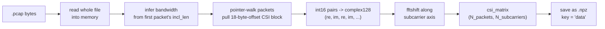

# Phase 1 — CSI Extraction

**File:** `csi_extractor.py`

## What it does

Reads a raw Nexmon `.pcap` capture and turns it into a plain complex CSI matrix, saved as `.npz`.

## Logic, step by step

1. **Bandwidth detection** (`_find_bandwidth`): reads the `incl_len` field of the first pcap record, back-computes bandwidth in MHz. 80 MHz → 256 subcarriers (`nsub = bandwidth * 3.2`).
2. **Pointer-based packet walk**: skips the 24-byte pcap global header, then for each record: skips timestamp + header fields (50 bytes), grabs the CSI block at payload offset `+18` (`nsub * 4` bytes), advances the pointer to the next record using `frame_len`.
3. **Bytes → complex**: the raw bytes are `int16` pairs — even indices are real, odd are imaginary. Combined into one `complex128` matrix, shape `(N_packets, N_subcarriers)`.
4. **`fftshift`** along the subcarrier axis (axis=1) — reorders subcarriers into physical frequency order.
5. **Save**: `np.savez_compressed`, single key `data`.

## Notable

- No filtering, no pruning, no sanitization here — purely bytes-to-complex-numbers extraction, same role as SiMWiSense's `CSI_extractor_SimWiSense.m` (see [[../project-log/03-code-walkthrough]] §1). Difference: SiMWiSense's extractor also does subcarrier pruning inline; Wilight splits that into Phase 2.
- Chip-agnostic here (assumes Nexmon's standard interleaved int16 format) — SiMWiSense's extractor branches per chip (`typecast` vs `unpack_float` MEX). Worth checking which chip the actual SiMWiSense captures use before assuming this extractor is a drop-in replacement.

## See also
- [[00-overview]]
- [[02-phase2-null-pilot-pruning]]
