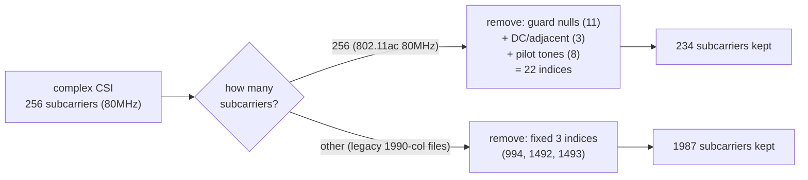

# Phase 2 — Null/Pilot Subcarrier Pruning

**File:** `Single_antenna_single_file_processing.py` (start of the per-file pipeline, before Stage 1)

## What it does

Drops subcarriers that carry no usable channel information (guard bands, DC, pilot tones), before any ratio math runs.

## Logic, step by step (256-subcarrier / 80 MHz case — the one that matters for SiMWiSense)

After `fftshift`, index in the array = subcarrier number + 128. Three groups get removed:

- **Guard nulls**: indices `0–5` (subcarriers −128..−123) and `251–255` (subcarriers +123..+127) — 11 indices.
- **DC + adjacent**: indices `127, 128, 129` (subcarriers −1, 0, +1) — 3 indices.
- **Pilot tones**: indices `25, 53, 89, 117, 139, 167, 203, 231` (fixed reference subcarriers used for phase tracking, not data-carrying) — 8 indices.

Union of all three (`remove_idx`) = 22 unique indices removed → **256 → 234 subcarriers kept**.

There's also a fallback branch for files with a different column count (`else: remove_idx = [994, 1492, 1493]`) — that's a legacy path for a different, larger capture format (1990 columns, likely multi-antenna or wider-band), not the 256-subcarrier case we care about.

## Notable

- This is a **static index mask**, same style as SiMWiSense's `non_zero` pruning in `CSI_extractor_SimWiSense.m` — but the two lists are **not the same indices** and come from different capture pipelines. Confirmed earlier ([[../project-log/02-devVM-and-next-steps]] step 4): must check alignment before reusing either mask blindly.
- Unlike SiMWiSense's extractor, Wilight keeps this as a **separate step after extraction**, not fused into it — cleaner seam for us to hook into.

## See also
- [[00-overview]]
- [[01-phase1-extraction]]
- [[03-phase3-ratio-sanitization]]
