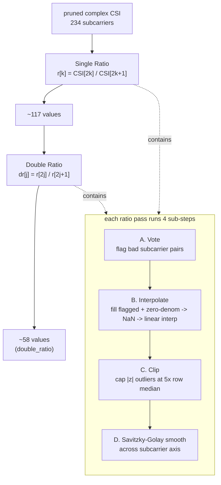

# Phase 3 — Ratio Sanitization (Single Ratio → Double Ratio)

**File:** `Single_antenna_single_file_processing.py` (`ratio_stage` function, called twice) — canonical logic matches `preprocessing_finalize.ipynb`.

> For **why** this works — the hardware model, what algebraically cancels, why the pass runs twice, and what it costs — see [[05-why-the-ratio-works]]. This note is the mechanics.

## What it does

Divides adjacent subcarriers to cancel noise that's common to both (per-packet phase offsets, hardware quirks), then does it again on the result. All complex-domain — no amplitude/phase split.

## Logic, step by step

**The ratio itself**: for a row of `N` complex values, `_ratio_row` pairs them up — `num = row[0::2]`, `den = row[1::2]` — and divides: `out = num/den` (guarding zero denominators → `NaN`). Applied once = Single Ratio, applied again to the Single Ratio output = Double Ratio. Each pass **halves** the subcarrier/group count.

**Sub-step A — Vote** (spatial, done once per stage, not per packet):
- For the first `VOTE_PACKETS = 100` packets, compute the ratio, unwrap its phase, and flag any subcarrier pair whose `|phase| > THRESHOLD(=2) × mean(|phase|)` for that packet.
- A subcarrier pair is **confirmed bad** if it gets flagged in at least `VOTE_FRACTION = 2/3` of those 100 packets (majority vote across a sample, not every packet).

**Sub-steps B–D — applied to every packet**:
- **B. Interpolate**: confirmed-bad pairs (from Vote) plus any exact zero-denominator cases are set to `NaN`, then linearly interpolated (`np.interp`) on real and imaginary parts independently.
- **C. Clip**: per-packet — any value with `|z| > CLIP_MULT(=5.0) × median(|row|)` gets projected onto that radius, preserving phase direction (`cap * z/|z|`).
- **D. Savitzky-Golay smoothing**: a polynomial smoothing filter (`window=11, poly=3`) applied across the subcarrier axis, real and imaginary independently, then recombined.

**Result**: `single_ratio` (~117 values from 234) → fed back through the same `ratio_stage` function → `double_ratio` (~58 values). Real captured numbers from the notebook's 1990-column example: 1987 → 993 (single) → 496 (double) — same halving pattern, different subcarrier count.

## Notable

- Deliberately **complex-domain throughout** — no separate amplitude/phase pipeline, which keeps it simple to plug into SiMWiSense's `Sp × K × 2` (real/imag) tensor format.
- Double ratio shrinks the usable dimension aggressively (234 → ~58 at 80MHz) — this is the open question flagged in [[../project-log/02-devVM-and-next-steps]]: is single-ratio-only enough, or do we need double ratio, given SiMWiSense's 20-class classifier might need more resolution.
- Vote is the only step that isn't per-packet — it's a one-time "which subcarriers are structurally bad" decision made from a 100-packet sample, then applied uniformly to the whole stream.

## See also
- [[05-why-the-ratio-works]]
- [[00-overview]]
- [[02-phase2-null-pilot-pruning]]
- [[04-phase4-temporal-clean-and-doppler]]
