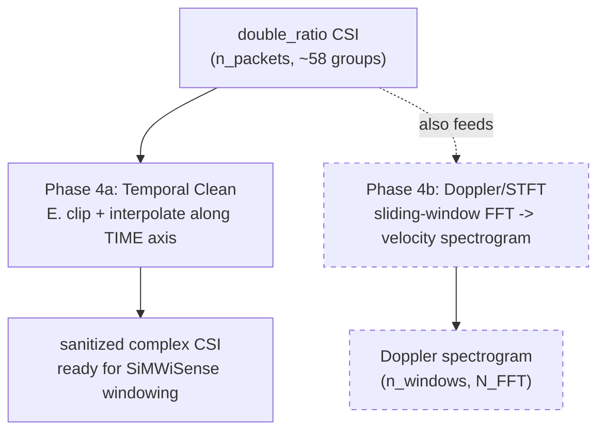

# Phase 4 — Temporal Clean (kept) + Doppler/STFT (dropped)

**File:** `Single_antenna_single_file_processing.py` (`temporal_clean` function, then `compute_doppler_raw` + normalization/smoothing cells — canonical logic in `preprocessing_finalize.ipynb`)

## What it does

Two sub-phases. We only want the first one.

*(Dashed = not ported into our integration, per [[../project-log/00-aim-and-plan]].)*

## Phase 4a — Temporal Clean (kept)

Same clip-and-interpolate idea as Phase 3's sub-steps C/B, but along the **packet/time axis** instead of the subcarrier axis:

1. For each ratio-group column `j`, compute the column's magnitude and its median.
2. Flag any packet where `|dr[:,j]| > T_CLIP_MULT(=5.0) × median(|column j|)`.
3. Set flagged entries to `NaN`, linearly interpolate along the time axis (real/imag independently).

No temporal *smoothing* step here — the code comments explicitly say smoothing is deferred to a post-Doppler 2-D Gaussian, specifically so it doesn't low-pass-filter the dynamics the (unused-by-us) Doppler FFT needs. Since we're not doing Doppler, this just means: **Temporal Clean is clip+interpolate only, nothing more** — which is exactly what we want as the final sanitization step.

## Phase 4b — Doppler/STFT (dropped, documented for completeness only)

1. Subtract the global per-recording mean (static-path removal).
2. Slide a `NUM_SYMBOLS=51`-packet Hann-windowed FFT (`N_FFT=100` bins) across the stream to get a velocity spectrogram.
3. Normalize by a shared max across paired recordings, clip to a noise floor, zero/handle the DC bin.
4. Apply a post-Doppler 2-D Gaussian smooth (time axis + velocity axis).

**We are not porting this.** SiMWiSense's FREL pipeline consumes raw `Sp × K × 2` (real/imag) CSI tensors directly — a Doppler spectrogram is a different representation entirely (velocity bins, not subcarriers). Per [[../project-log/00-aim-and-plan]], this stage is dropped outright.

## Notable — known discrepancies (irrelevant to us, only matters if Doppler is ever revisited)

Already flagged in [[../project-log/01-progress]] §4: the notebook (canonical) and the `.py` scripts disagree on normalization strategy, DC-bin zeroing, and packet-rate assumption (`Tc=1/150` notebook vs `Tc=1/500` in the `.py` scripts). None of this touches Temporal Clean or anything upstream of it.

## Integration handoff

Output of Phase 4a (sanitized complex `double_ratio` CSI, temporal-cleaned) is what gets handed to SiMWiSense's `csi2batches_SimWiSense.m` windowing step, replacing its current input (the bare pruned CSI from `CSI_extractor_SimWiSense.m`). See [[../project-log/02-devVM-and-next-steps]] step 4 for the glue-code plan.

## See also
- [[00-overview]]
- [[03-phase3-ratio-sanitization]]
- [[../project-log/00-aim-and-plan]]
