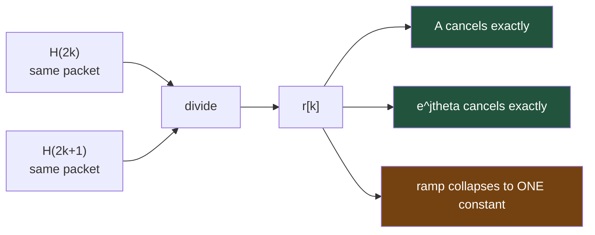
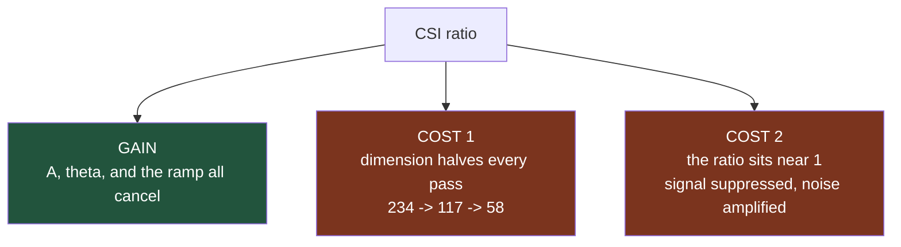

# Why the CSI Ratio Works — and What It Costs

> The *mechanics* of the ratio stages are in [[03-phase3-ratio-sanitization]]. This note is the **why**: the hardware model that motivates dividing adjacent subcarriers, the algebra of what cancels, why the pass is run twice, and the two real costs that make this an experiment rather than an obvious win.

## The baseline we are replacing

SiMWiSense's entire preprocessing stack is **one line** — `csi = csi_mon(:,non_zero)` in `CSI_extractor_SimWiSense.m`, a static index mask, 256 -> 242. No normalization, no phase correction, no outlier handling. Raw complex values go straight into the CNN (verified in [[../simwisense/05-baseline-proximity]] §gotcha 10). That is the bar.

## 1. What is actually wrong with raw CSI

What the chip reports is not the channel. It is the channel multiplied by a stack of hardware artifacts that change **every packet**:

$$H_{meas}(k,t) = \underbrace{A(t)}_{\text{AGC gain}} \cdot \underbrace{e^{j\theta(t)}}_{\text{CFO / random phase}} \cdot \underbrace{e^{j2\pi k\delta(t)}}_{\text{SFO / PBD ramp}} \cdot H_{true}(k,t)$$

| term | source | behaviour |
|---|---|---|
| $A(t)$ | automatic gain control | rescales the whole packet arbitrarily |
| $e^{j\theta(t)}$ | carrier frequency offset | random phase rotation, whole packet |
| $e^{j2\pi k\delta(t)}$ | sampling freq. offset + packet boundary detection | phase **ramp**, linear in subcarrier index $k$ |

Only $H_{true}$ carries human motion. Across a 50-packet window these artifacts dominate the variance — and right now the FREL embedding is being asked to learn *around* them. See [[../basics/CSI-sanitization]].

## 2. The trick — divide adjacent subcarriers in the same packet



$$r[k] = \frac{H_{meas}(2k)}{H_{meas}(2k+1)} = \frac{A e^{j\theta} e^{j2\pi(2k)\delta}\, H_{true}(2k)}{A e^{j\theta} e^{j2\pi(2k+1)\delta}\, H_{true}(2k+1)} = e^{-j2\pi\delta}\cdot\frac{H_{true}(2k)}{H_{true}(2k+1)}$$

Both subcarriers sit in the **same packet**, so they share the same $A$, $\theta$ and $\delta$:

- $A$ cancels exactly — AGC gone
- $e^{j\theta}$ cancels exactly — random per-packet phase gone
- the ramp $e^{j2\pi k\delta}$ (varying with $k$) collapses to $e^{-j2\pi\delta}$ — **one constant, identical for every $k$**

Same family as FarSense's CSI-ratio, which divides two **antennas**. Wilight divides two **subcarriers** — so it works on a single-antenna capture, which is exactly what SiMWiSense has. Related: [[../basics/CARM-CFR-power-model]].

## 3. Why the pass is run twice

Single ratio leaves the residual constant $e^{-j2\pi\delta}$ — a per-packet rotation. Because it is identical across all $k$, a **second** ratio cancels it too:

$$dr[j] = \frac{r[2j]}{r[2j+1]} = \frac{e^{-j2\pi\delta}\, H_t(4j)/H_t(4j{+}1)}{e^{-j2\pi\delta}\, H_t(4j{+}2)/H_t(4j{+}3)} = \frac{H_t(4j)\,H_t(4j{+}3)}{H_t(4j{+}1)\,H_t(4j{+}2)}$$

Fully hardware-independent — a pure four-point **cross-ratio** of the true channel.

**This answers one side of the open question** in [[../project-log/02-devVM-and-next-steps]] step 4 ("keep the double ratio or stop after single?"): stopping at single ratio leaves a per-packet phase rotation in the data. Whether that residual actually hurts a CNN more than losing half the subcarriers does is still empirical.

## 4. What it costs — the two real objections



**Cost 1 — dimension.** Each pass halves the feature axis. 20-class fine-grained classification on ~58 columns instead of 242.

**Cost 2 — the ratio is close to 1.** Subcarrier spacing at 80 MHz is **78.125 kHz**; indoor coherence bandwidth is typically megahertz. So $H_{true}(2k)$ and $H_{true}(2k+1)$ are *highly correlated* — this is dividing two nearly equal numbers. The hardware junk cancels, but **so does much of the signal**, and residual noise gets amplified — badly wherever the denominator sits in a deep fade.

FarSense's two-antenna version does not have this problem as sharply: separated antennas see genuinely **decorrelated** channels while still sharing the same hardware offsets. That is the ideal case — common artifacts, independent signal. Adjacent subcarriers share the artifacts *and* share most of the signal.

> **This tension is the experiment.** Cleaner but weaker and lower-dimensional. The accuracy comparison against the raw-242 baseline is what settles it.

Cost 2 is also *why* `ratio_stage` is 80 lines of damage control around a 2-line division — see the Vote / Interpolate / Clip / Savitzky-Golay sub-steps in [[03-phase3-ratio-sanitization]].

## 5. The five stages at a glance

```
256  ->[prune]->  234  ->[single ratio]->  117  ->[double ratio]->  58  ->[temporal clean]->  58   ->[Doppler X]
```

| stage | file / function | scope | note |
|---|---|---|---|
| 0. prune | `:318-333` | static mask | guard + DC±1 + **8 pilot tones**. Pilots carry a known reference symbol, not channel data — a ratio involving one is meaningless. [[02-phase2-null-pilot-pruning]] |
| 1. single ratio | `ratio_stage` `:110-192` | per packet | A, theta cancel; ramp -> constant |
| 2. double ratio | same function, called again | per packet | constant cancels |
| 3. temporal clean | `temporal_clean` `:197-232` | per column, along time | clip + interp only, **no smoothing** — deliberately, so Doppler dynamics survive. [[04-phase4-temporal-clean-and-doppler]] |
| 4. Doppler / STFT | `compute_doppler_raw` | — | **dropped.** FREL eats `50 x K x 2` CSI tensors, not velocity spectrograms |

**Vote is the one non-per-packet step.** It is a *structural* decision: some subcarrier pairs are persistently bad (standing-wave nulls, hardware quirks), so it identifies them from the first 100 packets and applies that verdict uniformly to the whole recording, rather than re-deciding every packet.

## 6. Where this leaves our data — two blockers

Both verified directly against `data/SimWi/Classroom/80MHz/3mo/m1/A/A.mat`.

**Blocker 1 — subcarrier ordering.** Wilight's `csi_extractor.py` applies `np.fft.fftshift`; `CSI_extractor_SimWiSense.m` **never does**. SiMWiSense arrays run subcarrier 0..127 then -128..-1 — *not* physical frequency order. `ratio_stage` divides **adjacent** columns and runs Savitzky-Golay **across the frequency axis**; both are meaningless on a discontinuous axis. **An `fftshift` must come first.**

*Evidence:* mean `|CSI|` per column over 2000 packets shows a dead run (amp ~3-6 against a 572 overall mean) at original indices **123-127 and 131-133** — exactly the 11-wide VHT80 guard band under the no-shift mapping. Under Wilight's shifted mapping those indices would be subcarriers -5..+5, which is not a null region in 802.11ac.

**Blocker 2 — the mask cannot be copied literally.** Wilight's hardcoded indices are in *shifted* coordinates. Translated to intent, on the already-pruned 242 columns:

| remove | columns (0-based, of the 242) |
|---|---|
| 8 dead guard columns SiMWiSense left in | 117–124 |
| 8 pilot tones | 5, 33, 69, 97, 144, 172, 208, 236 |

So the realistic chain for our data is:

```
242  ->[remap mask]->  226  ->[single ratio]->  113  ->[double ratio]->  56
```

`NoOfSubcarrier` becomes **56** (or **113** if we stop after single ratio) — not the 58 assumed in [[../modified/00-overview]], because SiMWiSense's prune is *more* aggressive around DC (it removes ±5, Wilight removes only ±1).

## See also
- [[00-overview]]
- [[03-phase3-ratio-sanitization]]
- [[02-phase2-null-pilot-pruning]]
- [[../modified/01-phase1-batch-and-sanitize]]
- [[../basics/CSI-sanitization]]
- [[../simwisense/05-baseline-proximity]]
